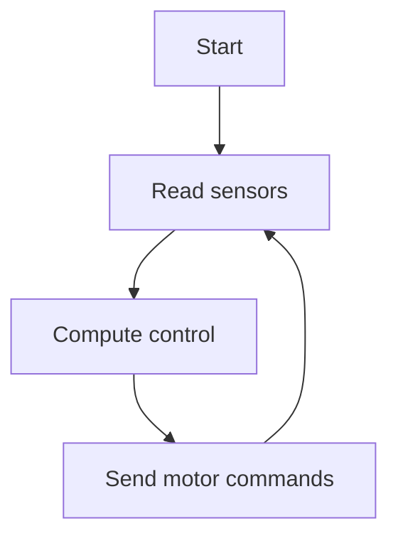

# Post Content Guide

## Scope

Use this skill when creating or editing pages in this blog workspace.

The blog is an MkDocs Material site. Content lives under `docs/`. Each subject or topic usually has an `index.md` file, optional `images/` subfolder, and optional `code/` subfolder.

## Before Editing

Inspect nearby pages before writing new content:

- Read the target `index.md`.
- Check sibling pages for style, grid menus, frontmatter, and asset naming.
- Prefer the existing folder pattern over inventing a new structure.
- Keep unrelated files unchanged.

## Page Structure

Every content page should start with YAML frontmatter:

```yaml
---
title: Page Title
tags:
    - tag1
    - tag2
---
```

Use `##` headings for main sections. Put the section content directly under the heading.

Prefer clear technical notes:

- Short explanation first
- Practical commands or examples next
- Notes, warnings, or tips when useful
- Links and references near the related content

Use MkDocs admonitions when they improve readability:

```md
!!! tip
    Short practical advice.
```

## Images

If a topic needs an image, diagram, screenshot, or visual explanation:

- Create an `images/` folder next to the page if it does not exist.
- Put image files under that local `images/` folder.
- Use lowercase names with underscores, for example `motor_direction.png`.
- Reference images with relative paths:

```md

```

Use downloaded images only when licensing and source are appropriate. Prefer screenshots, user-provided images, generated bitmap images, or simple diagrams created specifically for the page.

When creating a generated image, save it under the page-local `images/` folder and reference it from the document. Do not place page-specific images in global asset folders unless they are reused across many pages.

Never include binary image files with the snippet directive:

```md
--8<-- "path/to/image.png"
```

The snippet directive is only for text files. Use normal Markdown image syntax for images.

## Code Examples

Short code examples can be written directly in the document:

```python
print("hello")
```

Use a local `code/` subfolder when:

- The example is long
- The example should be runnable
- Multiple files are needed
- The page explains a complete project, launch file, config, or script

Reference code files with `pymdownx.snippets`:

````md
```python title="example.py"
--8<-- "docs/path/to/page/code/example.py"
```
````

Keep snippet paths relative to the repository root, matching the existing blog style.

Use descriptive file names:

- `publisher.py`
- `docker-compose.yml`
- `camera_demo.cpp`
- `config.yaml`

Do not provide absolute local filesystem paths in Markdown links, snippet paths, or command examples. Link to the local code file near the usage example, then show usage as if the reader downloaded the script from the post and runs it from their local working directory. Do not use `cd` in usage examples unless changing directories is the point of the example.

This is bad example:

```bash
cd /home/user/projects/new_blog/docs/Simulation/Gazebo/demo_worlds/dem_terrain/code
./download_usgs10m_2km.sh "$CENTER_LAT" "$CENTER_LON"
```

This is better:

[Download script](code/download_usgs10m_2km.sh)

```bash
./download_usgs10m_2km.sh "$CENTER_LAT" "$CENTER_LON"
```

## Math

Use LaTeX for equations.

Inline math:

```md
The thrust is proportional to \( \omega^2 \).
```

Block math:

```md
\[
F = k_f \omega^2
\]
```

Define symbols immediately after the equation when the meaning is not obvious.

## Flow Diagrams

Use Mermaid for flow diagrams, state diagrams, and simple architecture diagrams.



Keep Mermaid diagrams small enough to read on mobile. For complex systems, split the diagram into multiple sections.

## Links

Use relative links for local pages:

```md
[GPIO](../../RPI/gpio/)
```

Use direct external links for references, and make every external link open in a new window/tab:

```md
[PX4 documentation](https://docs.px4.io/){:target="_blank" rel="noopener noreferrer"}
```

Do not add `target="_blank"` to local relative links.

Check local image and page links when possible with MkDocs.

## Writing Style

Write practical engineering documentation:

- Use simple technical English.
- Prefer examples over abstract explanation.
- Explain what a command or concept is used for.
- Avoid marketing language.
- Keep headings specific.
- Use lists for procedures and tradeoffs.

For pros and cons, use explicit sections:

```md
## Option Name

Pros:

- ...

Cons:

- ...
```

## Validation

After editing, run:

```bash
./venv/bin/mkdocs build
```

For stricter validation, run:

```bash
./venv/bin/mkdocs build --strict
```

This repository currently has existing site-wide strict warnings. If strict mode fails, check whether the new or changed page appears in the warning output. Fix warnings caused by the current change, but do not clean unrelated warnings unless requested.

## Common Mistakes To Avoid

- Do not put binary images inside snippet includes.
- Do not place page-specific images in unrelated folders.
- Do not use absolute local filesystem paths in Markdown links.
- Do not add large code blocks when a runnable `code/` file is clearer.
- Do not change unrelated pages while adding a new topic.
- Do not create a new visual style when sibling pages already show a pattern.


## menu and navigation

- use the pattern to add menu and menu item

```
<div class="grid-container">
    <div class="grid-item">
        <a href="design_patterns/">
        <p>Design patterns</p>
        </a>
    </div>
    <div class="grid-item">
        <a href="plugin">
        <p>Plugin</p>
        </a>
    </div>
</div>
```

- Add a summary section for each menu item, and add a link to the page for more details. the summary section should be a collapsible section, and the link should be a clickable link to the page.

```
<div class="grid-item">
    <a href="control_video_bandwidth">
        <p>Control Video Bandwidth</p>
    </a>
    <details>
        <summary>More ..</summary>
        <p>
            Demo application for controlling video bandwidth with crop
            presets, FPS, encoder bitrate, keyframe interval, and measured
            RTP bandwidth from the running pipeline.
        </p>
    </details>
</div>
```