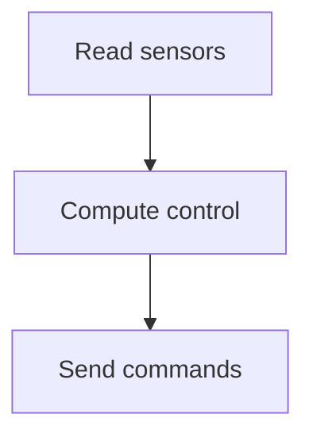

# Post Content Guide

Create and update practical MkDocs Material pages under `docs/`.

## Version

Current version: `1.0.0`.

!!! warning "Record the skill version"
    Add `<!-- post-content-skill: 1.0.0 -->` as the final line of every post
    created or substantially revised with this skill. Do not add it for a
    trivial typo or formatting correction.

## Workflow

1. Read the target page and nearby pages.
2. Match their folder structure, frontmatter, menus, naming, and visual style.
3. Write a short explanation followed by practical examples.
4. Add only the assets and navigation links the page needs.
5. Build MkDocs and fix warnings introduced by the change.

!!! tip "Match the local pattern"
    Prefer the nearest sibling page's structure over inventing a new layout.
    Keep unrelated files unchanged.

## Page structure

Start every content page with:

```yaml
---
title: Page Title
tags:
    - tag-one
    - tag-two
---
```

Use `##` for main sections. Put content directly below each heading.

A useful section normally contains:

1. A concise explanation
2. A command, configuration, or example
3. A tip or warning when needed
4. Relevant links or references

!!! danger "Required"
    Every content page must have valid YAML frontmatter. Do not silently change
    unrelated pages while adding or editing a topic.

## Highlight important instructions

Use MkDocs admonitions for information readers must notice:

```md
!!! tip
    Practical advice that improves the result.

!!! warning
    A condition that can cause failure or incorrect behavior.

!!! danger
    A safety risk, destructive action, or non-negotiable requirement.
```

Keep admonitions short. Put the required action first.

## Images and diagrams

Store page-specific visuals in an `images/` folder beside the page. Use
lowercase underscore-separated names:

```md

```

Prefer user-provided images, screenshots, generated visuals, or original
diagrams. Use downloaded images only when their source and license are
appropriate.

!!! warning "Image rules"
    Do not include binary images with `--8<--`; snippets are for text files.
    Do not place page-specific images in global or unrelated asset folders.

Use Mermaid for small flow, state, sequence, and architecture diagrams:


```mermaid
flowchart TD
    A[Read sensors] --> B[Compute control]
    B --> C[Send commands]
```

Split diagrams when labels become crowded or unreadable on mobile.

## Code examples

Keep short examples inline. Put code in a local `code/` folder when it is
runnable, long, multi-file, or represents a complete script or configuration.

Embed text files with a repository-root snippet path:

````md
```python title="example.py"
--8<-- "docs/path/to/page/code/example.py"
```
````

Link to runnable files near their usage example:

````md
[Download script](code/download_data.sh)

```bash
./download_data.sh
```
````

!!! warning "Portable examples"
    Do not put absolute local filesystem paths in posts, links, snippets, or
    commands. Avoid `cd` unless changing directories is the lesson.

## Math

Use LaTeX and define non-obvious symbols immediately:

```md
The thrust is proportional to \( \omega^2 \).

\[
F = k_f \omega^2
\]
```

## Links

Use relative links for local content:

```md
[GPIO](../../RPI/gpio/)
```

Open external references in a new tab:

```md
[PX4 documentation](https://docs.px4.io/){:target="_blank" rel="noopener noreferrer"}
```

!!! warning "Link rules"
    Do not add `target="_blank"` to local links. Check every changed local page,
    image, and code link during the MkDocs build.

## Menus and navigation

When adding a child page, update its parent menu unless the parent already
generates child links automatically.

Use the existing grid-card pattern and include a concise collapsible summary:

```html
<div class="grid-container">
    <div class="grid-item">
        <a href="control_video_bandwidth/">
            <p>Control Video Bandwidth</p>
        </a>
        <details>
            <summary>More...</summary>
            <p>
                Control crop presets, frame rate, encoder bitrate, keyframe
                interval, and measured RTP bandwidth.
            </p>
        </details>
    </div>
</div>
```

!!! tip "Menu summaries"
    Describe what the reader will learn. Keep the title link clickable and the
    summary brief.

## Writing style

- Use simple technical English.
- Lead with the outcome or concept.
- Prefer practical examples over abstract explanation.
- Explain what each important command does and why it matters.
- Avoid marketing language and unnecessary repetition.
- Use lists for procedures and trade-offs.

For comparisons, use explicit `Pros` and `Cons` labels.

## Validation

Run:

```bash
./venv/bin/mkdocs build
```

Use strict mode when helpful:

```bash
./venv/bin/mkdocs build --strict
```

!!! danger "Do not skip validation"
    Fix every warning caused by the changed page. Existing site-wide strict
    warnings may remain; do not modify unrelated content unless requested.
