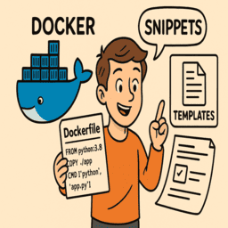

# Docker

<div class="grid-container">
    <div class="grid-item">
        <a href="tips_settings">
        
        <p>Tips / Settings</p>
        </a>
    </div>
    <div class="grid-item">
    <a href="docker_compose">
        
        <p>Docker Compose</p>
        </a>
    </div>
    <div class="grid-item">
        <a href="docker_images">
        
        <p>Images</p>
        </a>
    </div>
    <div class="grid-item">
        <a href="dockerfile_templates">
        
        <p>Dockerfile snippets and templates</p>
        </a>
    </div>
     <div class="grid-item">
        <a href="docker_nvidia">
        
        <p>docker nvidia</p>
        </a>
    </div>
     <div class="grid-item">
        <a href="docker_issues">
        
        <p>Issues</p>
        </a>
    </div>
</div>


## Install docker.ce
[How to Install Docker on Ubuntu – Step-by-Step Guide](https://www.digitalocean.com/community/tutorials/how-to-install-and-use-docker-on-ubuntu-22-04)


```bash
sudo apt update
sudo apt install apt-transport-https ca-certificates curl software-properties-common
# install key
curl -fsSL https://download.docker.com/linux/ubuntu/gpg | sudo gpg --dearmor -o /usr/share/keyrings/docker-archive-keyring.gpg
# update sources.list
echo "deb [arch=$(dpkg --print-architecture) signed-by=/usr/share/keyrings/docker-archive-keyring.gpg] https://download.docker.com/linux/ubuntu $(lsb_release -cs) stable" | sudo tee /etc/apt/sources.list.d/docker.list > /dev/null

sudo apt update
sudo apt install docker-ce
```

```bash
sudo systemctl status docker
```

```bash title="Run docker without sudo"
sudo usermod -aG docker ${USER}
#
reboot or logout/login

```

!!! Note
    Install nvidia toolkit

    ```bash
    docker run -it --rm --gpus all nvidia/cuda:13.0.0-runtime-ubuntu24.04 nvidia-smi
    ```
---

## Posts 
- [Running and Building ARM Docker Containers on x86](docker_build_arm.md)
- [Access Host Devices in Docker](docker_host_devices.md): how to connect hardware peripheral and share with docker
---

## To Read
- [Shared Memory & Docker](https://datawookie.dev/blog/2021/11/shared-memory-docker/)