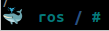

---
tags:
    - docker
    - tips
---

# Docker tips

## images

### Remove all dangling images

```bash
docker image prune
```

---

### Prompt

```bash
PS1='🐳  \[\033[1;36m\]\h \[\033[1;34m\]\W\[\033[0;35m\] \[\033[1;36m\]# \[\033[0m\]'
```



---

### overlay2 folder
```bash
# TODO: check again
docker builder prune
```