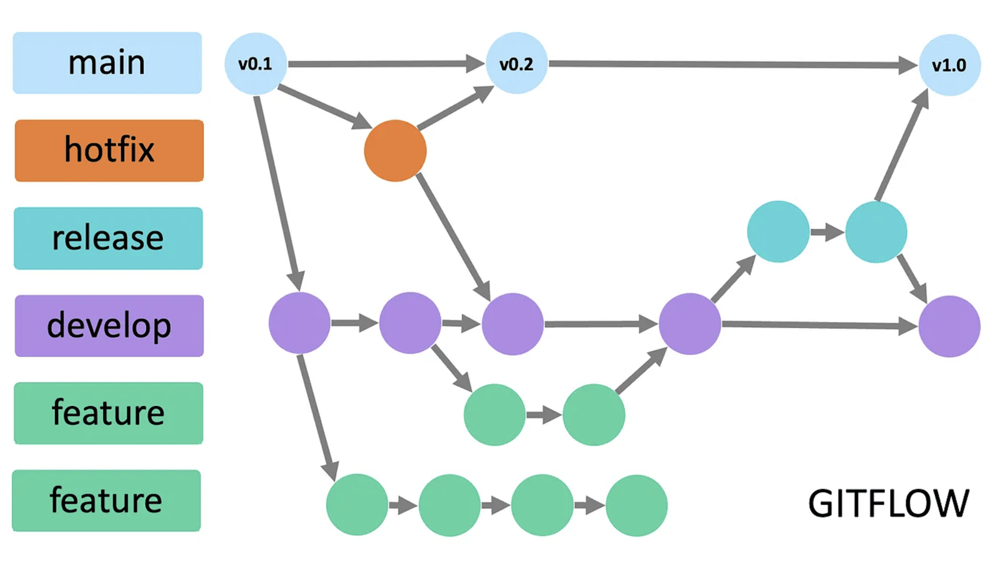
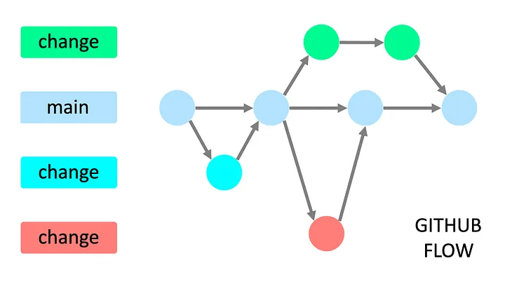

---
tags:
    - git
    - branching
---

# Git branching strategy

### Gitflow

| Branch  |   |
|---|---|
|  **main/master** | stores the currently released version of code and should match the code that is in production. |
| **develop** | stores a copy of the main branch with all additional changes that have been added since the last release |
| **feature** | is the branch where a new feature is developed. |
| **release** | is the branch where the code is prepared for the next release. its merge from develop and ready for test when it done it merge to main and back into develop if any change done, in main it's tag as release (with version) |
| **hotfix** | is the branch where the code is fixed for a bug in the main branch. it's merge to main and back into develop if any change done, in main it's tag as release (with version) |

---

### Github flow
Github flow is a lightweight, branch-based workflow. It revolves around branching from main and pull requests. 

A **Pull Request (PR)** is a request to merge a branch into another branch. It is a way to discuss changes before they are merged into the main branch.

| Branch  |   |
|---|---|
| main | stores the last working codebase |
| change/feature | Temporary branch for the new feature or bug fix , the branch well be base for pull request and well delete after merging into main branch |

!!! note "nameing"
    Name change/feature branch with prefix
    like:

    - feature/
    - bugfix/
    - hotfix/
     

### Pull Request
- Unit/Integration test
- Code review
- Reference to issue
- Has a comprehensive description
- Squashed into single commit

[more](http://radify.io/blog/perfect-pull-requests/)