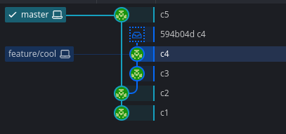
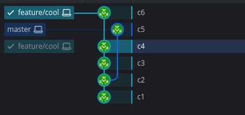
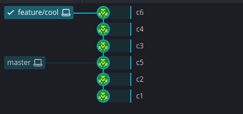
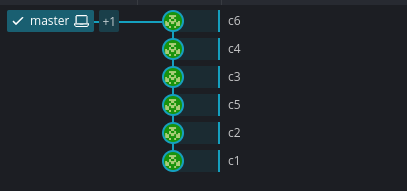

---
tags:
    - git
    - rebase
---

# GIT Rebase




```bash
#switch to feature branch
git checkout feature/cool

```



```bash
# from feature/cool
git checkout feature/cool
git rebase master
```




```bash
# from master
git checkout master
git rebase feature/cool
```


## Reference
- [A better Git workflow with rebase](https://www.themoderncoder.com/a-better-git-workflow-with-rebase/)