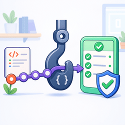
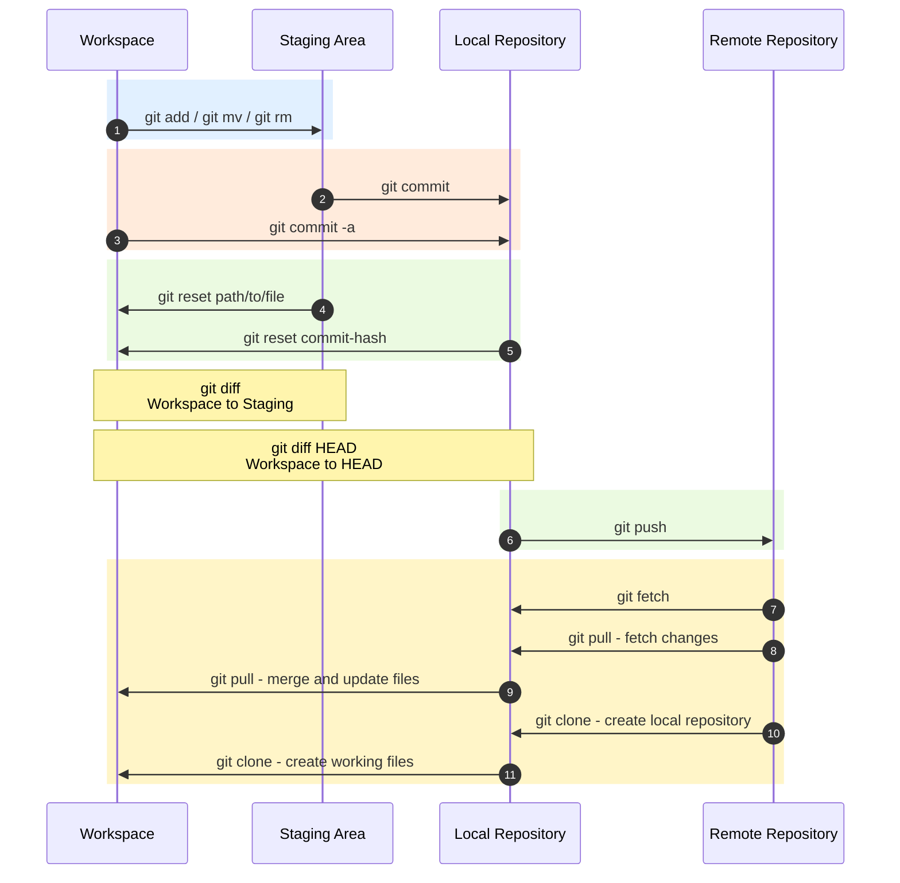

---
tags:
    - git
---


# Git

<div class="grid-container">
    <div class="grid-item">
        <a href="tips_settings">
        
        <p>Tips / Settings</p>
        </a>
    </div>
    <div class="grid-item">
    <a href="branching">
        
        <p>Git branching</p>
        </a>
    </div>
    <div class="grid-item">
         <a href="git_hooks">
        
        <p>Git hooks / precommit</p>
        </a>
    </div>
    
</div>



##  Cheat sheet
### Clone

`git clone` copies a remote repository to your machine and creates a local working directory.

Clone the default branch:

```bash
git clone https://github.com/user/repo.git
```

Clone a specific branch:

```bash
git clone --branch feature/login https://github.com/user/repo.git
```

Clone into a target folder:

```bash
git clone https://github.com/user/repo.git my-target-folder
```

Clone a specific branch into a target folder:

```bash
git clone --branch feature/login https://github.com/user/repo.git my-target-folder
```

Clone a specific tag:

```bash
git clone --branch v1.0.0 https://github.com/user/repo.git
```

Clone the repository and all submodules in one line:

```bash
git clone --recurse-submodules https://github.com/user/repo.git
```

---

### Push and pull

`git push` uploads commits from your local branch to a remote repository.
It does not upload uncommitted file changes.

Push commits from the current branch:

```bash title="push current branch"
git push
```

Push a new local branch and set the remote tracking branch:

```bash title="push new branch"
git push -u origin feature/login
```

Push a local branch to a different remote branch name:

```bash title="push to different remote branch"
git push origin local-branch:remote-branch
```

Push tags:

```bash title="push tags"
git push --tags
```

Delete a remote branch:

```bash title="delete remote branch"
git push origin --delete feature/login
```

!!! warning
    Avoid `git push --force` on shared branches.
    If you must update a rewritten branch, prefer `git push --force-with-lease` because it refuses to overwrite remote work you have not fetched.

Force push after rewriting local history:

```bash title="safer force push"
git push --force-with-lease
```

`git pull` downloads changes from a remote branch and updates your current branch.
By default, pull is similar to `git fetch` followed by `git merge`.

Pull the latest changes:

```bash title="pull latest changes"
git pull
```

Pull from a specific remote branch:

```bash title="pull specific branch"
git pull origin main
```

!!! note
    A normal `git pull` may create a merge commit when your local branch and the remote branch both have new commits.
    If Git can fast-forward your branch, no merge commit is created.

Pull without creating a merge commit:

```bash title="pull only if fast-forward is possible"
git pull --ff-only
```

Pull with rebase instead of merge:

```bash title="pull with rebase"
git pull --rebase
```

If you have uncommitted changes when pulling, Git tries to keep them.
If the remote changes touch the same files, Git may stop the pull and ask you to commit, stash, or discard your local changes first.

Check your local changes before pulling:

```bash title="check working tree"
git status
```

Stash uncommitted changes before pulling:

```bash title="stash before pull"
git stash push -m "work before pull"
git pull
git stash pop
```

Commit local changes before pulling:

```bash title="commit before pull"
git add .
git commit -m "save local changes"
git pull
```

Pull with automatic stash:

```bash title="pull with auto stash"
git pull --rebase --autostash
```

!!! note
    `--autostash` temporarily stashes your uncommitted changes, pulls the remote changes, then reapplies your work.
    Conflicts can still happen when the same lines changed locally and remotely.

`git pull` updates the branch you are currently on.
To review remote changes in a new branch, create the review branch first.

Create a review branch from the remote branch:

```bash title="create review branch from remote"
git fetch origin
git switch -c review/main origin/main
```

Pull into an existing review branch:

```bash title="pull into review branch"
git switch review/main
git pull origin main
```

After reviewing, commit your own changes on the review branch:

```bash title="commit after review"
git add .
git commit -m "review remote changes"
```

Fetch remote changes without merging into your current branch:

```bash title="fetch without changing current branch"
git fetch origin
```

Show local commits that are not pushed yet:

```bash title="show unpushed commits"
git log origin/main..HEAD --oneline
```

Show remote commits that you have not pulled yet:

```bash title="show unpulled commits"
git log HEAD..origin/main --oneline
```

---

### branch

Git branches let you work on features, fixes, or experiments without changing the main code line.

Create a new branch:

```bash title="create branch"
git branch feature/login
```

Create a new branch and switch to it:

```bash title="create and switch branch"
git switch -c feature/login
```

Switch between branches:

```bash title="switch branch"
git switch main
```

Switch to a remote branch:

```bash title="switch to remote branch"
git fetch origin
git switch -c feature/login origin/feature/login
```

Show local branches:

```bash title="show local branches"
git branch
```

Show local and remote branches:

```bash title="show all branches"
git branch -a
```

Delete a local branch:

```bash title="delete local branch"
git branch -d feature/login
```

Force delete a local branch:

```bash title="force delete local branch"
git branch -D feature/login
```

Delete a remote branch:

```bash title="delete remote branch"
git push origin --delete feature/login
```

Push a local branch that does not have a remote branch yet:

```bash title="push new branch to remote"
git push -u origin feature/login
```

Rename the current branch:

```bash title="rename current branch"
git branch -m new-branch-name
```

Show the current branch:

```bash title="show current branch"
git branch --show-current
```

Show merged branches:

```bash title="show merged branches"
git branch --merged
```

!!! warning
    `git branch --merged` only shows branches that still exist locally.
    If a merged source branch was already deleted, it will not appear in the output.
    The merged commits are still part of the history, but the branch name is gone.

### Discard file changes

Use these commands when you want to throw away local uncommitted changes.

!!! warning
    These commands discard changes from your working tree.
    Make sure you do not need the changes before running them.

Discard changes in all tracked files:

```bash title="discard all tracked file changes"
git restore .
```

Discard changes in one file:

```bash title="discard one file"
git restore path/to/file
```

Discard staged changes but keep the file content:

```bash title="unstage file changes"
git restore --staged path/to/file
```

Discard staged and unstaged changes in one file:

```bash title="discard staged and unstaged file changes"
git restore --staged path/to/file
git restore path/to/file
```

Remove untracked files and folders:

```bash title="remove untracked files and folders"
git clean -fd
```

### Merge

`git merge` combines changes from another branch into the branch you are currently on.
For example, if you are on `main` and merge `feature/login`, Git brings the commits from `feature/login` into `main`.

Merge a branch into the current branch:

```bash title="merge branch"
git switch main
git merge feature/login
```

Merge process:

1. Git checks the current branch.
2. Git finds the common commit between the current branch and the branch being merged.
3. Git applies the commits from the source branch into the current branch.
4. If the changes do not conflict, Git completes the merge.
5. If both branches changed the same lines, Git stops and asks you to resolve conflicts.

!!! note
    If the current branch has no new commits, Git can do a fast-forward merge.
    If both branches have new commits, Git creates a merge commit.

Merge without creating a merge commit only if fast-forward is possible:

```bash title="fast-forward only merge"
git merge --ff-only feature/login
```

Always create a merge commit:

```bash title="merge with merge commit"
git merge --no-ff feature/login
```

Abort a merge before finishing it:

```bash title="abort merge"
git merge --abort
```

Resolve merge conflicts:

```bash title="finish merge after conflicts"
git status
git add path/to/resolved-file
git commit
```


### Rebase

`git rebase` moves your branch commits so they start from a newer base commit.
It is commonly used to update a feature branch with the latest changes from `main` while keeping a linear history.

Rebase the current branch on top of `main`:

```bash title="rebase current branch"
git switch feature/login
git fetch origin
git rebase origin/main
```

Rebase one branch onto another branch:

```bash title="rebase branch onto main"
git switch feature/login
git rebase main
```

Rebase process:

1. Git finds the commits that exist only on your current branch.
2. Git temporarily removes those commits.
3. Git moves your branch to the new base branch.
4. Git reapplies your commits one by one.
5. If conflicts happen, Git stops and asks you to resolve them.

Continue after resolving rebase conflicts:

```bash title="continue rebase"
git status
git add path/to/resolved-file
git rebase --continue
```

Abort a rebase and return to the previous state:

```bash title="abort rebase"
git rebase --abort
```

Skip the current commit during a rebase:

```bash title="skip rebase commit"
git rebase --skip
```

Interactive rebase for editing, squashing, or reordering commits:

```bash title="interactive rebase"
git rebase -i HEAD~3
```

Pull remote changes using rebase instead of merge:

```bash title="pull with rebase"
git pull --rebase
```

!!! warning
    Rebase rewrites commit history.
    Avoid rebasing commits that were already pushed to a shared branch unless your team expects that workflow.
    If you rebase a pushed branch, you usually need `git push --force-with-lease`.


#TODO
- git log
- git stash
- git cherry-pick
- git reset
- git revert
---


### Git tools
[GitKraken](https://www.gitkraken.com/download)

---

## Reference
- [10 Git Commands Every Developer Should Master](https://medium.com/@ranjan.monisha233/10-git-commands-every-developer-should-master-and-why-a84584c72cac){:target="_blank"}
- [learn git inter active - very good learning tool](https://learngitbranching.js.org/){:target="_blank"}
