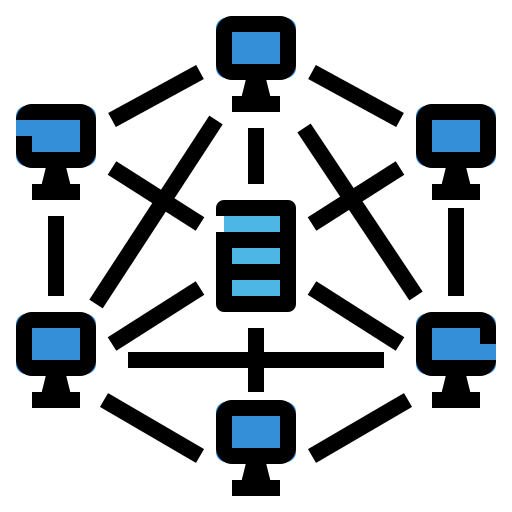

# Devops

        

        <a href="docker">
            
            
Docker

             </a>
        

    

        <a href="linux">
        
        
Linux

        </a>
    

    

        <a href="networking">
        
        
Networking

        </a>
    

    

        <a href="vscode">
        
        
VSCode

        </a>
    

    

    <a href="git">
        
        
GIT

        </a>
    

    

        <a href="aptly">
        
        
Aptly

        </a>
    

