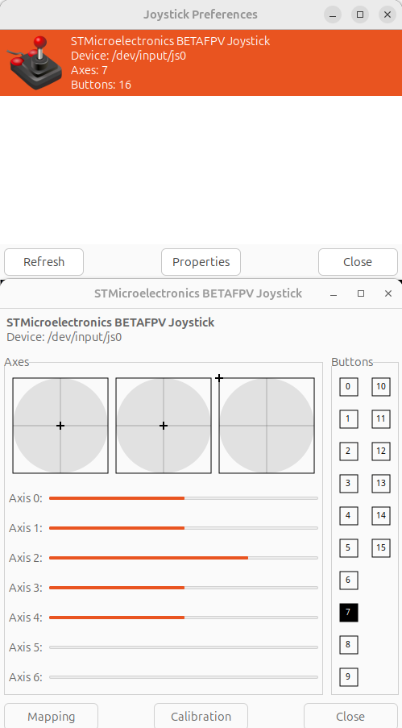

`/dev/input/by-id/` is a directory created by udev that provides stable symbolic names for input devices.

```bash
ll /dev/input/by-id
#
usb-STMicroelectronics_BETAFPV_Joystick_5643437C4100-event-joystick -> ../event18
lrwxrwxrwx 1 root root   6 May 12 18:56 usb-STMicroelectronics_BETAFPV_Joystick_5643437C4100-joystick -> ../js0
```

## Legacy vs event
The main difference is:

jsX (legacy joystick API)
→ specialized/simple joystick interface
eventX (Linux input event system)
→ modern generic input framework for ALL input devices

## install joystick utils
```bash
sudo apt install joystick
sudo apt install jstest-gtk
sudo apt install evtest
```

## Test

```bash
jstest /dev/input/js0
```

```bash
jstest-gtk
```



```
sudo evtest
```

---

## Using event subsystem and python

```bash
evtest /dev/input/event18

# move the joystick
Event: time 1778603558.652614, -------------- SYN_REPORT ------------
Event: time 1778603558.700587, type 3 (EV_ABS), code 3 (ABS_RX), value 1307
```

### python

```bash
pip install evdev
```

```python
from evdev import InputDevice, ecodes

#dev = InputDevice("/dev/input/event18")
dev = InputDevice("/dev/input/by-id/usb-STMicroelectronics_BETAFPV_Joystick_5643437C4100-event-joystick")


for event in dev.read_loop():

    if event.type == ecodes.EV_ABS:
        print(
            "AXIS",
            ecodes.ABS[event.code],
            event.value
        )
```