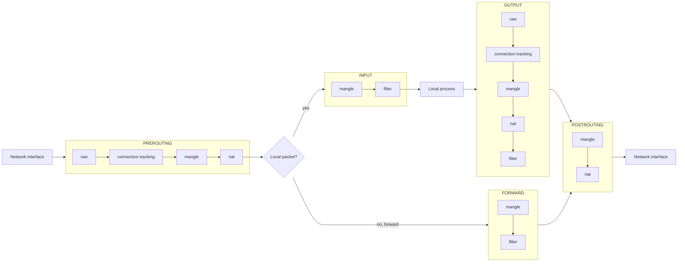
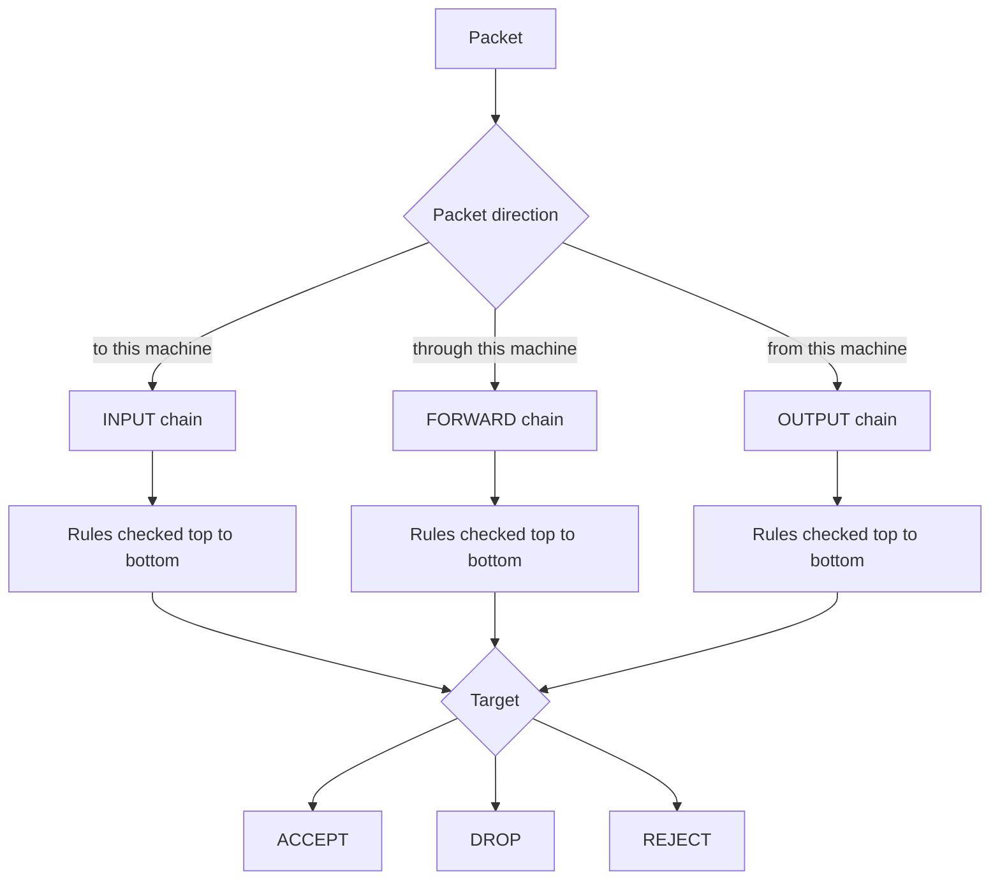

# iptables

`iptables` is a Linux firewall tool.

It configures Netfilter rules in the kernel. Packets pass through **tables**,
then **chains**, then **rules**.

In modern Linux, `nftables` is the newer replacement, but `iptables` is still
common on many systems and in many examples.

---

## Packet path overview

This is a simplified view of the main packet path.



---

## Filter table

The `filter` table is the default table.

It is used for basic firewall decisions:

- allow packet: `ACCEPT`
- block packet silently: `DROP`
- reject packet with response: `REJECT`



---

## Table, chain, rule

### Table

A table groups rules by purpose.

Common tables:

| Table | Purpose |
|---|---|
| `filter` | firewall allow/block rules |
| `nat` | address translation, port forwarding, masquerade |
| `mangle` | modify packet fields |
| `raw` | early packet handling before connection tracking |

If you do not specify a table, `iptables` uses the `filter` table.

```bash
sudo iptables -L
```

Same as:

```bash
sudo iptables -t filter -L
```

### Chain

A chain is a list of rules in a table.

Main `filter` chains:

| Chain | Packet type |
|---|---|
| `INPUT` | packets going to this machine |
| `OUTPUT` | packets created by this machine |
| `FORWARD` | packets routed through this machine |

### Rule

A rule matches packets and sends matching packets to a target.

Example:

```bash
sudo iptables -A INPUT -p tcp --dport 22 -j ACCEPT
```

Meaning:

- `-A INPUT`: append rule to the `INPUT` chain
- `-p tcp`: match TCP packets
- `--dport 22`: match destination port 22
- `-j ACCEPT`: accept matching packets

Rules are checked from top to bottom. The first matching rule usually decides
what happens.

---

## List rules

List rules in the default `filter` table:

```bash
sudo iptables -L
```

Verbose list:

```bash
sudo iptables -L -v
```

Verbose list with numeric addresses and line numbers:

```bash
sudo iptables -L -v -n --line-numbers
```

List one chain:

```bash
sudo iptables -L INPUT -v -n --line-numbers
```

List rules as commands:

```bash
sudo iptables -S
```

---

## Add rules

Allow SSH:

```bash
sudo iptables -A INPUT -p tcp --dport 22 -j ACCEPT
```

Allow HTTP:

```bash
sudo iptables -A INPUT -p tcp --dport 80 -j ACCEPT
```

Drop ping:

```bash
sudo iptables -A INPUT -p icmp -j DROP
```

Allow established connections:

```bash
sudo iptables -A INPUT -m conntrack --ctstate ESTABLISHED,RELATED -j ACCEPT
```

Insert a rule at the top of a chain:

```bash
sudo iptables -I INPUT 1 -p tcp --dport 22 -j ACCEPT
```

Use `-A` to append and `-I` to insert.

---

## Remove rules

First list rules with line numbers:

```bash
sudo iptables -L INPUT -v -n --line-numbers
```

Delete by line number:

```bash
sudo iptables -D INPUT 3
```

Delete by full rule:

```bash
sudo iptables -D INPUT -p tcp --dport 22 -j ACCEPT
```

Flush all rules in one chain:

```bash
sudo iptables -F INPUT
```

Flush all rules in the `filter` table:

```bash
sudo iptables -F
```

---

## Default policy

Each built-in chain has a default policy.

Example: drop incoming packets unless a rule accepts them.

```bash
sudo iptables -P INPUT DROP
```

Allow outgoing packets:

```bash
sudo iptables -P OUTPUT ACCEPT
```

Show policies:

```bash
sudo iptables -L -v -n
```

!!! warning "Be careful on remote machines"
    Do not set `INPUT DROP` over SSH unless you already allowed SSH and
    established connections. You can lock yourself out.

Minimal safer order:

```bash
sudo iptables -A INPUT -m conntrack --ctstate ESTABLISHED,RELATED -j ACCEPT
sudo iptables -A INPUT -p tcp --dport 22 -j ACCEPT
sudo iptables -P INPUT DROP
```

---

## Save rules

Rules added with `iptables` are usually temporary.

Save current IPv4 rules:

```bash
sudo iptables-save > rules.v4
```

Restore rules:

```bash
sudo iptables-restore < rules.v4
```

On Debian/Ubuntu, persistent rules are often managed with:

```bash
sudo apt install iptables-persistent
```
