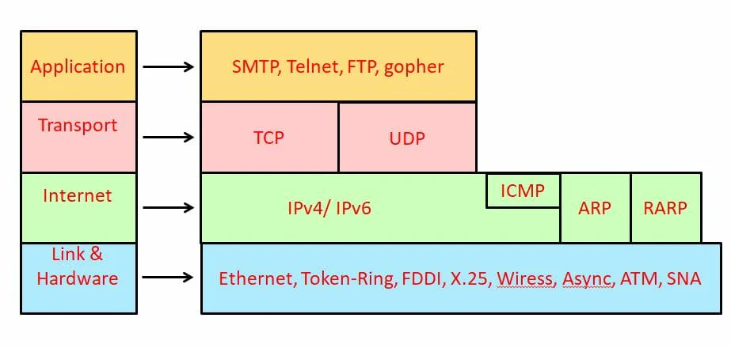

---
tags:
    - networking
    - tips
    - mtu
---

# Checking MTU

Check the MTU (Maximum Transmission Unit) of a network interface using the ping command with the Don't Fragment (DF) flag.

```
ping -M do -s 1472 <destination>
```

- `-M do` → Enables the Don't Fragment (DF) flag, preventing packet fragmentation.
- `-s 1472` → Specifies the payload size (1472 bytes is used for standard Ethernet with an MTU of 1500).

!!! note "1472"
    The payload size of 1472 is used because the ICMP header is 8 bytes, and IP header 20 which makes the total packet size 1500 bytes.
     
    
## usage

To find the actual MTU, decrease the -s value in steps until you get a successful response.