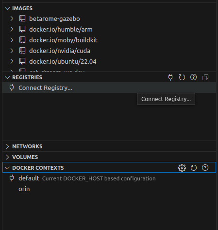

---
tags:
    - vscode
    - devcontainer
    - remote
    - context
---

# Run dev container on remote host

## Prepared host
### SSH key

```bash
ssh-keygen -t ed25519 -C "dev@gmail.com"
```

```bash
ssh-copy-id <user>r@<host>
```

---

## Prepared VSCode
- install `Remote - SSH` (ms-vscode-remote.remote-ssh) extension
- install `Dev Containers` (ms-vscode-remote.remote-containers) extension


## Config docker context
Docker context defines the endpoint (i.e., the target Docker Engine) that the Docker CLI talks to. This allows you to easily switch between local Docker engines, remote Docker hosts

## Create docker context for the remote host

```bash
docker context create <remote_name></remote_bane> --docker "host=ssh://user@remote-host"

docker context create orin --docker "host=ssh://user@10.0.0.4"

docker context ls
```


---

## VSCode working with Devcontainer on Remote machine
- Create folder on host and remote machine with the same path
- Change to remote context from docker/containers extension


### Change docker context



### Create folders
Create project folder on the **remote** machine
in the same location like the **local** machine


---

### Demo

```json title="devcontainer.json"
{
  "name": "Remote DevContainer",
  "workspaceFolder": "/workspaces/vscode_remote_devcontainer",
  "build": {
    "dockerfile": "Dockerfile"
  },
  "remoteUser": "user",
  "runArgs": ["--network=host"],
  "postCreateCommand": "echo 'DevContainer is ready!'"
}

```


### Dockerfile
Base on ubuntu 22.04 add none root user and install and config `sudo`


```Dockerfile
FROM ubuntu:22.04

ARG DEBIAN_FRONTEND=noninteractive

ARG USERNAME=user
ARG USER_UID=1000
ARG USER_GID=$USER_UID

# Check if "ubuntu" user exists, delete it if it does, then create the desired user
RUN if getent passwd ubuntu > /dev/null 2>&1; then \
        userdel -r ubuntu && \
        echo "Deleted existing ubuntu user"; \
    fi && \
    groupadd --gid $USER_GID $USERNAME && \
    useradd -s /bin/bash --uid $USER_UID --gid $USER_GID -m $USERNAME && \
    echo "Created new user $USERNAME"

# Add sudo support for the non-root user
RUN apt-get update && apt-get install -y sudo \
  && echo $USERNAME ALL=\(root\) NOPASSWD:ALL > /etc/sudoers.d/$USERNAME\
  && chmod 0440 /etc/sudoers.d/$USERNAME \
  && rm -rf /var/lib/apt/lists/*


  ARG DEBIAN_FRONTEND=
```

---

# Run

!!! warning
    How to sync files from remote to local machine