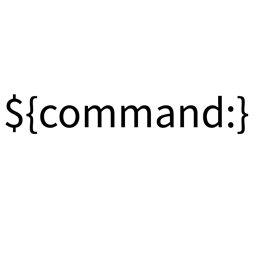

---
tags:
    - vscode
    - extensions
---

# VSCode Extensions

<div class="grid-container">
    <div class="grid-item">
        <a href="command_variable">
        
        <p>Command Variable</p>
        </a>
    </div>
    <div class="grid-item">
    <a href="dev_container">
        
        <p>TBD</p>
        </a>
    </div>
    <div class="grid-item">
        <a href="remote_ssh">
        
        <p>TBD</p>
        </a>
    </div>
   
</div>

## Download vsix link


```
 https://marketplace.visualstudio.com/_apis/public/gallery/publishers/${publisher}/vsextensions/${extension}/${version}/vspackage
```

### Demo

Download [ROS2 Topic Viewer](https://marketplace.visualstudio.com/items?itemName=AlessandroSofia.ros2-topic-viewer) and install offline

- publisher: AlessandroSofia
- extension: ros2-topic-viewer
- Version: 0.1.3

```bash
wget https://marketplace.visualstudio.com/_apis/public/gallery/publishers/AlessandroSofia/vsextensions/ros2-topic-viewer/0.1.3/vspackage
```

```bash
code --install-extension AlessandroSofia.ros2-topic-viewer-0.1.3.vsix
```