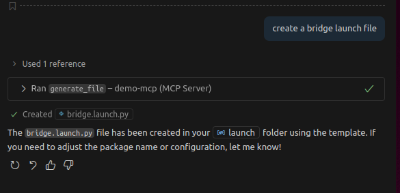

{{ page_folder_links() }}

The demo combine prompt and tool the generate file it use `rules` file to guide copilot to use the prompt from our mcp server


```

├── mcp_demo.py
├── .copilot
│   └── rules.json
├── .vscode
│   ├── settings.json
│   └── mcp.json
└── templates
    ├── bridge.launch.py
    ├── gazebo.launch.py
    └── rviz.launch.py

```

<details>
    <summary>.vscode/mcp.json</summary>
```json
--8<-- "docs/DevOps/vscode/mcp/generate_files/code/mcp.json"
```
</details>

<details>
    <summary>.copilot/rules.json</summary>
```json
--8<-- "docs/DevOps/vscode/mcp/generate_files/code/rules.json"
```
</details>

<details>
    <summary>mcp_demo.py</summary>
```python
--8<-- "docs/DevOps/vscode/mcp/generate_files/code/mcp.py"
```
</details>

---

## Usage

