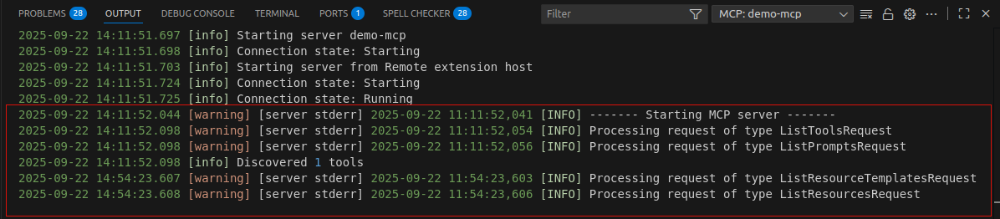
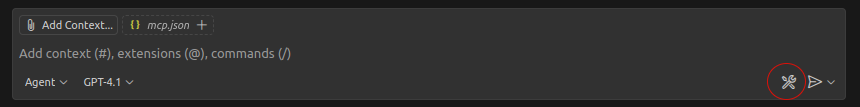
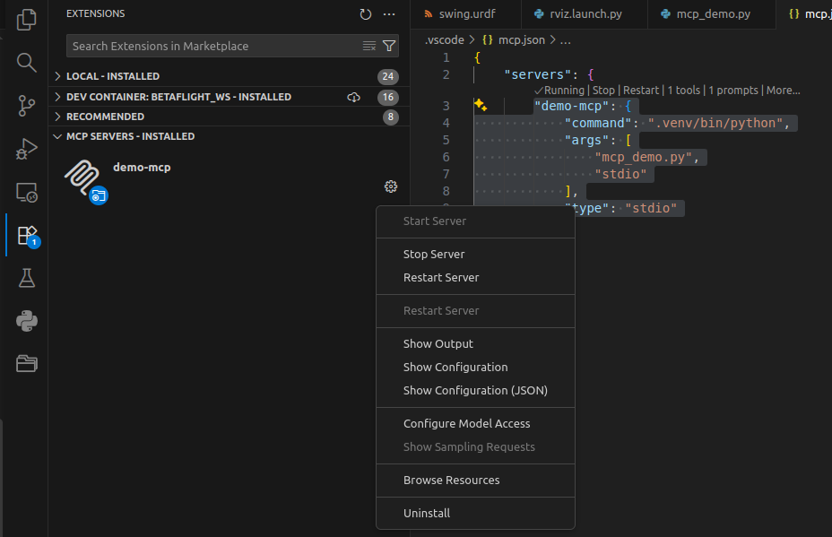
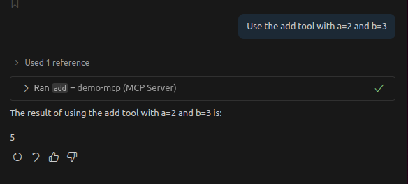

{{ page_folder_links() }}

MCP (Model Context Protocol) is an open-source standard for connecting AI applications to external systems.


## MCP Concept

- **Resources**: File-like data that can be read by clients (like API responses or file contents)
- **Tools**: Functions that can be called by the LLM (with user approval)
- **Prompts**: Pre-written templates that help users accomplish specific tasks


## Simple MCP Server demo
using python [mcp library](https://github.com/modelcontextprotocol/python-sdk)

!!! warning "uv"
    Must of the example use `uv` the new package installer and runner
    I still use pip and the old virtual environment
     

!!! tip "using logging"
    Using logging and not print

    ```python
    import logging


    logging.basicConfig(level=logging.INFO,
        format="%(asctime)s [%(levelname)s] %(message)s"
    )

    log = logging.getLogger(__name__)
    ```


### Logging
The logging from the mcp server mark is `warning` and from [server stderr] as source , is ok and not an **error** the mcp output to stderr we can show from the image below that the rest of the logging line describe to output from our mcp server





### Install
```bash
pip install mcp[cli]
pip install trio #  friendly Python library for async concurrency and I/O
```

### Very simple server

```python

from mcp.server.fastmcp import FastMCP
import logging


logging.basicConfig(level=logging.INFO,
    format="%(asctime)s [%(levelname)s] %(message)s"
    )

log = logging.getLogger(__name__)


# Create an MCP server
mcp = FastMCP("Demo")
log.info("------- Starting MCP server -------")


@mcp.tool()
def add(a: int, b: int) -> int:
    """Add two numbers together."""
    return a + b

# Prompt: greeting
@mcp.prompt()
def greet(name: str) -> str:
    """Generate a greeting prompt."""
    return f"Please write a short greeting for {name}."

# Resource: static greeting
@mcp.resource("hello://{name}")
def hello(name: str) -> str:
    """Return a static greeting resource."""
    return f"Hello, {name}!"

# Entrypoint
if __name__ == "__main__":
    mcp.run()
```


### Register the server in vscode
From `mcp.json` file we can manage the server: start, stop, show output(log) and more
```json title="mcp.json"
{
    "servers": {
        "demo-mcp": {
            "command": ".venv/bin/python",
            "args": [
                "mcp_demo.py",
                "stdio"
            ],
            "type": "stdio"
        }
    }
}
```

The `tools` relevant only from agent mode and can config using the tool icon



### Manage
From vscode extensions tab



### Usage from copilot

#### @mcp.tool()
- Purpose: Expose a Python function as a structured action the client (Copilot Chat, Cursor, Windsurf, etc.) can call.
- Input/Output: JSON-serializable arguments and return values.
- Use case: Do something deterministic (math, file ops, API calls).

!!! note "permission"

     
```title="agent mode"
Use the add tool with a=2 and b=3
```



#### @mcp.prompt()
- Purpose: Expose a prompt template (reusable instruction).
- Input: Arguments you want to inject into the prompt string.
- Output: A text template that will be fed to the AI.
- Use case: Style instructions, boilerplate phrasing, workflows.


```
Use the greet prompt with name="Amir"
```

#### @mcp.resource()
- Purpose: Expose structured data sources the client can browse/fetch.
- Input: Usually a URI-like parameter (you define the pattern).
- Output: String or JSON content.
- Use case: Provide documents, snippets, templates, or data.


```
Fetch hello://Alice
```

---

## More Demos

<div class="grid-container">
    <div class="grid-item">
        <a href="generate_files">
        <p>Generate files from templates</p>
        </a>
    </div>
    <div class="grid-item">
    <a href="">
        <p></p>
        </a>
    </div>
    <div class="grid-item">
        <a href="">
        <p></p>
        </a>
    </div>
</div>
---

## Resources

- [MCP Servers for VS Code (Crash Course)](https://www.youtube.com/watch?v=Dklv1DkYgK8)
- [Visual Studio code + CMP server getting started guid what why how](https://youtu.be/iS25RFups4A)
- [Create MCP Servers from Python Code in 10.5 Minutes](https://youtu.be/2hwrxAbw-9Y)
- [MCP Server in Python — Everything I Wish I’d Known on Day One](https://www.digitalocean.com/community/tutorials/mcp-server-python)