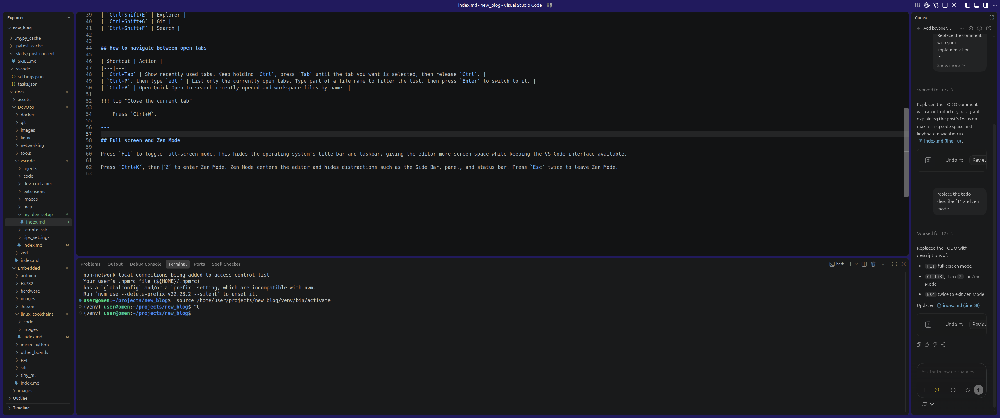
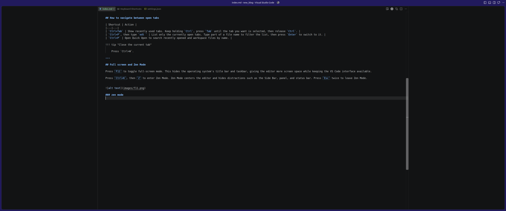

This setup keeps VS Code focused on the code by hiding space-consuming UI elements and relying on keyboard shortcuts for navigation. The settings below maximize the editor area, while the shortcut reference makes it easy to move between files, symbols, definitions, and tools without reaching for the mouse.

```json
{
    "window.commandCenter": false,
    "workbench.activityBar.location": "hidden",

    "editor.minimap.enabled": false,
    # remove file path
    "breadcrumbs.enabled": false,

    "window.menuBarVisibility": "compact",

    "workbench.statusBar.visible": true,
    #When enabled, VS Code keeps the surrounding function/class/scope names visible at the top of the editor while you scroll down
    "editor.stickyScroll.enabled": false
}
```

| Shortcut | Action |
|---|---|
| `Ctrl+P` | Find/open file |
| `Ctrl+Shift+O` | Find symbol in current file |
| `Ctrl+T` | Find symbol in workspace |
| `F12` | Go to definition |
| `Alt+F12` | Peek definition |
| `Shift+F12` | Find references |
| `Ctrl+B` | Toggle Side Bar |
| `Ctrl+Alt + B` | Toggle secondary bar (Chat Bar) |
| `Ctrl+J` | Toggle terminal/panel |
| `Ctrl+Shift+E` | Explorer |
| `Ctrl+Shift+G` | Git |
| `Ctrl+Shift+F` | Search |
| `Ctrl+0` | focus primary side bar (the result: like open explorer) |


## How to navigate between open tabs

| Shortcut | Action |
|---|---|
| `Ctrl+Tab` | Show recently used tabs. Keep holding `Ctrl`, press `Tab` until the tab you want is selected, then release `Ctrl`. |
| `Ctrl+P`, then type `edt ` | List only the currently open tabs. Type part of a file name to filter the list, then press `Enter` to switch to it. |
| `Ctrl+P` | Open Quick Open to search recently opened and workspace files by name. |

!!! tip "Close the current tab"

    Press `Ctrl+W`.

---

## Full screen and Zen Mode

Press `F11` to toggle full-screen mode. This hides the operating system's title bar and taskbar, giving the editor more screen space while keeping the VS Code interface available.

Press `Ctrl+K`, then `Z` to enter Zen Mode. Zen Mode centers the editor and hides distractions such as the Side Bar, panel, and status bar. Press `Esc` twice to leave Zen Mode.




### Zen mode



---

## Split and navigation

Split the editor when you want to view or edit multiple files at the same time.

| Shortcut | Action |
|---|---|
| `Ctrl+\` | Split the current editor vertically, opening a new pane to the right. |
| `Ctrl+K`, then `Ctrl+\` | Split in the direction perpendicular to the current layout. In a vertical layout, this creates a horizontal split. |
| `Ctrl+1`, `Ctrl+2`, `Ctrl+3` | Focus the first, second, or third editor pane. |

You can also open the Command Palette with `Ctrl+Shift+P` and run **View: Split Editor Right** or **View: Split Editor Down** to choose the split direction explicitly. After creating panes, use `Ctrl+1`, `Ctrl+2`, and so on to move between them without using the mouse.
