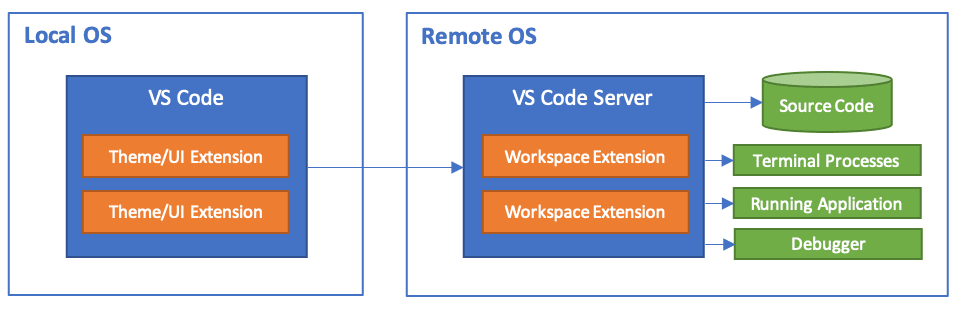

---
tags:
    - vscode
    - remote
    - ssh
    - vscode-server
---
The Remote - SSH extension lets you use any remote machine with a SSH server as your development environment.




!!! warning "VSCode server"
  The server base on node.js and work best with  64-bit x86 glibc-based Linux distributions
  it work also with distribution the base:

  ```
  kernel >= 4.18
  glibc >= 2.28
  libstdc++ >= 3.4.25
  bash
  tar
  curl or wget
  OpenSSH server
  ```  

| ext  | install name  |
|---|---|
| Remote-ssh  | ms-vscode-remote.remote-ssh  |
| Remote ssh : edit configuration file  | ms-vscode-remote.remote-ssh-edit  |


---

## ssh config
`~/.ssh/config` is a configuration file for the SSH client. It lets you save connection settings so you don't have to type long SSH commands every time.

```
Host robot
    HostName 192.168.1.50
    User ubuntu
    Port 22
    IdentityFile ~/.ssh/id_ed25519
```

| Setting        | Meaning                           |
<!-- | -------------- | --------------------------------- | -->
| `Host`         | Local nickname / matching pattern |
| `HostName`     | Real hostname or IP               |
| `User`         | Remote username                   |
| `Port`         | SSH server port                   |
| `IdentityFile` | Private SSH key to use            |

## Tips
### Add x11 support

Add ForwardX11 and ForwardX11Trusted to user `.ssh/config` file

```
Host 10.0.0.4
  HostName 10.0.0.4
  User user
  ForwardX11 yes
  ForwardX11Trusted yes
```

### Vscode remote default extension

```json
{
    "remote.SSH.defaultExtensions": [
        "ms-vscode.cpptools",
        "ms-vscode.cmake-tools"
    ]
}
```


