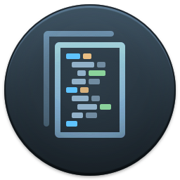

---
tags:
    - vscode
    - tips
    - settings
---

# VSCode tips and settings

<div class="grid-container">
    <div class="grid-item">
        <a href="tasks">
        
        <p>Tasks</p>
        </a>
    </div>
    <div class="grid-item">
    <a href="launch">
        
        <p>Launch</p>
        </a>
    </div>
    <div class="grid-item">
        <a href="snippets">
        
        <p>Snippets</p>
        </a>
    </div>
</div>


- [Keyboard shortcuts](#keyboard-shortcuts)
- [Editor](#editor)
- [Workbanch](#workbench)
- [Terminal](#terminal)

## keyboard shortcuts
### VSCode explorer 
Add `new file` and `new folder` keyboard shortcut in file explorer

Add `key` to `keybindings.json` file
```json
{
    "key": "ctrl+n",
    "command": "explorer.newFile",
    "when": "explorerViewletFocus"
},
{
    "key": "ctrl+shift+n",
    "command": "explorer.newFolder",
    "when": "explorerViewletFocus"
},
```


---


## Terminal
### run script when terminal open

```json
"terminal.integrated.profiles.linux": {
      "bash": {
          "path": "bash",
          "icon": "terminal-bash",
          "args": ["--rcfile", "<project>/env.sh"]
      }
  }
```

- rcfile: specify an alternative initialization file (RC file) to source when starting a new bash session

---

## Editor

### Use tab instead of space
Config `tab` and not `space` for shell script
```json
 "[shellscript]": {
            "editor.insertSpaces": false,
            "editor.tabSize": 4,
            "editor.detectIndentation": false
        },
```

When `editor.detectIndentation` false, VS Code ignores the file’s existing indentation and uses the user-defined settings (e.g., editor.tabSize, editor.insertSpaces).


---
## Workbench
- [Mark active tab](#add-custom-color-to-active-tab)
- [Tab focus mode](#tab-key-function)
- [Preview mode](#preview-mode)

### Tab key function

I accidentally pressed some key combonition and the "Tab" switch the focus mode between pans' using command pallette to change tab function


### Add custom color to active tab

```json
"workbench.colorCustomizations": {
        "tab.activeBorder": "#ff0000",
        "tab.activeBackground": "#373737"
    },
```

### Preview mode
[preview or not](https://vscode.one/new-tab-vscode/)

#### Preview mode
VSCode default

Preview Mode tabs **are not kept open**. As soon as you go to open another file from the sidebar, the existing Preview Mode tab (if one exists) is used. You can determine if a tab is in Preview Mode, by looking at its title in the tab bar. If the title is italic, the tab is in preview mode.

To open a file for editing (i.e. don't open in Preview Mode), double-click on the file in the sidebar, or single-click it in the sidebar then double click the title of its Preview Mode tab.

- Clicking on a file in the explorer opens it in the editor in preview (the file name well be italic).
- Dbl-clicking on a file in the explorer opens it in the editor in a new tab.
- To switch file from preview to tab, dbl-click on the file title bar. (or start to edit)


#### Disabled preview mode
```json
"workbench.editor.enablePreview": false,
```