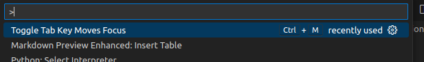

---
tags:
    - vscode
    - tips
    - settings
---


# VSCode tips and settings

<div class="grid-container">
    <div class="grid-item">
        <a href="tasks">
        
        <p>Tasks</p>
        </a>
    </div>
    <div class="grid-item">
    <a href="launch">
        
        <p>Launch</p>
        </a>
    </div>
    <div class="grid-item">
        <a href="remote_ssh">
        
        <p>TBD</p>
        </a>
    </div>
</div>

- [Keyboard shortcuts](#keyboard-shortcuts)
- [Editor](#editor)
- [Terminal](#terminal)

## keyboard shortcuts
### VSCode explorer 
Add `new file` and `new folder` keyboard shortcut in file explorer

Add `key` to `keybindings.json` file
```json
{
    "key": "ctrl+n",
    "command": "explorer.newFile",
    "when": "explorerViewletFocus"
},
{
    "key": "ctrl+shift+n",
    "command": "explorer.newFolder",
    "when": "explorerViewletFocus"
},
```


---


## Terminal
### run script when terminal open

```json
"terminal.integrated.profiles.linux": {
      "bash": {
          "path": "bash",
          "icon": "terminal-bash",
          "args": ["--rcfile", "<project>/env.sh"]
      }
  }
```

- rcfile: specify an alternative initialization file (RC file) to source when starting a new bash session

---


## Editor
- [Mark active tab](#add-custom-color-to-active-tab)
- [Tab focus mode](#tab-key-function)


### Tab key function

I accidentally pressed some key combonition and the "Tab" switch the focus mode between pans' using command pallette to change tab function



### Add custom color to active tab

```json
"workbench.colorCustomizations": {
        "tab.activeBorder": "#ff0000",
        "tab.activeBackground": "#373737"
    },
```
