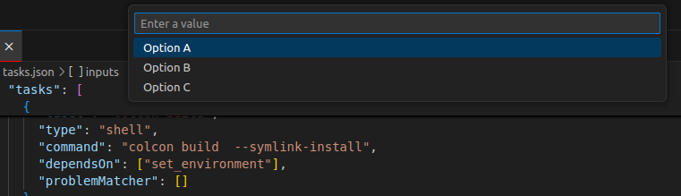

---
tags:
    - vscode
    - tips
    - tasks
---

# VSCode Tasks

## Inputs
Inputs provide a way to get user-defined values before running a task.

- promptString
- pickString

### promptString

```json
{
  "version": "2.0.0",
  "tasks": [
    {
      "label": "Run script with input",
      "type": "shell",
      "command": "echo User entered: ${input:myInput}",
      "problemMatcher": [],
      "group": "build"
    }
  ],
  "inputs": [
    {
      "id": "myInput",
      "type": "promptString",
      "description": "Enter a value"
    }
  ]
}

```

### pickString

```json
{
  "version": "2.0.0",
  "tasks": [
    {
      "label": "Run script with input",
      "type": "shell",
      "command": "echo User entered: ${input:myInput}",
      "problemMatcher": [],
      "group": "build"
    }
  ],
  "inputs": [
    {
      "id": "myInput",
      "type": "pickString",
      "description": "Enter a value",
      "options": ["Option A", "Option B", "Option C"]
    }
  ]
}

```


<figure>
  
  <figcaption>VSCode pickString</figcaption>
</figure>

