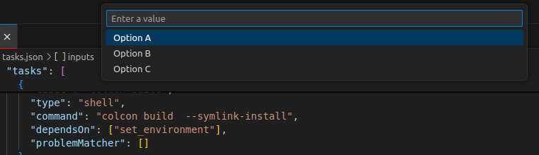
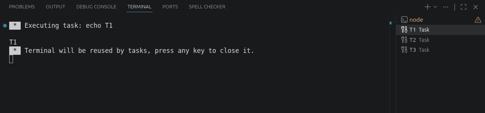
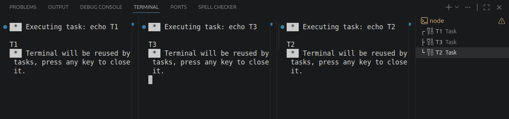

---
tags:
    - vscode
    - tips
    - tasks
---

# VSCode Tasks

VS Code tasks automate repeatable commands such as building, testing, formatting,
starting development services, or opening a prepared terminal layout. Workspace
tasks are normally stored in `.vscode/tasks.json`, so they can be committed and
shared with the rest of the project.

Open the Command Palette and use:

- **Tasks: Configure Task** to create or edit `tasks.json`.
- **Tasks: Run Task** to select and run a task.
- **Tasks: Run Build Task** to run the default build task.
- **Tasks: Terminate Task** to stop a running task.

## Basic task

```json title=".vscode/tasks.json"
{
  "version": "2.0.0",
  "tasks": [
    {
      "label": "Build project",
      "type": "shell",
      "command": "cmake",
      "args": ["--build", "${workspaceFolder}/build"],
      "options": {
        "cwd": "${workspaceFolder}"
      },
      "problemMatcher": [],
      "group": {
        "kind": "build",
        "isDefault": true
      }
    }
  ]
}
```

Important fields:

| Field | Purpose |
| --- | --- |
| `label` | Name shown by **Tasks: Run Task** and used by `dependsOn` |
| `type` | `shell` uses a shell; `process` starts an executable directly |
| `command` | Program or shell command to run |
| `args` | Arguments passed as separate values, avoiding one long command string |
| `options.cwd` | Working directory for the task |
| `options.env` | Environment variables added or overridden for the task |
| `problemMatcher` | Parses compiler or tool output into VS Code problems |
| `group` | Assigns a task to the build or test group |
| `presentation` | Controls terminal creation, focus, reveal, reuse, and grouping |

Prefer `args` over embedding every argument in `command`. This makes quoting
clearer and usually behaves more consistently across platforms.

---

## Inputs
Inputs provide a way to get user-defined values before running a task.

- promptString
- pickString
- command

### promptString

```json
{
  "version": "2.0.0",
  "tasks": [
    {
      "label": "Run script with input",
      "type": "shell",
      "command": "echo User entered: ${input:myInput}",
      "problemMatcher": [],
      "group": "build"
    }
  ],
  "inputs": [
    {
      "id": "myInput",
      "type": "promptString",
      "description": "Enter a value"
    }
  ]
}

```

### pickString

```json
{
  "version": "2.0.0",
  "tasks": [
    {
      "label": "Run script with input",
      "type": "shell",
      "command": "echo User entered: ${input:myInput}",
      "problemMatcher": [],
      "group": "build"
    }
  ],
  "inputs": [
    {
      "id": "myInput",
      "type": "pickString",
      "description": "Enter a value",
      "options": ["Option A", "Option B", "Option C"]
    }
  ]
}

```


<figure>
  
  <figcaption>VSCode pickString</figcaption>
</figure>

---


## Multiple terminals

A compound task can start several child tasks. Multiple dependencies run in
parallel by default. 

```json
{
  "version": "2.0.0",
  "tasks": [
    {
      "label": "Start all services",
      "dependsOn": [
        "T1",
        "T2",
        "T3"
      ],
      "problemMatcher": []
    },
    {
      "label": "T1",
      "type": "shell",
      "command": "echo T1",
      "isBackground": true,
      "problemMatcher": [],
    },
    {
      "label": "T2",
      "type": "shell",
      "command": "echo T2",
      "isBackground": true,
      "problemMatcher": [],
    },
    {
      "label": "T3",
      "type": "shell",
      "command": "echo T3",
      "isBackground": true,
      "problemMatcher": [],
    }
  ]
}
```



Giving the child tasks the same `presentation.group` places
their terminals in split panes within one terminal group.

```json title=".vscode/tasks.json"
{
  "version": "2.0.0",
  "tasks": [
    {
      "label": "Start all services",
      "dependsOn": [
        "T1",
        "T2",
        "T3"
      ],
      "problemMatcher": []
    },
    {
      "label": "T1",
      "type": "shell",
      "command": "echo T1",
      "isBackground": true,
      "problemMatcher": [],
      "presentation": {
        "group": "development",
        "panel": "dedicated",
        "reveal": "always",
        "focus": false
      }
    },
    {
      "label": "T2",
      "type": "shell",
      "command": "echo T2",
      "isBackground": true,
      "problemMatcher": [],
      "presentation": {
        "group": "development",
        "panel": "dedicated",
        "reveal": "always",
        "focus": true
      }
    },
    {
      "label": "T3",
      "type": "shell",
      "command": "echo T3",
      "isBackground": true,
      "problemMatcher": [],
      "presentation": {
        "group": "development",
        "panel": "dedicated",
        "reveal": "always",
        "focus": false
      }
    }
  ]
}
```

Run **Tasks: Run Task → Start all services**. VS Code starts the three child
tasks at the same time and shows them as split terminals.



!!! note "Background task readiness"
    An empty `problemMatcher` does not tell VS Code when a background service is
    ready. If another task must wait for a server or watcher, configure a
    background problem matcher with `beginsPattern` and `endsPattern`.

## Run tasks in sequence

Dependencies run in parallel unless the compound task sets
`"dependsOrder": "sequence"`:

```json
{
  "label": "Build then test",
  "dependsOrder": "sequence",
  "dependsOn": ["Build project", "Run tests"],
  "problemMatcher": []
}
```

Every task in the sequence must finish before the next one starts. A long-lived
background task therefore needs a background problem matcher that reports when
the task is ready.

## Reuse or separate terminals

Useful `presentation` settings include:

| Setting | Common values | Effect |
| --- | --- | --- |
| `reveal` | `always`, `silent`, `never` | When the terminal panel is shown |
| `focus` | `true`, `false` | Whether the task terminal receives keyboard focus |
| `panel` | `shared`, `dedicated`, `new` | Reuse one panel, reuse per task, or create a new panel |
| `group` | Any string | Tasks with the same value appear as split panes |
| `clear` | `true`, `false` | Clear the terminal before running |
| `showReuseMessage` | `true`, `false` | Show or hide the terminal reuse message |

## Useful variables

Variables keep tasks portable between machines and workspaces:

```json
{
  "label": "Show active file",
  "type": "shell",
  "command": "printf",
  "args": [
    "workspace=%s\\nfile=%s\\n",
    "${workspaceFolder}",
    "${relativeFile}"
  ],
  "problemMatcher": []
}
```

Common variables include `${workspaceFolder}`, `${relativeFile}`,
`${fileBasename}`, `${selectedText}`, `${env:NAME}`, and `${config:setting}`.

## References

- [Integrate with external tools using tasks](https://code.visualstudio.com/docs/debugtest/tasks){:target="_blank"}
- [VS Code variables reference](https://code.visualstudio.com/docs/reference/variables-reference){:target="_blank"}
- [Tasks schema and presentation options](https://code.visualstudio.com/docs/reference/tasks-appendix){:target="_blank"}
