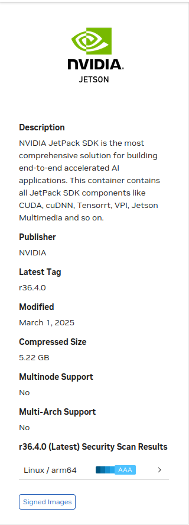
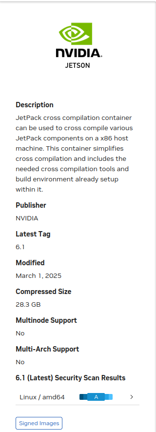
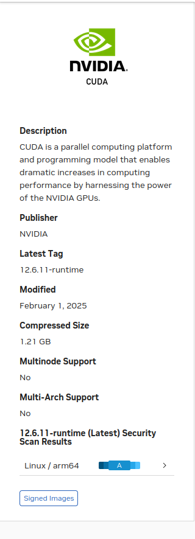

---
tags:
    - nvidia
    - jetson
    - docker
    - docker-compose
---

# Docker nvidia

[Nvidia NGC Catalog](https://catalog.ngc.nvidia.com/containers)

|   |   |   |
|---|---|---|
| [](https://catalog.ngc.nvidia.com/orgs/nvidia/containers/l4t-jetpack)  | [](https://catalog.ngc.nvidia.com/orgs/nvidia/containers/jetpack-linux-aarch64-crosscompile-x86)  | []()  |


## Jetpack

```
docker pull nvcr.io/nvidia/l4t-jetpack:r36.4.0
```
## Nvidia container runtime

```bash
sudo apt install nvidia-container-toolkit
```

```bash title="usage"
sudo docker run --gpus all --runtime=nvidia -it --rm nvcr.io/nvidia/l4t-jetpack:r36.4.0 nvidia-smi
```

## Using compose
Using compose override to run nvidia docker on pc and jetson

!!! note "nvidia runtime on jetson"
    - jetPack includes NVIDIA Container Runtime for Jetson, which is based on **nvidia-docker2**, but it does **not** auto-assign `runtime: nvidia`.
    - You must explicitly request the nvidia runtime in your Docker Compose file to enable GPU access.

    ### What Does runtime: nvidia Do?:
    
    - Enables GPU passthrough into the container.
    - Loads required GPU drivers and libraries into container's environment.
    - Makes nvidia-smi, CUDA, cuDNN, TensorRT available in the container.

### Demo: using vscode devcontainer with docker compose
- use `nvidia/cuda:12.6.0-cudnn-runtime-ubuntu22.04` as a base image
- use compose override to support pc and jetson running
- check running using `nvidia-smi`

```dockerfile
FROM nvidia/cuda:12.6.0-cudnn-runtime-ubuntu22.04

```

```yaml title="docker-compose.yaml"
services:
  dev:
    build:
      context: .
      dockerfile: .devcontainer/Dockerfile
    deploy:
      resources:
        reservations:
          devices:
            - capabilities: [gpu]
    volumes:
      - .:/workspace:cached
    hostname: dev
    network_mode: host
    stdin_open: true
    tty: true

```

```yaml title="docker-compose.jetson.yaml"
services:
  dev:
    runtime: nvidia
    environment:
      - NVIDIA_VISIBLE_DEVICES=all
      - NVIDIA_DRIVER_CAPABILITIES=compute,utility

```


### VScode devcontainer

```json
{
    "name": "opencv_cuda",
    "dockerComposeFile": [
      "../docker-compose.yaml",
      "../docker-compose.jetson.yaml"
    ],
    "service": "dev",
    "shutdownAction": "stopCompose",
    "workspaceFolder": "/workspace",
    "customizations": {
      "vscode": {
        "extensions": [],
        "settings": {}
      }
    }
  }
```