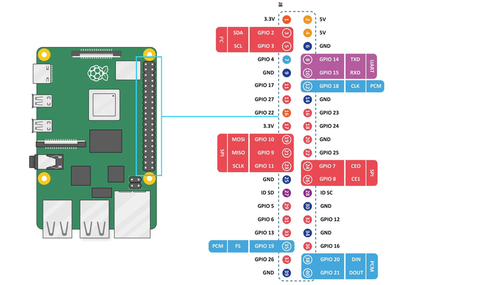

---
tags:
    - raspberry pi
    - rpi
    - gpio
    - gpiod
---

# Raspberry Pi GPIO using gpiod

gpiod (libgpiod) is a modern, fast, and safe way to control GPIOs on Linux-based systems
the gpiod library work with `/dev/gpiochip*`

!!! note 
    gpiod replaces the deprecated `/sys/class/gpio` interface.
     

## Install

```bash
sudo apt install gpiod
```

## usage

gpiod installed 6 utils

- gpiodetect: List all GPIO chips on the system
- gpiofind: Find a GPIO by label
- gpioget: Turn GPIOs ON/OFF
- gpioset: Read digital input state
- gpioinfo: Show info about all lines on a chip
- gpiomon: Monitor GPIOs for edge events


## Demo: using gpiod utilities with rpi5




```bash title="gpiodetect"
gpiodetect
#
gpiochip0 [gpio-brcmstb@107d508500] (32 lines)
gpiochip1 [gpio-brcmstb@107d508520] (4 lines)
gpiochip2 [gpio-brcmstb@107d517c00] (15 lines)
gpiochip3 [gpio-brcmstb@107d517c20] (6 lines)
gpiochip4 [pinctrl-rp1] (54 lines)
```

!!! note gpiochip4
    Control the j8 header

```bash title="gpioset"
gpioset gpiochip4 17=1
gpioset gpiochip4 17=0
```

## Python and CPP

### cpp

```bash title="install"
sudo apt install -y libgpiod-dev 
```

<details>
    <summary>blink cpp code</summary>

```cpp
--8<-- "docs/Embedded/RPI/gpio/code/gpio_blink.cpp"
```
</details>


```bash title="build"
g++ -o gpio_toggle gpio_blink.cpp -lgpiod
```

---

### python

```bash
sudo apt install python3-libgpiod
```

<details>
    <summary>blink cpp code</summary>

```cpp
--8<-- "docs/Embedded/RPI/gpio/code/gpio_blink.py"
```
</details>