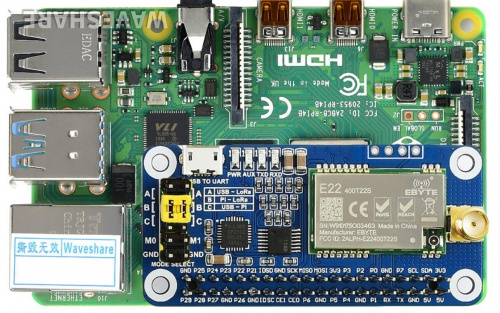
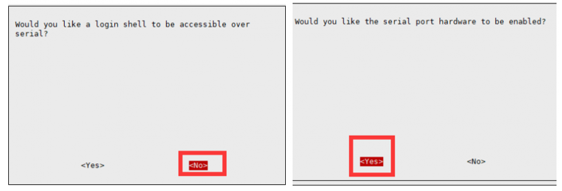
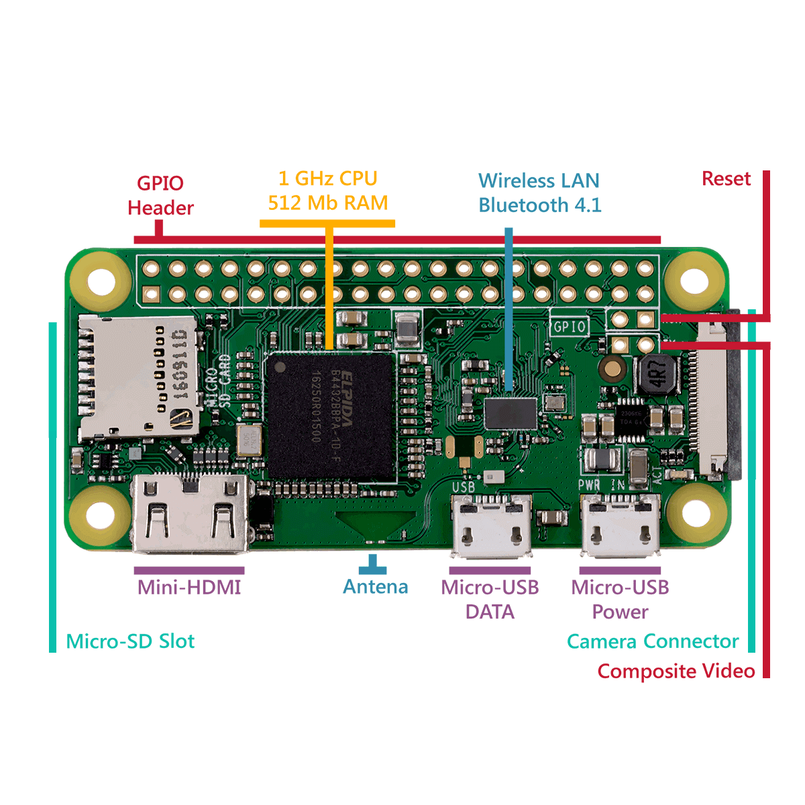
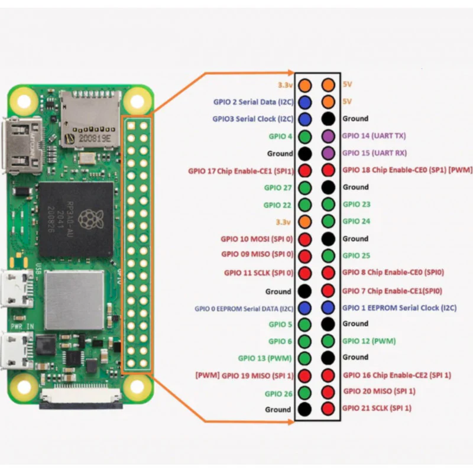

---
tags:
    - zero
    - rpi
    - lora
---

# RPi zero with lora HAT

[SX1268 433M LoRa HAT](https://www.waveshare.com/wiki/SX1268_433M_LoRa_HAT)




## Enable Serial port
- Run `sudo raspi-config`
- From Inerfacing Option select **serial**



## Install python dependencies
```bash
sudo apt install python3-pip
pip3 install --break-system-packages pyserial
```

## Add user to dialout
```bash
sudo usermod -aG dialout $USER
```

### Run demo

```bash
cd ~/SX126X_LoRa_HAT_Code/raspberrypi/python/
python3 main.py
```

---

## PinOut







---

## GPIO

