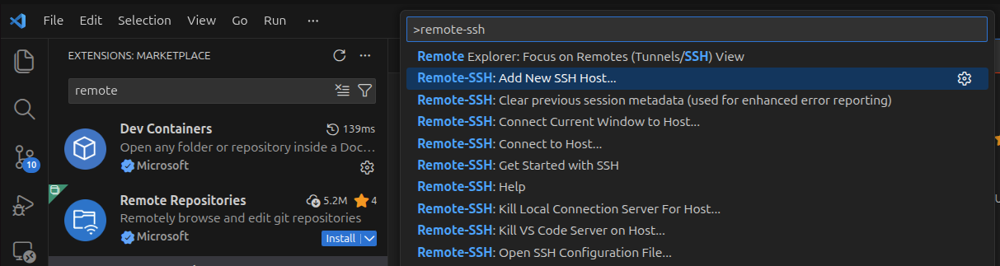
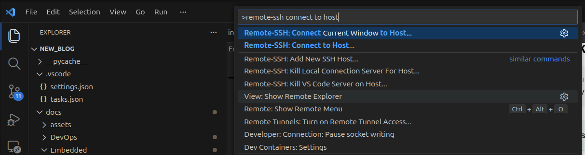
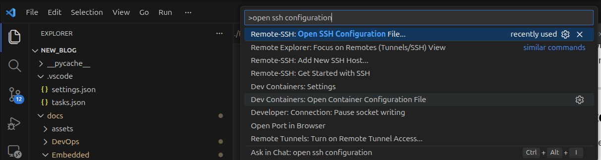
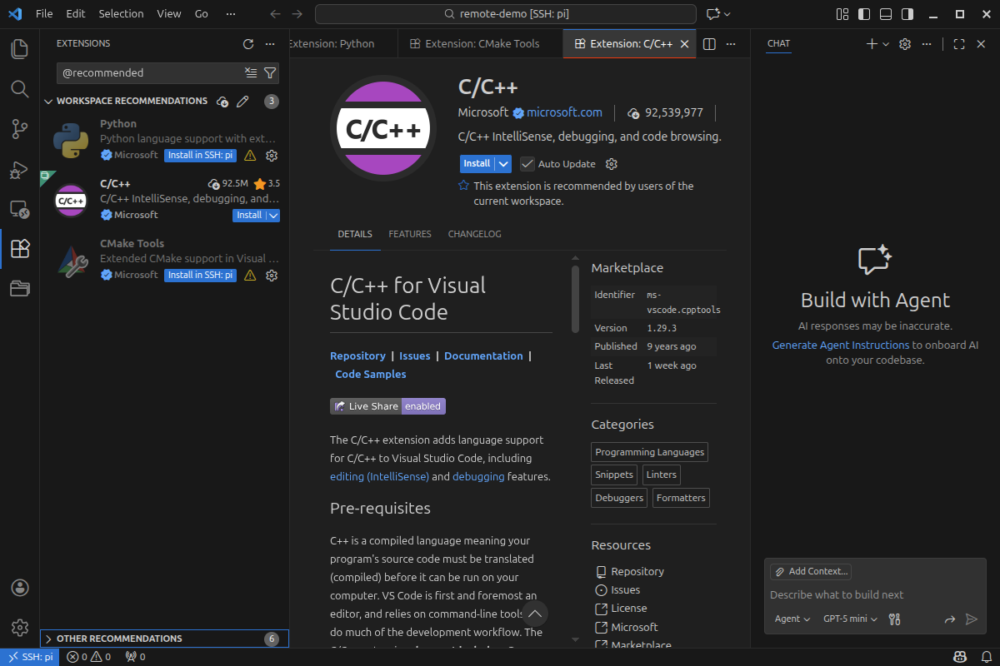

The Remote - SSH extension lets you use any remote machine with a SSH server as your development environment.

## Login using SSH key

### Create key
Create ssh key (private/public)
```bash
# ssh-keygen -t ed25519 -C "your_email@example.com"

ssh-keygen -t ed25519 -C "dev@dev.com"
# Type enter for empty passphrase
```

!!! tip Passphrase
    For simplicity (less secure) create key without passphrase
    
### Copy key to remote
Copy the public key to remote machine

```bash
# ssh-copy-id user@remote
ssh-copy-id user@pi
```

!!! tip "ssh-agent"
    If the private key has passphrase we need to type it every time we start ssh session.
    ssh-agent keep the private key after we type the passphrase once


---

## VSCode Remote-SSH

The Remote - SSH extension lets you use any remote machine with a SSH server as your development environment. [install and more](https://marketplace.visualstudio.com/items?itemName=ms-vscode-remote.remote-ssh)


---

### Remote-ssh usage
#### Add new remote



#### Connect 



#### Edit ssh config
Edit remote name and other settings



- Change remote name
- Add x11 settings

```
Host pi
    HostName 192.168.1.50
    User pi
    ForwardX11 yes
    ForwardX11Trusted yes
    # Port 2222
```

### Tip: Change prompt

```bash title="Add to .bashrc"
if [ -n "$SSH_CONNECTION" ]; then
    if [ "$EUID" -eq 0 ]; then
        PS1='🍓\[\e[1;41m\][ROOT SSH \u@\h]\[\e[0m\] \w # '
    else
        PS1='🍓\[\e[1;31m\][SSH \u@\h]\[\e[0m\] \w \$ '
    fi
fi
```

### VSCode project
All the file **exists** on the remote machine

use `extensions.json` file to control with extension will installed on the remote

```json
{
  "recommendations": [
    "ms-python.python",
    "ms-vscode.cpptools",
    "ms-vscode.cmake-tools",
  ]
}
```



