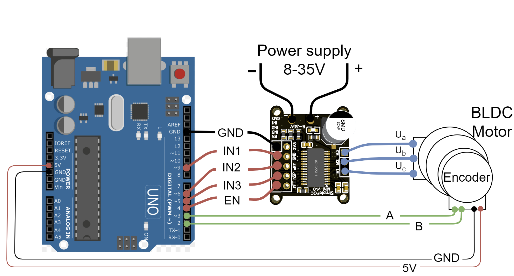

---
tags:
  - arduino
  - foc
  - bldc
---

# Using SimpleFOC library with arduino

## BOM

| Item                |                                                                                                                                                          |
| ------------------- | -------------------------------------------------------------------------------------------------------------------------------------------------------- |
| GM3506 Gimbal Motor | [Datasheet](https://shop.iflight.com/ipower-motor-gm3506-brushless-gimbal-motor-pro967?srsltid=AfmBOorxFPdcsXxCQ93Hxf0i4cnaE-LePHXlcyZ7TCP1cqd_aKF_H0R0) |
| SimpleFOCMini       | [V1.0](https://docs.simplefoc.com/simplefocmini)                                                                                                         |

## Wiring




| mini pin | EN  | IN3 | IN2 | IN1 | GND |
| -------- | --- | --- | --- | --- | --- |
| Uno pin  | 4   | 5   | 6   | 9   | GND |


## Code

```cpp title="src/main.cpp"
#include <Arduino.h>
#include <SimpleFOC.h>

// Define motor driver pins
#define PWM_A 9
#define PWM_B 6
#define PWM_C 5
#define ENABLE_PIN 4

// Create the BLDC driver object
BLDCDriver3PWM driver(PWM_A, PWM_B, PWM_C, ENABLE_PIN);

// Create the BLDC motor object
BLDCMotor motor = BLDCMotor(11); // 7 pole pairs (estimate for GM3506)

// Create an open-loop velocity control
void setup()
{
  Serial.begin(9600);

  // Initialize driver
  driver.voltage_power_supply = 12; // Set to your supply voltage
  driver.init();

  // Link driver to motor
  motor.linkDriver(&driver);

  // Open-loop velocity mode
  motor.voltage_limit = 6; // Limit voltage to half supply
  motor.controller = MotionControlType::velocity_openloop;

  // Initialize motor
  motor.init();
  Serial.println("Motor Ready!");
}

void loop()
{
  motor.move(1);
  motor.loopFOC();
}
```

!!! note Velocity
    In `velocity_openloop` mode the speed depends on supply voltage and motor parameters. 
     

```ini title="platformio.ini"
[env:uno]
platform = atmelavr
board = uno
framework = arduino
lib_deps = askuric/Simple FOC@^2.2
```

