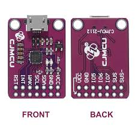
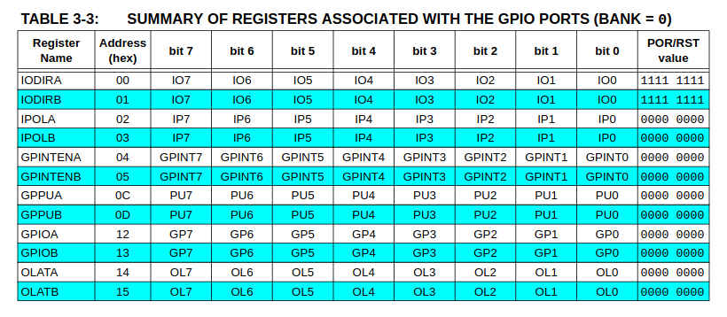

MCP23017 IO Expansion Board, I2C Interface, Expands 16 I/O Pins

- 16 GPIOs split into Port A (GPA0–GPA7) and Port B (GPB0–GPB7)
- Per-pin direction control (input or output)
- Internal pull-ups for inputs (ideal for buttons/switches)
- Interrupt support via INTA/INTB pins (or mirrored)
- Up to 8 devices on one I²C bus (addresses via A0–A2)
- Operates at 3.3V or 5V (logic follows VDD)


### Address


### Connector

| #  | name  | Color (PH2.0 20cm 6Pin x1) |
|---|---|---|
| 1  | vcc  | red  |
| 2  | gnd  | black  |
| 3  | SDA  | blue  |
| 4  | SCL  | yellow  |
| 5  | INTA  | orange  |
| 6  | INTB  | green  |

---

## CP2112
The CP2112 USB-to-I2C Bridge is a communication device between a USB host (like a PC) and I2C devices




### install

```
sudo apt install i2c-tools
```

### usage

```bash
i2cdetect -l
#
i2c-0	unknown   	Synopsys DesignWare I2C adapter 	N/A
i2c-1	unknown   	Synopsys DesignWare I2C adapter 	N/A
..
i2c-21	unknown   	CP2112 SMBus Bridge on hidraw6  	N/A

```

```bash
sudo i2cdetect -y -r 21
#
     0  1  2  3  4  5  6  7  8  9  a  b  c  d  e  f
00:                         -- -- -- -- -- -- -- -- 
10: -- -- -- -- -- -- -- -- -- -- -- -- -- -- -- -- 
20: -- -- -- -- -- -- -- 27 -- -- -- -- -- -- -- -- 
30: -- -- -- -- -- -- -- -- -- -- -- -- -- -- -- -- 
40: -- -- -- -- -- -- -- -- -- -- -- -- -- -- -- -- 
50: -- -- -- -- -- -- -- -- -- -- -- -- -- -- -- -- 
60: -- -- -- -- -- -- -- -- -- -- -- -- -- -- -- -- 
```
---

#### Output




| Register  | Use for            | Read gives                 |
| --------- | ------------------ | -------------------------- |
| `IODIRA`  | Direction          | 1=input, 0=output          |
| `GPPUA`   | Pull-ups           | Enabled bits               |
| `OLATA`   | Output latch       | Last written output values |
| `GPIOA`   | Pin state          | Actual pin logic level     |
| `INTCAPA` | Interrupt snapshot | Pin state at interrupt     |


!!! tip "OLATA vs GPIOA"
    - To CONTROL pins → OLATA
    - To OBSERVE pins → GPIOA

---

## i2c-tools

```
sudo apt install i2c-tools
```

```bash title="i2cset cli"
i2cset [OPTIONS] BUS SLAVE_ADDR REGISTER VALUE [MODE]
```

1️⃣ IODIRA(0x00) — I/O Direction Register (Port A)
IODIRA controls whether each Port A pin is an input or output.

- Address: 0x00
- Reset value: 0xFF (all inputs)

```
Bit = 1 → INPUT  (output driver OFF, Hi-Z)
Bit = 0 → OUTPUT (output driver ON)
```

##### Demo
- Config GPA0 as output 0xFE using IODIRA register
- Set/ Unset output value using register OLATA register
  
  
```bash
# i2cset [OPTIONS] BUS SLAVE_ADDR REGISTER VALUE [MODE]
sudo i2cset -y 21 0x27 0x00 0xFE b
sudo i2cset -y 21 0x27 0x14 0x01 b
sudo i2cset -y 21 0x27 0x14 0x00 b

```

---

### Input

#### Demo: 
- Config GPA1 as input
- Config it as pull-up: `GPA1 ----[ button ]---- GND`
- Create poll loop 


```bash title="init"
# config GPA1 as input
#bus: 21 address:0x27 IODIRA: 0x00 GPIA1: bit (1) 0x02
i2cset -y 21 0x27 0x00 0x02 b

# config GPA1 as pull up
# GPPUA register: 0x0c
i2cset -y 21 0x27 0x0C 0x02 b
```

```bash title="poll_loop.sh"
#/bin/bash
i2cset -y 21 0x27 0x00 0x02
i2cset -y 21 0x27 0x0C 0x02

last=""

while true; do
  v=$(i2cget -y 21 0x27 0x12)
  # convert hex string (0x..) to number
  n=$((v))

  if [ $((n & 0x02)) -eq 0 ]; then
    s="pressed"
  else
    s="released"
  fi

  if [ "$s" != "$last" ]; then
    echo "$s ($v)"
    last="$s"
  fi

  sleep 0.05
done
```

---

# TODO: implement INT on rpi and jetson board

---

## Python

```python title="blink LED"

from smbus2 import SMBus
import time


ADDRESS = 0x27
BUS = 21
REG_IODIRA = 0x00
REG_OLATA = 0x14
GPA0 = 0x01

# Initialize SMBus
bus = SMBus(BUS)
# Set GPA0 as output
iodir = bus.read_byte_data(ADDRESS, REG_IODIRA)
iodir &= ~GPA0
bus.write_byte_data(ADDRESS, REG_IODIRA, iodir)

while True:
    # Read current OLATA value
    olata = bus.read_byte_data(ADDRESS, REG_IODIRA)
    # Set GPA0 high
    olata |= GPA0
    # Write OLATA with GPA0 high
    bus.write_byte_data(ADDRESS, REG_OLATA, olata)  # OLATA
    time.sleep(1)
    olata = bus.read_byte_data(ADDRESS, REG_IODIRA)
    # Set GPA0 low
    olata &= ~GPA0
    # Write OLATA with GPA0 low
    bus.write_byte_data(ADDRESS, REG_OLATA, olata)  # OLATA
    time.sleep(1)
```

---

## TODO
- implement interrupt using rpi
- implement python simple pool

---

## Reference
- [mcp23017 datasheet](https://ww1.microchip.com/downloads/en/devicedoc/20001952c.pdf)
- [MCP23017 IO Expansion Board](https://www.waveshare.com/mcp23017-io-expansion-board.htm)