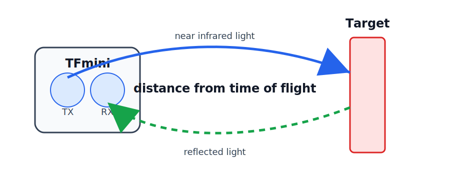
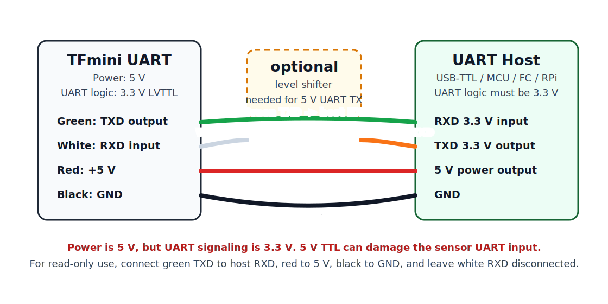

## What It Is

`TFmini 12m UART` is a small single-point LiDAR distance sensor. It measures one distance in front of the sensor, not a 2D scan.


Image source: [Benewake TFmini-S product page](https://en.benewake.com/TFminiS/index.html)



How it works:

- The sensor sends near infrared light toward the target.
- The light reflects back to the receiver.
- The sensor estimates distance from the light time-of-flight / phase difference.
- It outputs distance frames over `UART`.

The default output is a binary frame at `115200 baud`, usually `100 Hz`.

## Main Specification

| Parameter | Typical value |
| --------- | ------------- |
| Range | `0.3-12 m` indoor / weak ambient light |
| Blind zone | `0-0.3 m`, data is unreliable |
| Accuracy | about `+/-6 cm` from `0.3-6 m`, about `+/-1%` from `6-12 m` |
| Resolution | `1 cm` |
| Default frame rate | `100 Hz` |
| Supply voltage | `5 V` |
| Average current | up to about `140 mA` |
| Peak current | up to about `800 mA` |
| Interface | `UART` |
| UART default | `115200`, `8N1` |
| UART logic level | `3.3 V LVTTL` |

!!! warning
    The sensor power is `5 V`, but the UART logic is `3.3 V`. Do not drive the TFmini `RXD` pin from a `5 V TTL` UART without a logic level shifter.

## Benewake TFmini Family

Benewake has several small single-point LiDAR modules with similar names. The table below is a practical comparison for choosing a module.

| Model | Range | Interface | Protection | Power | Suitable outside? | Notes |
| ----- | ----- | --------- | ---------- | ----- | ----------------- | ----- |
| `TFmini`, older UART 12 m module | about `0.3-12 m` | `UART` | no sealed enclosure | `5 V` | Limited | Good for indoor tests or protected mounting. Not a weatherproof outdoor sensor. |
| `TF-Luna` | `0.2-8 m` | `UART`, `I2C`, `I/O` | without enclosure | `<=0.35 W` | Limited | Small and low power, but should be protected from water and dust. |
| `TFmini-S` | `0.1-12 m` | `UART`, `I2C`, `I/O` | `IP65` | `<=0.7 W` | Yes | Better option than old TFmini for outdoor or dusty use. |
| `TFmini Plus` | `0.1-12 m` | `UART`, `I2C`, `I/O` | `IP65` | about `550 mW` | Yes | Robust 12 m option with sealed enclosure. |
| `TFmini-i` | `0.1-12 m` | `CAN`, `RS-485` | `IP65` | `<=0.8 W @ 12 V` | Yes | Industrial version. Good for noisy wiring, but not a UART module. |
| `TFS20-L` | `0.2-20 m` | `UART`, `I2C` | without enclosure | `<=0.35 W` | Limited | Longer range bare module. Use enclosure if mounted outside. |

For outdoor use, prefer `IP65` or better. A bare module can still measure outside in some conditions, but it is not protected from water, dust, or mechanical exposure.

## Wiring

For the common original TFmini UART cable:

| TFmini wire color | TFmini pin | Connect to host |
| ----------------- | ---------- | --------------- |
| Green | `TXD`, 3.3 V UART output | Host `RX` |
| White | `RXD`, 3.3 V UART input | Host `TX` through 3.3 V logic |
| Red | `+5V` power | `5 V` supply |
| Black | `GND` | `GND` |



Notes:

- `TX` and `RX` are crossed: sensor `TXD` goes to host `RX`.
- Connect grounds together.
- A USB-to-TTL adapter should use `3.3 V logic` for UART.
- The sensor still needs `5 V` power. Do not power it from `3.3 V`.
- If your adapter or microcontroller UART is `5 V`, use a level shifter at least on host `TXD -> TFmini RXD`.
- If you only read distance and do not send commands, connect only `TXD`, `5 V`, and `GND`; leave TFmini `RXD` disconnected.

## Python Read Example

Install dependency:

```bash
python3 -m pip install pyserial
```

Example:

```python
import serial


PORT = "/dev/ttyUSB0"
BAUD = 115200


def read_tfmini_frame(ser):
    while True:
        if ser.read(1) != b"\x59":
            continue
        if ser.read(1) != b"\x59":
            continue

        payload = ser.read(7)
        if len(payload) != 7:
            return None

        frame = b"\x59\x59" + payload
        checksum = sum(frame[:8]) & 0xFF
        if checksum != frame[8]:
            return None

        distance_cm = frame[2] + (frame[3] << 8)
        strength = frame[4] + (frame[5] << 8)
        temperature_raw = frame[6] + (frame[7] << 8)
        temperature_c = temperature_raw / 8.0 - 256.0

        return distance_cm, strength, temperature_c


def main():
    with serial.Serial(PORT, BAUD, timeout=0.1) as ser:
        while True:
            data = read_tfmini_frame(ser)
            if data is None:
                continue

            distance_cm, strength, temperature_c = data
            print(
                f"distance={distance_cm / 100:.2f} m "
                f"strength={strength} "
                f"temperature={temperature_c:.1f} C"
            )


if __name__ == "__main__":
    main()
```

For Raspberry Pi UART, the port may be `/dev/serial0`. For a USB-TTL adapter, it is commonly `/dev/ttyUSB0` or `/dev/ttyACM0`.

## Quick Check

If no data appears:

- Check that the sensor has `5 V` power and common ground.
- Swap host `RX` and `TX` if the UART wiring may be reversed.
- Confirm the serial port name.
- Confirm baud rate is `115200`.
- Check that the host UART logic is `3.3 V`.
- Point the sensor at a target farther than `30 cm`.

## References

- [TFmini GitHub documentation](https://github.com/TFmini/TFmini)
- [TFmini FAQ](https://github.com/TFmini/FAQ)
- [SparkFun TFMini UART hookup guide](https://learn.sparkfun.com/tutorials/tfmini---micro-lidar-module-hookup-guide/all)
- [Benewake TFmini-S product page](https://en.benewake.com/TFminiS/index.html)
- [Benewake TFmini Plus product page](https://en.benewake.com/TFminiPlus/index.html)
- [Benewake product list](https://en.benewake.com/Products/info.html)
