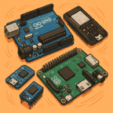

# Embedded

    

        <a href="arduino">
            
            
Arduino

        </a>
    

    

        <a href="ESP32">
            
            
ESP32

        </a>
    

    

        <a href="Jetson">
            
            
Jetson

        </a>
    

    

         <a href="RPI">
            
            
RPi

        </a>
    

    

        <a href="tiny_ml">
            
            
TinyML

        </a>
    

    

        <a href="other_boards">
            
            
Other embedded boards

        </a>
    

    

        <a href="micro_python">
            
            
micro python

        </a>
    

