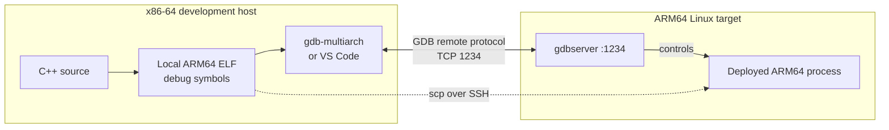

# Remote cross-debugging with GDB and VS Code

This tutorial builds a C++ program on an x86-64 Ubuntu/Debian host, runs it on
an ARM64 Linux target, and debugs it remotely with `gdb-multiarch` and
`gdbserver`. The command-line workflow comes first so that the VS Code
automation is easy to understand rather than a collection of unexplained JSON.

The Radxa ZERO 3 is used as the example target, but the same workflow applies
to other ARM64 Linux boards with SSH access.

By the end, you will be able to:

- explain which debugging components run on the host and target
- create an ARM64 Debug build with CMake
- deploy and debug the application from a GDB terminal
- inspect variables, stack frames, threads, memory, and breakpoints
- automate build, upload, and remote debugging with VS Code
- attach `gdbserver` to an already-running application

The complete example is available in the
[`code` directory](https://github.com/robobe/new_blog/tree/master/docs/Embedded/linux_toolchains/cross_debugging/code).

## How remote debugging works



The target runs the application and `gdbserver`. The host runs
`gdb-multiarch`, reads the source code, and uses the **local** ARM64 executable
for debug symbols. The local executable must be the exact build deployed to
the target; otherwise source lines, variables, and breakpoints may be wrong.

`gdbserver` is deliberately small. It controls the target process and sends
register, memory, signal, and stop information to GDB, but it does not need a
copy of the source tree.

!!! warning "Use a trusted development network"
    The GDB remote protocol does not provide authentication or encryption.
    Do not expose port `1234` to the internet or an untrusted network. Restrict
    it with a firewall or use an SSH tunnel when debugging outside a trusted
    lab network.

## Prerequisites

This tutorial assumes:

- an x86-64 Ubuntu/Debian development host
- an ARM64 Linux target using glibc
- host-to-target SSH connectivity
- permission to install packages on both machines

### Install host tools

Install the build tools, ARM64 cross-compiler, debugger, and SSH client:

```bash title="Development host"
sudo apt update
sudo apt install \
    cmake \
    ninja-build \
    g++-aarch64-linux-gnu \
    gdb-multiarch \
    openssh-client
```

Install Visual Studio Code and these extensions for the VS Code section:

- [C/C++](https://marketplace.visualstudio.com/items?itemName=ms-vscode.cpptools)
- [CMake Tools](https://marketplace.visualstudio.com/items?itemName=ms-vscode.cmake-tools)

Verify the tools:

```bash
aarch64-linux-gnu-g++ --version
gdb-multiarch --version
cmake --version
```

### Install target tools

On the ARM64 target:

```bash title="ARM64 target"
sudo apt update
sudo apt install gdbserver openssh-server
sudo systemctl enable --now ssh
```

Replace `USER` and `HOST` in this tutorial with the target login and address,
then verify the connection and architecture from the host:

```bash title="Development host"
ssh USER@HOST uname -m
```

Expected output:

```text
aarch64
```

This proves that SSH works and the target architecture matches the compiler
prefix `aarch64-linux-gnu-`.

### Check C++ runtime compatibility

The compiler package is intentionally unversioned: the correct compiler is the
one whose generated program is compatible with the target image. A sysroot or
vendor SDK is preferable when the host distribution is newer than the target.

Check the newest C++ ABI version supplied by the target:

```bash title="ARM64 target"
strings /usr/lib/aarch64-linux-gnu/libstdc++.so.6 \
    | grep '^GLIBCXX_' \
    | sort -V \
    | tail -1
```

After building, compare it with the executable requirement:

```bash title="Development host"
aarch64-linux-gnu-readelf --version-info \
    build/arm64-debug/remote_debug_demo \
    | grep 'GLIBCXX_' \
    | sort -V \
    | tail -1
```

The executable requirement must not be newer than the version provided by the
target. If it is newer, select an older compatible cross-toolchain or use the
target vendor's SDK. Do not replace the target's system `libstdc++.so.6` by
copying an arbitrary host library.

## Example project

The companion project has this structure:

```text
code/
├── .vscode/
│   ├── extensions.json
│   ├── launch.json
│   ├── settings.json
│   └── tasks.json
├── cmake/
│   └── toolchain-aarch64.cmake
├── src/
│   └── main.cpp
├── .gitignore
├── CMakeLists.txt
└── CMakePresets.json
```

### Application

The value `answer` gives us a simple variable to inspect:

```cpp title="src/main.cpp"
#include <iostream>

int main() {
    const int answer = 6 * 7; // Put a breakpoint here.
    std::cout << "Hello from the remote target. Answer: " << answer << '\n';
}
```

### CMake project

```cmake title="CMakeLists.txt"
cmake_minimum_required(VERSION 3.20)
project(remote_debug_demo LANGUAGES CXX)

add_executable(remote_debug_demo src/main.cpp)
target_compile_features(remote_debug_demo PRIVATE cxx_std_17)
target_compile_options(remote_debug_demo PRIVATE -Wall -Wextra -Wpedantic)
```

The toolchain file declares a Linux ARM64 target and locates the unversioned
cross-compiler:

```cmake title="cmake/toolchain-aarch64.cmake"
set(CMAKE_SYSTEM_NAME Linux)
set(CMAKE_SYSTEM_PROCESSOR aarch64)

find_program(AARCH64_CXX aarch64-linux-gnu-g++ REQUIRED)
set(CMAKE_CXX_COMPILER "${AARCH64_CXX}")
```

The Debug preset creates a separate build tree with debug information:

```json title="CMakePresets.json"
{
  "version": 3,
  "cmakeMinimumRequired": {
    "major": 3,
    "minor": 20,
    "patch": 0
  },
  "configurePresets": [
    {
      "name": "arm64-debug",
      "displayName": "ARM64 Debug",
      "generator": "Ninja",
      "binaryDir": "${sourceDir}/build/arm64-debug",
      "toolchainFile": "${sourceDir}/cmake/toolchain-aarch64.cmake",
      "cacheVariables": {
        "CMAKE_BUILD_TYPE": "Debug"
      }
    }
  ],
  "buildPresets": [
    {
      "name": "arm64-debug",
      "configurePreset": "arm64-debug"
    }
  ]
}
```

## Build and inspect the executable

Run from the companion `code/` directory:

```bash
cmake --preset arm64-debug
cmake --build --preset arm64-debug
```

Verify its architecture and debug information:

```bash
file build/arm64-debug/remote_debug_demo
aarch64-linux-gnu-readelf -S build/arm64-debug/remote_debug_demo \
    | grep -E '\.debug_(info|line)'
```

`file` must report an ARM AArch64 executable that is not stripped, and
`readelf` must list debug sections. This proves the host produced a debuggable
target executable rather than a native x86-64 program.

Upload and run it once before introducing the debugger:

```bash
scp build/arm64-debug/remote_debug_demo USER@HOST:/tmp/
ssh USER@HOST /tmp/remote_debug_demo
```

Expected output:

```text
Hello from the remote target. Answer: 42
```

If the application cannot run normally, fix deployment or ABI compatibility
before debugging it.

## Debug from the command line

### 1. Start gdbserver on the target

Open a target SSH terminal and run:

```bash title="ARM64 target"
gdbserver :1234 /tmp/remote_debug_demo
```

Expected output includes:

```text
Process /tmp/remote_debug_demo created; pid = ...
Listening on port 1234
```

Leave this terminal open. The application is paused before its first
instruction until a debugger connects.

### 2. Open the matching executable in GDB

From the companion project directory on the host:

```bash title="Development host"
gdb-multiarch build/arm64-debug/remote_debug_demo
```

The argument is the local ARM64 executable containing source and symbols. Do
not point GDB at the copy in `/tmp` on the target.

### 3. Connect, stop, and inspect

Enter these commands at the `(gdb)` prompt:

```gdb
target remote HOST:1234
break main
continue
next
print answer
info locals
backtrace
continue
quit
```

What each command proves:

| Command | Result |
|---|---|
| `target remote HOST:1234` | Connects local GDB to `gdbserver`. |
| `break main` | Creates a breakpoint using the local symbols. |
| `continue` | Runs the remote process until the breakpoint. |
| `next` | Executes the current source line without entering called functions. |
| `print answer` | Evaluates the variable; the checkpoint value is `42`. |
| `info locals` | Lists local variables in the selected stack frame. |
| `backtrace` | Displays the active call stack. |
| `continue` | Lets the target application finish. |
| `quit` | Closes GDB. |

`gdbserver` normally exits when the application or debug session ends. Start
it again before opening another session.

## Must-have GDB commands

### Source, breakpoints, and execution

| Command | Purpose |
|---|---|
| `list` | Show source around the current line. |
| `break LOCATION` | Stop at a function, file and line, or address. |
| `tbreak LOCATION` | Create a breakpoint that deletes itself after one hit. |
| `condition N EXPR` | Stop at breakpoint `N` only when the expression is true. |
| `info breakpoints` | List breakpoints and watchpoints. |
| `disable N` / `enable N` | Temporarily disable or enable breakpoint `N`. |
| `delete N` | Remove breakpoint `N`. |
| `continue` or `c` | Resume execution until the next stop. |
| `next` or `n` | Execute one source line, stepping over function calls. |
| `step` or `s` | Execute one source line, entering function calls. |
| `finish` | Run until the current function returns. |
| `until LOCATION` | Run until a later source line or address. |

### Variables and stack frames

| Command | Purpose |
|---|---|
| `print EXPR` or `p EXPR` | Evaluate an expression or variable. |
| `display EXPR` | Print an expression automatically whenever execution stops. |
| `info locals` | Show local variables in the selected frame. |
| `info args` | Show function arguments in the selected frame. |
| `whatis EXPR` | Show the declared type of an expression. |
| `ptype TYPE` | Show the detailed definition of a type. |
| `set variable NAME=VALUE` | Change a program variable while stopped. |
| `backtrace` or `bt` | Show the call stack. |
| `frame N` | Select stack frame `N`. |
| `up` / `down` | Move through callers and callees in the stack. |

### Threads, memory, and session control

| Command | Purpose |
|---|---|
| `info threads` | List all known threads. |
| `thread N` | Select thread `N`. |
| `thread apply all backtrace` | Print a stack trace for every thread. |
| `watch EXPR` | Stop when an expression is written and changes value. |
| `rwatch EXPR` | Stop when an expression is read. |
| `awatch EXPR` | Stop when an expression is read or written. |
| `x/16xb ADDRESS` | Examine 16 bytes of memory in hexadecimal. |
| `disassemble /m FUNCTION` | Show source lines mixed with assembly for a function. |
| `detach` | Disconnect while allowing an attached process to continue. |
| `kill` | Terminate the process controlled by `gdbserver`. |
| `quit` | Exit GDB; GDB asks what to do if the process is still active. |

Use `help COMMAND` inside GDB for the complete syntax of any command.

## Automate the workflow with VS Code

VS Code uses the same executable, debugger, port, and GDB remote protocol. A
pre-launch task performs three operations in order:

```text
Build ARM64 Debug -> Upload to remote -> Start remote gdbserver -> Connect GDB
```

### Build, upload, and server tasks

```json title=".vscode/tasks.json"
{
  "version": "2.0.0",
  "tasks": [
    {
      "label": "Build ARM64 Debug",
      "type": "shell",
      "command": "cmake --preset arm64-debug && cmake --build --preset arm64-debug",
      "group": {
        "kind": "build",
        "isDefault": true
      },
      "problemMatcher": "$gcc"
    },
    {
      "label": "Upload to remote",
      "type": "shell",
      "command": "scp build/arm64-debug/remote_debug_demo ${input:remoteUser}@${input:remoteHost}:/tmp/remote_debug_demo",
      "dependsOn": "Build ARM64 Debug",
      "problemMatcher": []
    },
    {
      "label": "Start remote gdbserver",
      "type": "shell",
      "command": "ssh ${input:remoteUser}@${input:remoteHost} 'pkill -x gdbserver 2>/dev/null || true; nohup gdbserver --once :1234 /tmp/remote_debug_demo >/tmp/gdbserver.log 2>&1 &'",
      "dependsOn": "Upload to remote",
      "problemMatcher": []
    }
  ],
  "inputs": [
    {
      "id": "remoteUser",
      "type": "promptString",
      "description": "Remote SSH user",
      "default": "radxa"
    },
    {
      "id": "remoteHost",
      "type": "promptString",
      "description": "Remote host or IP",
      "default": "192.168.1.50"
    }
  ]
}
```

| Field | Role |
|---|---|
| `dependsOn` | Forms the required build, upload, and server-start sequence. |
| `${input:remoteUser}` | Prompts for the target SSH account. |
| `${input:remoteHost}` | Prompts for the target address instead of hardcoding it. |
| `pkill -x gdbserver` | Removes a stale demo server before starting a new session. |
| `nohup ... &` | Leaves `gdbserver` running after the SSH command returns. |
| `/tmp/gdbserver.log` | Captures target-side startup and error messages. |

!!! caution "Dedicated development target"
    `pkill -x gdbserver` stops every process named `gdbserver` on the target.
    Use this automation only on a dedicated development target where it cannot
    interrupt another developer's debug session.

### Debugger launch configuration

```json title=".vscode/launch.json"
{
  "version": "0.2.0",
  "configurations": [
    {
      "name": "ARM64 remote debug",
      "type": "cppdbg",
      "request": "launch",
      "program": "${workspaceFolder}/build/arm64-debug/remote_debug_demo",
      "cwd": "${workspaceFolder}",
      "MIMode": "gdb",
      "miDebuggerPath": "/usr/bin/gdb-multiarch",
      "miDebuggerServerAddress": "${input:remoteHost}:1234",
      "stopAtEntry": false,
      "preLaunchTask": "Start remote gdbserver",
      "setupCommands": [
        {
          "description": "Enable GDB pretty-printing",
          "text": "-enable-pretty-printing",
          "ignoreFailures": true
        }
      ]
    }
  ],
  "inputs": [
    {
      "id": "remoteHost",
      "type": "promptString",
      "description": "Remote host or IP",
      "default": "192.168.1.50"
    }
  ]
}
```

| Field | Role |
|---|---|
| `program` | Supplies the matching local ARM64 executable and debug symbols. |
| `MIMode` | Tells the C/C++ extension to communicate with GDB through MI. |
| `miDebuggerPath` | Selects the host's multi-architecture GDB. |
| `miDebuggerServerAddress` | Connects GDB to port 1234 on the target. |
| `preLaunchTask` | Builds, uploads, and starts the server before GDB connects. |
| `stopAtEntry` | Leaves stopping behavior to the breakpoints you set. |

The host value is requested once by the task and again by the launch
configuration; enter the same target address both times.

### Run the VS Code session

1. Open the companion `code/` directory in VS Code.
2. Put a breakpoint on `const int answer = 6 * 7;` in `src/main.cpp`.
3. Open **Run and Debug** and select **ARM64 remote debug**.
4. Press **F5** and enter the remote user and host when prompted.
5. When execution stops, confirm that `answer` appears in the Variables panel.
6. Use **Step Over**, then continue the program.

The resolved breakpoint and visible variable prove that VS Code connected to
the target process while using the matching symbols and source on the host.

## Attach to an existing process

Launch mode starts the application under `gdbserver`. Attach mode is useful
when the process is already running.

Find its PID on the target:

```bash title="ARM64 target"
pgrep -a remote_debug_demo
```

Attach `gdbserver`, replacing `PID`:

```bash title="ARM64 target"
gdbserver --attach :1234 PID
```

Connect from the project directory on the host:

```bash
gdb-multiarch build/arm64-debug/remote_debug_demo
```

```gdb
target remote HOST:1234
backtrace
info threads
detach
quit
```

Attaching may require the same user as the process, appropriate `ptrace`
permissions, or root privileges. Prefer `detach` when the application must keep
running; `kill` terminates it.

## Troubleshooting

| Symptom | Likely cause | Diagnostic or fix |
|---|---|---|
| `Exec format error` | The executable architecture is wrong. | Run `file build/arm64-debug/remote_debug_demo`; it must report AArch64. |
| `GLIBCXX_* not found` | The executable requires a newer target `libstdc++`. | Compare the maximum required and provided `GLIBCXX_*` values; use a compatible toolchain or SDK. |
| `Connection timed out` | Routing or a firewall blocks TCP 1234. | Check `ping HOST`, firewall rules, and that port 1234 is restricted to the trusted LAN. |
| `Connection refused` | `gdbserver` is not listening or has exited. | Restart it and inspect `/tmp/gdbserver.log`. |
| `Address already in use` | A stale server owns port 1234. | On a dedicated target, run `pkill -x gdbserver`, then restart it. |
| Breakpoint is pending or hollow | Symbols are absent or source and target binaries differ. | Rebuild the Debug preset, upload that exact file, and verify it is not stripped. |
| Variables show `<optimized out>` | The program was built with optimization or without useful debug information. | Use the Debug preset and confirm `.debug_info` exists. |
| SSH requests a password during F5 | Passwordless SSH is not configured. | Run `ssh-copy-id USER@HOST`, then verify `ssh USER@HOST true`. |
| VS Code connects to the wrong host | The two host prompts received different values. | Enter the same address for the task and launch prompts. |

Useful target-side checks:

```bash
pgrep -a gdbserver
ss -ltnp | grep ':1234'
cat /tmp/gdbserver.log
```

Useful host-side checks:

```bash
file build/arm64-debug/remote_debug_demo
ssh USER@HOST file /tmp/remote_debug_demo
cmp build/arm64-debug/remote_debug_demo \
    <(ssh USER@HOST cat /tmp/remote_debug_demo)
```

The final `cmp` command produces no output when the local and deployed files
are identical.

## Completion checklist

- The target reports `aarch64`.
- The executable is an AArch64 Debug build and is not stripped.
- The executable runs normally on the target before debugging.
- Command-line GDB stops at `main` and `print answer` displays `42`.
- VS Code builds, uploads, starts `gdbserver`, and resolves the breakpoint.
- Port 1234 is limited to a trusted development network.

## References

- [Debugging Remote Programs with GDB](https://sourceware.org/gdb/current/onlinedocs/gdb.html/Remote-Debugging.html)
- [`gdbserver` manual](https://sourceware.org/gdb/current/onlinedocs/gdb.html/gdbserver-man.html)
- [VS Code C++ debugging documentation](https://code.visualstudio.com/docs/cpp/cpp-debug)
