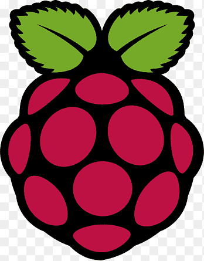

---
tags:
    - micro python
    - esp32
    - thonny
---

# Micro Python
MicroPython is a lean and efficient implementation of the Python 3 programming language that includes a small subset of the Python standard library and is optimised to run on microcontrollers and in constrained environments. [more](https://micropython.org/)

    

        <a href="pico">
            
            
RPI Pico

        </a>
    

    

        <a href="ESP32">
            
            

        </a>
    

    

        <a href="Jetson">
            
            

        </a>
    

