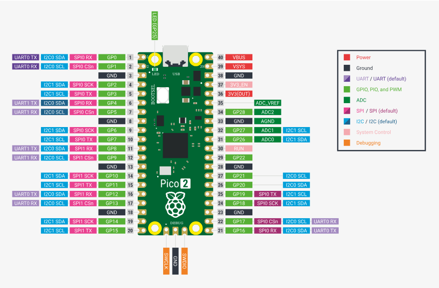
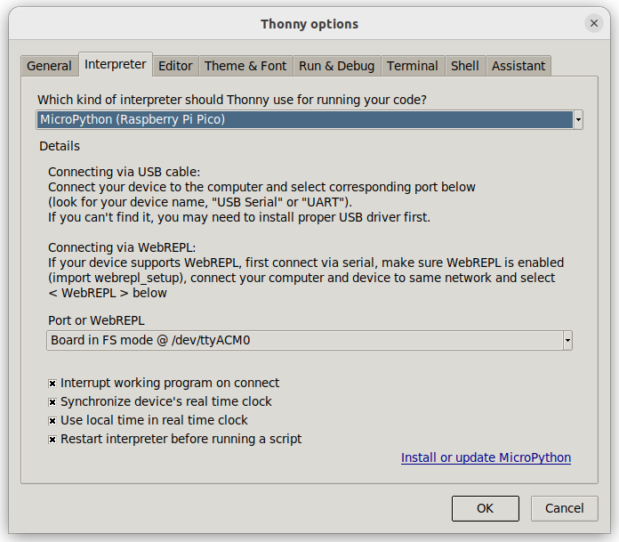
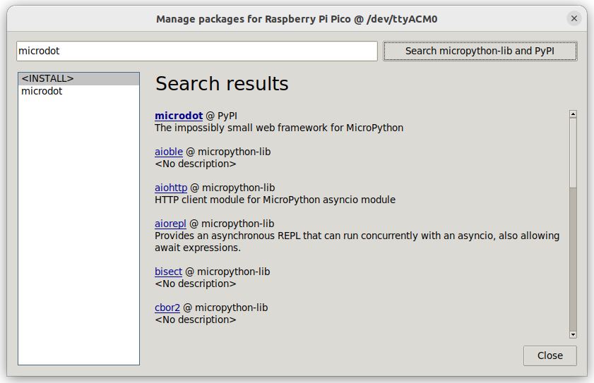

---
tags:
    - pico
    - micropython
---

# Raspberry PI pico with MicroPython


## Install
[Download](https://micropython.org/download/RPI_PICO2_W/) , boot with bootsel press and drag it to mass storage

## Pinout



## Thonny




## Demo: blink led

```python title="blink"
from machine import Pin
from time import sleep

led = Pin("LED", Pin.OUT)

while True:
    led.toggle()
    sleep(1)        # Wait 1 second
```

## Demo: Web Server

- install micodot library
- set wlan using network library




```python
# default port 5000
import network
import time
import asyncio
from microdot import Microdot

# === Connect to Wi-Fi ===
ssid = '<ssid>'
password = '<pass>'

wlan = network.WLAN(network.STA_IF)
wlan.active(True)
wlan.connect(ssid, password)

print('Connecting to WiFi...', end='')
while not wlan.isconnected():
    print('.', end='')
    time.sleep(1)

print('\nConnected. IP:', wlan.ifconfig()[0])

app = Microdot()

@app.route('/')
async def index(request):
    return 'Hello, world!'

async def main():
    # start the server in a background task
    server = asyncio.create_task(app.start_server())

    # ... do other asynchronous work here ...

    # cleanup before ending the application
    await server

asyncio.run(main())

```

