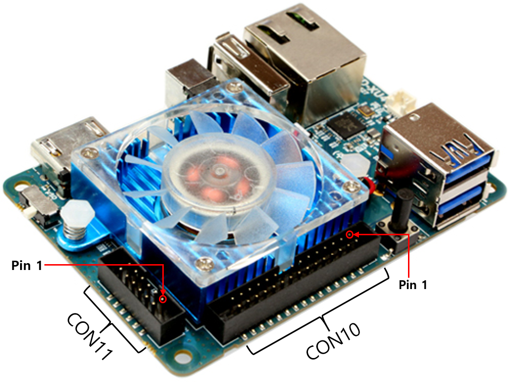
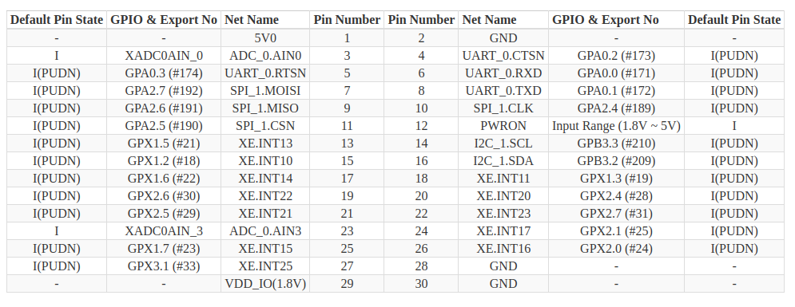
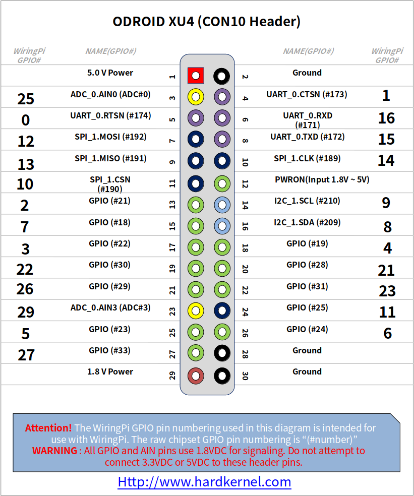

---
tags:
    - odroid
    - gpio
    - gpiod
---

# Odroid

An affordable, power-efficient, high-performance Single Board Computer that supports Android and Linux platforms.
[more](https://www.hardkernel.com/)


## Install

- [docs](https://systems-docs.readthedocs.io/en/latest/odroid-xu4.html#setup)
- [Download os](https://wiki.odroid.com/odroid-xu4/os_images/linux/ubuntu_5.4/ubuntu_5.4)

---



!!! warning "1.8 v"
    All GPIO use 1.8 vdc for signaling
    Don't connect 3.3VDC or 5VDC






### Demo
Mapping gpio name to gpiod command

**from the pinout table we locate ping 13 as GPX1.5**
using `/sys/kernel/debug/gpio` we look for gpx1 pins

```bash
sudo cat /sys/kernel/debug/gpio | grep gpx
#
gpiochip1: GPIOs 8-15, parent: platform/13400000.pinctrl, gpx0:
gpiochip2: GPIOs 16-23, parent: platform/13400000.pinctrl, gpx1:
gpiochip3: GPIOs 24-31, parent: platform/13400000.pinctrl, gpx2:
gpiochip4: GPIOs 32-39, parent: platform/13400000.pinctrl, gpx3:
```

```bash title="gpioinfo on gpiochip2"
sudo gpioinfo gpiochip2

gpiochip2 - 8 lines:
        line   0:      unnamed       unused   input  active-high 
        line   1:      unnamed       unused   input  active-high 
        line   2:      unnamed       unused   input  active-high 
        line   3:      unnamed       unused   input  active-high 
        line   4:      unnamed       unused   input  active-high 
        line   5:      unnamed       unused   input  active-high 
        line   6:      unnamed       unused   input  active-high 
        line   7:      unnamed       unused   input  active-high 
```

!!! warning "1.8 v"
    All GPIO use 1.8 vdc for signaling
    Don't connect 3.3VDC or 5VDC
     

```bash title="gpioset"
# toggle line5 to high (1.8v)
sudo gpioset gpiochip2 5=1
# toggle line5 to low
sudo gpioset gpiochip2 5=0
```


```bash title="gpioinfo on gpiochip2 after the set command"
sudo gpioinfo gpiochip2
gpiochip2 - 8 lines:
        line   0:      unnamed       unused  output  active-high 
        line   1:      unnamed       unused   input  active-high 
        line   2:      unnamed       unused   input  active-high 
        line   3:      unnamed       unused   input  active-high 
        line   4:      unnamed       unused   input  active-high 
        line   5:      unnamed       unused  output  active-high 
        line   6:      unnamed       unused   input  active-high 
        line   7:      unnamed       unused   input  active-high 
```

### Demo: do it again
```bash
sudo cat /sys/kernel/debug/gpio | grep gpx
#
gpiochip1: GPIOs 8-15, parent: platform/13400000.pinctrl, gpx0:
gpiochip2: GPIOs 16-23, parent: platform/13400000.pinctrl, gpx1:
gpiochip3: GPIOs 24-31, parent: platform/13400000.pinctrl, gpx2:
gpiochip4: GPIOs 32-39, parent: platform/13400000.pinctrl, gpx3:
```

**from the pinout table we locate ping 19 as GPX2.6**

```bash title="gpioset"
# toggle line5 to high (1.8v)
sudo gpioset gpiochip3 6=1
# toggle line5 to low
sudo gpioset gpiochip3 6=0
```