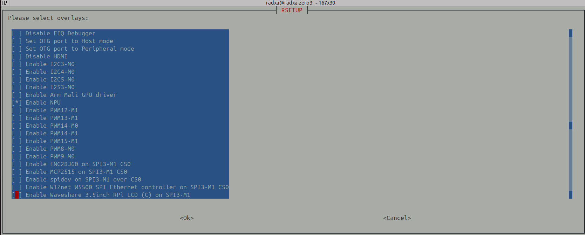

## Install
I try
- [armbian](): Base on ubuntu 24.04
- [Ubuntu for various Rockchip single board computers](https://joshua-riek.github.io/ubuntu-rockchip-download/boards/radxa-zero3.html?utm_source=chatgpt.com) 
- [Radxa document center](https://docs.radxa.com/en/zero/zero3/getting-started/install-os)
[Downloads for the Radxa Zero 3 6.1 Kernel: radxa-zero3_bookworm_kde_b1](https://docs.radxa.com/en/zero/zero3/download)


!!! tip "NPU Driver"
    Work only on [Debian Desktop image](https://github.com/radxa-build/radxa-zero3/releases/tag/rsdk-b1) kernel 6.1 from radxa Official image

    user: radxa, pass: radxa

!!! tip "Flash USB"
    Try [usbimager](https://gitlab.com/bztsrc/usbimager/) to flush the image

---

### RKNN Installation
[radxa doc center](https://docs.radxa.com/en/zero/zero3/app-development/ai/rknn-install)


#### NPU Driver Configuration

Run `sudo rsetup`

Select:
```
Overlays -> Manage overlays -> Enable NPU, then reboot the system.
```



---

### GStreamer

```bash
gst-inspect-1.0 | grep mpp
rockchipmpp:  mpph264enc: Rockchip Mpp H264 Encoder
rockchipmpp:  mpph265enc: Rockchip Mpp H265 Encoder
rockchipmpp:  mppjpegdec: Rockchip's MPP JPEG image decoder
rockchipmpp:  mppjpegenc: Rockchip Mpp JPEG Encoder
rockchipmpp:  mppvideodec: Rockchip's MPP video decoder
rockchipmpp:  mppvpxalphadecodebin: VP8/VP9 Alpha Decoder

```
#### Pipe test

```bash title="radxa source"
export DEST_IP="10.100.102.15"

gst-launch-1.0 -v   videotestsrc is-live=true pattern=ball ! \
video/x-raw,width=1280,height=720,framerate=30/1,format=NV12 ! \
mpph265enc ! \
h265parse config-interval=1 ! \
rtph265pay pt=96 ! \
udpsink host=$DEST_IP port=5000
```

```bash title="pc side"
gst-launch-1.0 -v   udpsrc port=5000 caps="application/x-rtp,media=video,encoding-name=H265,payload=96" ! \
rtph265depay ! \
h265parse ! \
avdec_h265 ! \
autovideosink sync=false
```

!!! warning "high cpu"

    There is no different between

    ```bash
    gst-launch-1.0 videotestsrc ! x265enc ! fakesink
    ```

    ```bash
    gst-launch-1.0 videotestsrc ! mpph265enc ! fakesink
    ```
    

---

## gpio


---


## Reference
- [Downloads for the Radxa Zero 3](https://armbian.com/boards/radxa-zero3)