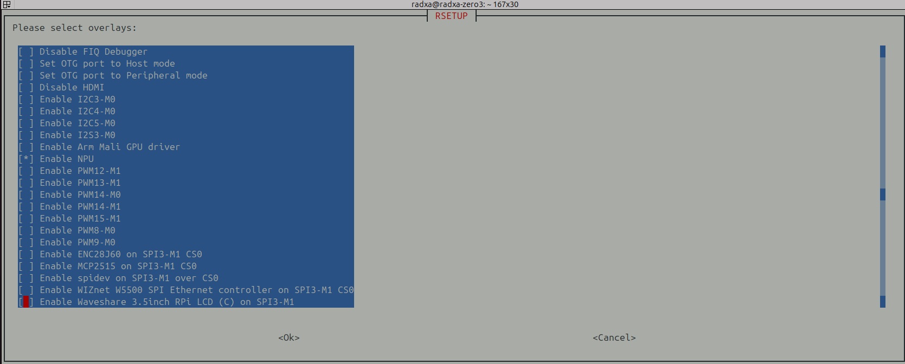
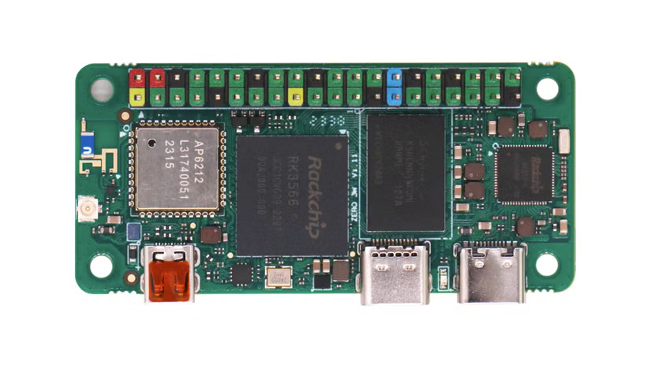
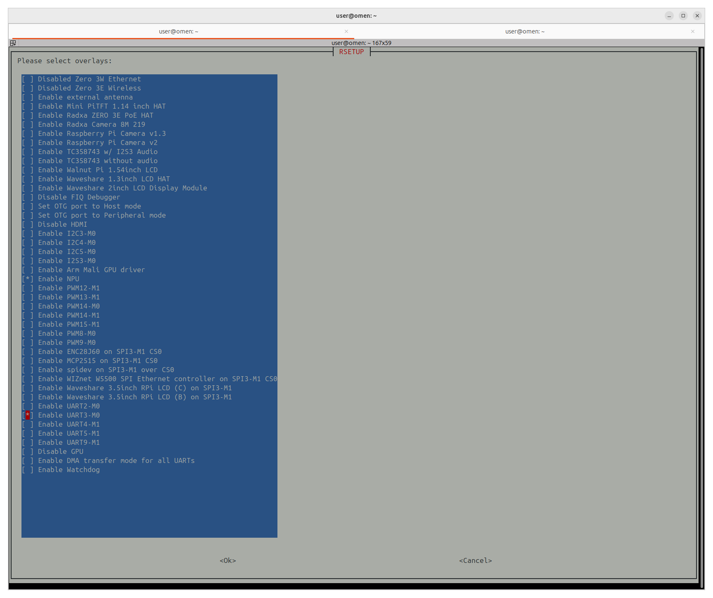
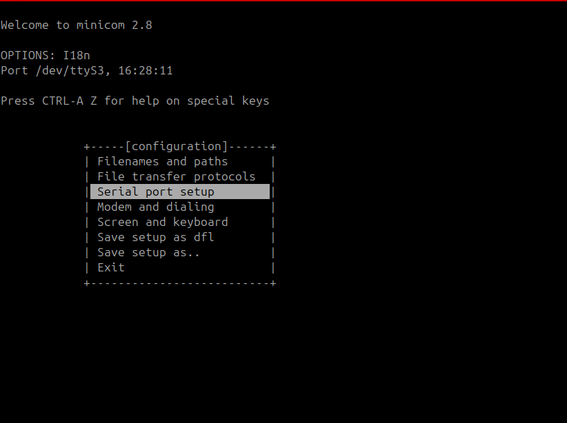
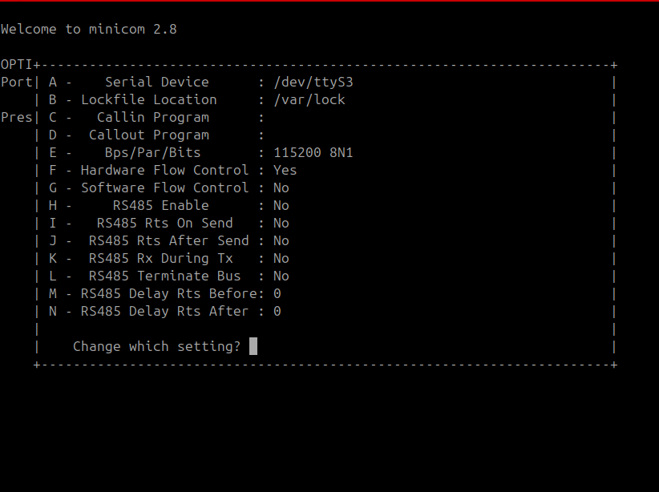
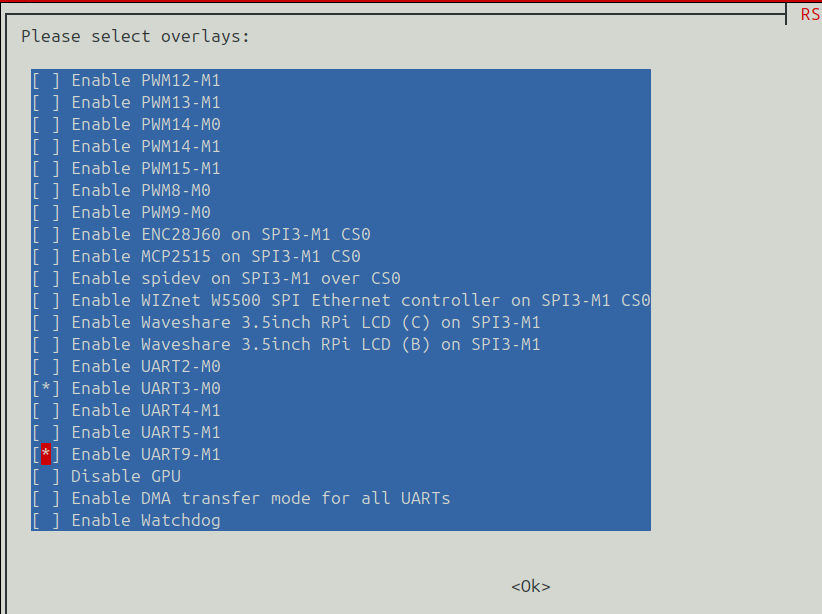

## OS
I try:

- [armbian](): Base on ubuntu 24.04  
- [Ubuntu for various Rockchip single board computers](https://joshua-riek.github.io/ubuntu-rockchip-download/boards/radxa-zero3.html?utm_source=chatgpt.com)  
- [Radxa document center](https://docs.radxa.com/en/zero/zero3/getting-started/install-os)
[Downloads for the Radxa Zero 3 6.1 Kernel: radxa-zero3_bookworm_kde_b1](https://docs.radxa.com/en/zero/zero3/download) 


!!! tip "NPU Driver"
    Work only on [Debian Desktop image](https://github.com/radxa-build/radxa-zero3/releases/tag/rsdk-b1) kernel 6.1 from radxa Official image

    user: radxa, pass: radxa

!!! tip "Flash USB"
    Try [usbimager](https://gitlab.com/bztsrc/usbimager/) to flush the image

---

### RKNN Installation
[radxa doc center](https://docs.radxa.com/en/zero/zero3/app-development/ai/rknn-install)


#### NPU Driver Configuration

Run `sudo rsetup`

Select:
```
Overlays -> Manage overlays -> Enable NPU, then reboot the system.
```



---

### GStreamer

```bash
gst-inspect-1.0 | grep mpp
rockchipmpp:  mpph264enc: Rockchip Mpp H264 Encoder
rockchipmpp:  mpph265enc: Rockchip Mpp H265 Encoder
rockchipmpp:  mppjpegdec: Rockchip's MPP JPEG image decoder
rockchipmpp:  mppjpegenc: Rockchip Mpp JPEG Encoder
rockchipmpp:  mppvideodec: Rockchip's MPP video decoder
rockchipmpp:  mppvpxalphadecodebin: VP8/VP9 Alpha Decoder

```
#### Pipe test

```bash title="radxa source"
export DEST_IP="10.100.102.15"

gst-launch-1.0 -v   videotestsrc is-live=true pattern=ball ! \
video/x-raw,width=1280,height=720,framerate=30/1,format=NV12 ! \
mpph265enc ! \
h265parse config-interval=1 ! \
rtph265pay pt=96 ! \
udpsink host=$DEST_IP port=5000
```

```bash title="pc side"
gst-launch-1.0 -v   udpsrc port=5000 caps="application/x-rtp,media=video,encoding-name=H265,payload=96" ! \
rtph265depay ! \
h265parse ! \
avdec_h265 ! \
autovideosink sync=false
```

!!! warning "high cpu"

    There is no different between

    ```bash
    gst-launch-1.0 videotestsrc ! x265enc ! fakesink
    ```

    ```bash
    gst-launch-1.0 videotestsrc ! mpph265enc ! fakesink
    ```
    

---

## gpio
[radxa document center](https://docs.radxa.com/en/zero/zero3/hardware-design/hardware-interface?utm_source=chatgpt.com)



### 40-pin GPIO interface

The header exposes power, ground, GPIO, UART, PWM, I2C, I2S, and SPI signals.
Each signal can only use the alternate functions supported by its row.

#### Function 1–5 and pin multiplexing

`Function 1` through `Function 5` are the hardware roles available through the
SoC's pin multiplexer, usually called **pinmux**. They are selector positions,
not priority levels. Only one function can control a physical pin at a time.

| Column | Meaning |
|---|---|
| Function 1 | Normally the basic GPIO signal, such as `GPIO4_C3`. |
| Function 2–5 | Alternate peripheral signals such as UART, I2C, SPI, PWM, or I2S. |
| Empty cell | That selector position is not available on the pin. |

For example, physical pin 19 can operate as `GPIO4_C3`, `SPI3_MOSI_M1`,
`I2S3_SCLK_M1`, or `PWM15_IR_M1`. Selecting SPI disconnects the normal GPIO
function from that pin and connects the SPI controller instead.

#### Switch a pin function

On an official Radxa OS image, first check whether Radxa provides an overlay
for the required peripheral:

1. Run `sudo rsetup`.
2. Open **Overlays** -> **Manage overlays**.
3. Press Space to enable the desired UART, I2C, SPI, PWM, or other overlay.
4. Disable any overlay that assigns a conflicting function to the same pins.
5. Confirm the selection, exit `rsetup`, and reboot with `sudo reboot`.

Available overlays depend on the board and OS image. Use **View overlays info**
to inspect which physical pins an overlay configures. If the required mapping
is not offered, create or adapt a device-tree overlay (`.dts`/`.dtbo`) and load
it through **Overlays** -> **Install 3rd party overlay**. See Radxa's
[device-tree overlay instructions](https://docs.radxa.com/en/template/tcm/os-config/rsetup/devicetree).

!!! note "GPIO level control is different from pinmux"
    A GPIO command or library changes a pin's input/output direction and logic
    level after it is configured as GPIO. It does not turn the pin into UART,
    SPI, I2C, PWM, or I2S. Peripheral selection belongs in the device tree so
    the kernel can reserve the pins and bind the correct driver.

!!! warning "I2C pull-up resistors"
    Physical pins 3, 5, 27, and 28 have additional pull-up resistors for I2C.
    They may not behave normally when configured as general-purpose GPIOs.

<style>
.gpio-pin {
    display: inline-block;
    min-width: 2.2em;
    padding: 0.1em 0.35em;
    color: white;
    font-weight: 700;
    text-align: center;
}
.gpio-pin-3v3 { background: #ffff00; color: black; }
.gpio-pin-5v  { background: #ff0000; }
.gpio-pin-gnd { background: #000000; }
.gpio-pin-io  { background: #008000; }
.gpio-pin-i2c { background: #0000ff; }
</style>

| GPIO | Function 5 | Function 4 | Function 3 | Function 2 | Function 1 | Pin | Pin | Function 1 | Function 2 | Function 3 | Function 4 | Function 5 | GPIO |
|---:|---|---|---|---|---|---:|---:|---|---|---|---|---|---:|
| | | | | | +3.3 V | <span class="gpio-pin gpio-pin-3v3">1</span> | <span class="gpio-pin gpio-pin-5v">2</span> | +5.0 V | | | | | |
| 32 | | | | UART3_RX_M0 | GPIO1_A0 | <span class="gpio-pin gpio-pin-io">3</span> | <span class="gpio-pin gpio-pin-5v">4</span> | +5.0 V | | | | | |
| 33 | | | | UART3_TX_M0 | GPIO1_A1 | <span class="gpio-pin gpio-pin-io">5</span> | <span class="gpio-pin gpio-pin-gnd">6</span> | GND | | | | | |
| 116 | | PWM14_M0 | | | GPIO3_C4 | <span class="gpio-pin gpio-pin-io">7</span> | <span class="gpio-pin gpio-pin-io">8</span> | GPIO0_D1 | UART2_TX_M0 | | | | 25 |
| | | | | | GND | <span class="gpio-pin gpio-pin-gnd">9</span> | <span class="gpio-pin gpio-pin-io">10</span> | GPIO0_D0 | UART2_RX_M0 | | | | 24 |
| 97 | | | | | GPIO3_A1 | <span class="gpio-pin gpio-pin-io">11</span> | <span class="gpio-pin gpio-pin-io">12</span> | GPIO3_A3 | | | | I2S3_SCLK_M0 | 99 |
| 98 | | I2S3_MCLK_M0 | | | GPIO3_A2 | <span class="gpio-pin gpio-pin-io">13</span> | <span class="gpio-pin gpio-pin-gnd">14</span> | GND | | | | | |
| 104 | | | | | GPIO3_B0 | <span class="gpio-pin gpio-pin-io">15</span> | <span class="gpio-pin gpio-pin-io">16</span> | GPIO3_B1 | UART4_RX_M1 | PWM8_M0 | | | 105 |
| | | | | | +3.3 V | <span class="gpio-pin gpio-pin-3v3">17</span> | <span class="gpio-pin gpio-pin-io">18</span> | GPIO3_B2 | UART4_TX_M1 | PWM9_M0 | | | 106 |
| 147 | | PWM15_IR_M1 | I2S3_SCLK_M1 | SPI3_MOSI_M1 | GPIO4_C3 | <span class="gpio-pin gpio-pin-io">19</span> | <span class="gpio-pin gpio-pin-gnd">20</span> | GND | | | | | |
| 149 | UART9_TX_M1 | PWM12_M1 | I2S3_SDO_M1 | SPI3_MISO_M1 | GPIO4_C5 | <span class="gpio-pin gpio-pin-io">21</span> | <span class="gpio-pin gpio-pin-io">22</span> | GPIO3_C1 | | | | I2S1_SDO2_M2 | 113 |
| 146 | | PWM14_M1 | I2S3_MCLK_M1 | SPI3_CLK_M1 | GPIO4_C2 | <span class="gpio-pin gpio-pin-io">23</span> | <span class="gpio-pin gpio-pin-io">24</span> | GPIO4_C6 | SPI3_CS0_M1 | PWM13_M1 | UART9_RX_M1 | I2S3_SDI_M1 | 150 |
| | | | | | GND | <span class="gpio-pin gpio-pin-gnd">25</span> | <span class="gpio-pin gpio-pin-io">26</span> | NC | | | | | |
| 138 | | I2C4_SDA_M0 | I2S2_SDI_M1 | | GPIO4_B2 | <span class="gpio-pin gpio-pin-i2c">27</span> | <span class="gpio-pin gpio-pin-i2c">28</span> | GPIO4_B3 | | | I2C4_SCL_M0 | I2S2_SDO_M1 | 139 |
| 107 | | I2C5_SCL_M0 | | | GPIO3_B3 | <span class="gpio-pin gpio-pin-io">29</span> | <span class="gpio-pin gpio-pin-gnd">30</span> | GND | | | | | |
| 108 | | I2C5_SDA_M0 | | | GPIO3_B4 | <span class="gpio-pin gpio-pin-io">31</span> | <span class="gpio-pin gpio-pin-io">32</span> | GPIO3_C2 | UART5_TX_M1 | | | I2S1_SDO3_M2 | 114 |
| 115 | UART5_RX_M1 | | I2S1_SCLK_RX_M2 | | GPIO3_C3 | <span class="gpio-pin gpio-pin-io">33</span> | <span class="gpio-pin gpio-pin-gnd">34</span> | GND | | | | | |
| 100 | | | I2S3_LRCK_M0 | | GPIO3_A4 | <span class="gpio-pin gpio-pin-io">35</span> | <span class="gpio-pin gpio-pin-io">36</span> | GPIO3_A7 | | | | | 103 |
| 36 | | | I2S1_SCLK_RX_M0 | | GPIO1_A4 | <span class="gpio-pin gpio-pin-io">37</span> | <span class="gpio-pin gpio-pin-io">38</span> | GPIO3_A6 | | | | I2S3_SDI_M0 | 102 |
| | | | | | GND | <span class="gpio-pin gpio-pin-gnd">39</span> | <span class="gpio-pin gpio-pin-io">40</span> | GPIO3_A5 | | | | I2S3_SDO_M0 | 101 |

Pinout data adapted from the
[Radxa ZERO 3 hardware interface documentation](https://docs.radxa.com/en/zero/zero3/hardware-design/hardware-interface),
licensed under [CC BY 4.0](https://creativecommons.org/licenses/by/4.0/).


### Enable uarts

```bash
sudo rsetup
```



!!! info "Don't forget to reboot"
    

#### Check it 

jumper pin 3 to 5

!!! tip Don't forget to jumper the pins
    

and check it using minicom

```bash
sudo apt install minicom
```

```bash title="run it"
sudo minicom -D /dev/ttyS3 -b 115200
```

!!! warning "check minicom configuration"
    Disable uart Hardware Flow Control

```
ctrl-a o
```



Then press `f` 

    

- Exit using `esc`
- Press any key and get echo on screen


#### enable other uart's

| Physical pin | GPIO     | Alternate function |
| -----------: | -------- | ------------------ |
|            3 | GPIO1_A0 | **UART3_RX_M0**    |
|            5 | GPIO1_A1 | **UART3_TX_M0**    |
|            8 | GPIO0_D1 | UART2_TX_M0        |
|           10 | GPIO0_D0 | UART2_RX_M0        |
|           16 | GPIO3_B1 | UART4_RX_M1        |
|           18 | GPIO3_B2 | UART4_TX_M1        |
|           21 | GPIO4_C5 | UART9_TX_M1        |
|           24 | GPIO4_C6 | UART9_RX_M1        |
|           32 | GPIO3_C2 | UART5_TX_M1        |
|           33 | GPIO3_C3 | UART5_RX_M1        |


**Uart linux device mapping**

| RK3566 UART | Linux device | Zero 3W header pins  |
| ----------- | ------------ | -------------------- |
| UART2       | `/dev/ttyS2` | TX **8**, RX **10**  |
| UART3       | `/dev/ttyS3` | RX **3**, TX **5**   |
| UART4       | `/dev/ttyS4` | RX **16**, TX **18** |
| UART5       | `/dev/ttyS5` | TX **32**, RX **33** |
| UART9       | `/dev/ttyS9` | TX **21**, RX **24** |

##### Demo: enable uart9

- Run rsetup
- Manage overlays
- Enable uart9
- Save
- Reboot
  


```title="check after boot"
ls -l /dev/ttyS*
crw-rw---- 1 root dialout 4, 65 Aug 18 16:43 /dev/ttyS1
crw-rw---- 1 root dialout 4, 67 Aug 18 16:43 /dev/ttyS3
crw-rw---- 1 root dialout 4, 73 Aug 18 16:43 /dev/ttyS9
```

```bash title="minicom"
sudo minicom -D /dev/ttyS9 -b 115200
```

!!! warning check minicom configuration
    Disable uart `Hardware Flow Control`

    - `ctrl-a o`
    - select **Serial port setup**
    - press `f`


!!! tip Add user to dialout

    ```bash
    sudo usermod -aG dialout $USER
    ```

    boot or logout/login

    check using `id` command
---


## Reference
- [Downloads for the Radxa Zero 3](https://armbian.com/boards/radxa-zero3)
