## Demo: pre-trained yolo to RKNN
Target: radxa zero 3w: RK3566

- Clone zoo
- Clone toolkit v 2.3.2
- Create venv in zoo folder using uv
- Install other dependencies
- Run Convert
- Check on device

```bash title="clone zoo"
https://github.com/airockchip/rknn_model_zoo.git
```

```bash title="clone toolkit"
git clone -b v2.3.2 https://github.com/airockchip/rknn-toolkit2.git
```

### Create virtual environment
- create venv in zoo root folder using `uv`

```bash title="python virtual environment"
uv venv
```

!!! tip python version
    The repository has `.python-version` file that set the version `3.11` when create **venv** using uv it use it to set the python venv version

### install toolkit version
All the version locate in repository packages folder

```bash title="install relevant whl package"
uv pip install ../rknn-toolkit2/rknn-toolkit2/packages/x86_64/rknn_toolkit2-2.3.2-cp311-cp311-manylinux_2_17_x86_64.manylinux2014_x86_64.whl
```

```bash title="fix some dependencies"
uv add "setuptools<82"
uv add "onnx==1.16.1"
uv add "protobuf==4.25.4"
```

### Run convert
```bash title="convert"
# switch to 
cd examples/yolov8/python/
# convert model target_platform type dest_name (path and file name)
uv run convert.py ~/git/rknn-toolkit2/yolov8n.onnx rk3566 i8 `pwd`/yolov8n_i8.rknn
```


### Check the model
Copy the code into device, don't forget the mode and source image

<details>
<summary>Inference code</summary>
````python
--8<-- "docs/Embedded/other_boards/rockchip/rknn/code/zoo_inference.py"
````

```mermaid
flowchart LR
    A[Load .rknn model] --> B[Initialize RKNN NPU runtime]
    B --> C[Read bus.jpg with OpenCV]
    C --> D{Image is 640 x 640?}
    D -- No --> X[Stop with size error]
    D -- Yes --> E[Convert OpenCV BGR to model RGB]
    E --> F[Add batch dimension<br/>shape 1 x 640 x 640 x 3]
    F --> G[Run model.inference on the NPU]
    G --> H[Raw box and class tensors<br/>at 3 detection scales]
    H --> I[Decode DFL box distances]
    I --> J[Convert to x1 y1 x2 y2]
    J --> K[Flatten and join all scales]
    K --> L[Choose best class and score]
    L --> M{Score at least OBJ_THRESH?}
    M -- No --> N[Discard candidate]
    M -- Yes --> O[Apply NMS separately per class]
    O --> P[Draw retained boxes and labels]
    P --> Q[Save bus_detected.jpg]
    Q --> R[Release RKNN runtime]
    X --> R
```

</details>




The important data changes are:

1. `cv2.imread()` loads the file as **BGR**, OpenCV's default channel order.
2. `cv2.cvtColor(..., cv2.COLOR_BGR2RGB)` changes it to **RGB**, the channel order expected by this model.
3. `image[None]` adds the batch dimension, changing `(640, 640, 3)` into `(1, 640, 640, 3)`.
4. `model.inference()` sends that tensor to the RK3566 NPU. Its result is a collection of raw NumPy tensors, not ready-to-draw boxes.
5. `post_process()` decodes those tensors, removes low-confidence and overlapping candidates, and returns the final boxes, class IDs, and scores.


```bash title="output"
uv run zoo_inference.py 
I RKNN: [19:33:43.881] RKNN Runtime Information, librknnrt version: 2.3.0 (c949ad889d@2024-11-07T11:35:33)
I RKNN: [19:33:43.882] RKNN Driver Information, version: 0.9.8
I RKNN: [19:33:43.883] RKNN Model Information, version: 6, toolkit version: 2.3.2(compiler version: 2.3.2 (e045de294f@2025-04-07T19:48:25)), target: RKNPU lite, target platform: rk3566, framework name: ONNX, framework layout: NCHW, model inference type: static_shape
W RKNN: [19:33:43.934] query RKNN_QUERY_INPUT_DYNAMIC_RANGE error, rknn model is static shape type, please export rknn with dynamic_shapes
W Query dynamic range failed. Ret code: RKNN_ERR_MODEL_INVALID. (If it is a static shape RKNN model, please ignore the above warning message.)
person @ (211 241 282 506) 0.864
person @ (109 235 225 535) 0.860
person @ (477 226 560 522) 0.848
person @ (79 327 116 513) 0.305
bus @ (96 136 549 449) 0.864
Saved bus_detected.jpg
```

#### Explain output

The run completed successfully. The log contains:
- one harmless warning, 
- detection results, 
- saved-image path.

##### Runtime and model information

```text
librknnrt version: 2.3.0
RKNN Driver Information, version: 0.9.8
toolkit version: 2.3.2
target platform: rk3566
framework name: ONNX
model inference type: static_shape
```

- `librknnrt` is the RKNN runtime installed on the board.
- The driver connects that runtime to the NPU.
- Toolkit 2.3.2 converted the original ONNX model for the RK3566.
- `static_shape` means the model accepts its fixed 640 × 640 input shape.

##### Static-shape warning

```text
query RKNN_QUERY_INPUT_DYNAMIC_RANGE error
If it is a static shape RKNN model, please ignore the above warning message.
```

This warning is expected for this model. RKNNLite tried to query dynamic input dimensions, but the model was intentionally exported with a fixed shape. The example supplies a 640 × 640 image, so no change is required.

##### Detections

Each result uses this format:

```text
class @ (x1 y1 x2 y2) confidence
```

For example:

```text
person @ (211 241 282 506) 0.864
```

| Field | Meaning |
| --- | --- |
| `person` | Predicted COCO class. |
| `(211, 241)` | Top-left corner of the bounding box. |
| `(282, 506)` | Bottom-right corner of the bounding box. |
| `0.864` | Confidence score, approximately 86.4%. |

The model found four people and one bus. The last person has a score of `0.305` and remains because `OBJ_THRESH` is `0.25`. Increase the threshold to reject weaker detections.

The bus box can overlap person boxes because non-maximum suppression runs separately for each class.

##### Saved result

```text
Saved bus_detected.jpg
```

Open `bus_detected.jpg` to inspect the bounding boxes drawn over the source image.


---

## Reference
- [RKNN Toolkit Lite2 YOLOv8](https://docs.radxa.com/en/rock5/rock5c/app-development/ai/rknn-toolkit-lite2-yolov8)
- [Convert Custom Trained YOLO Models](https://docs.radxa.com/en/som/cm/cm3/app-development/ai/rknn-custom-yolo)
