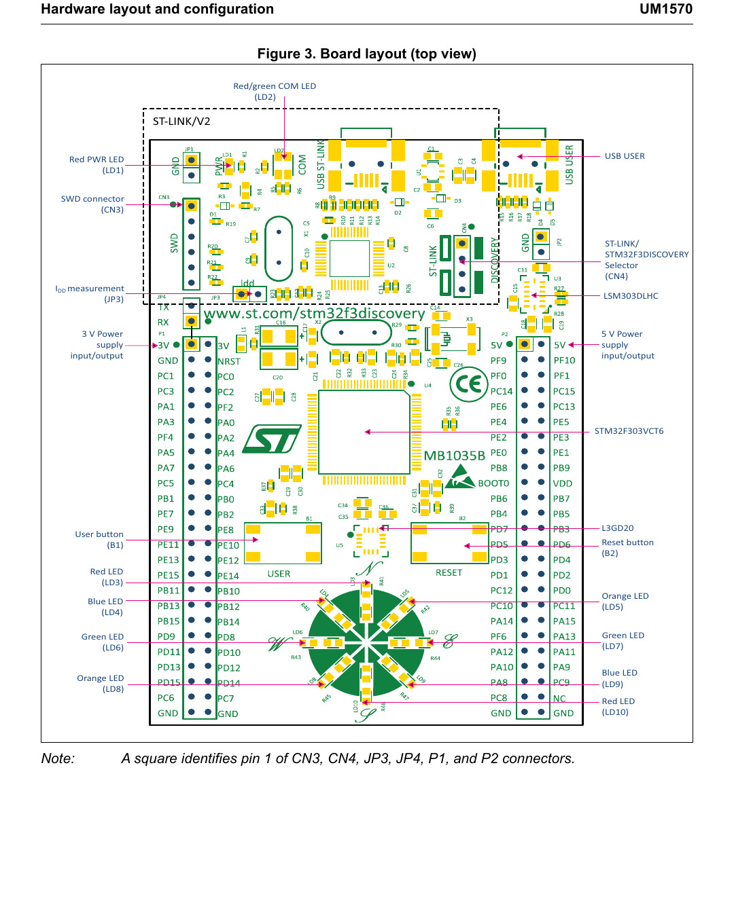

# Stage 0 — STM32F3DISCOVERY board orientation

The STM32F3DISCOVERY is a development board built around the `STM32F303VCT6`. It combines the target microcontroller with a debugger, sensors, buttons, LEDs, USB, and accessible I/O headers, so the first experiments need little external hardware.

By the end of this stage, you should be able to point to the MCU, ST-LINK, LEDs, buttons, USB connectors, and headers on your own board.

*Board layout from STMicroelectronics [UM1570, Figure 3](https://www.st.com/resource/en/user_manual/dm00063382.pdf). The exact component version can vary with the board revision.*

## What the board includes

| Part | Purpose |
| --- | --- |
| STM32F303VCT6 | The target microcontroller that runs your program. |
| Embedded ST-LINK/V2 or V2-B | Programs and debugs the target MCU through USB. |
| Eight user LEDs | Provide simple GPIO output experiments without extra wiring. |
| USER and RESET buttons | Provide one GPIO input and one hardware reset input. |
| Gyroscope | Measures angular motion. The fitted device depends on board revision. |
| Accelerometer and magnetometer | Measure acceleration and magnetic direction; the fitted device depends on revision. |
| USB USER connector | Lets the target MCU operate as a USB full-speed device. |
| P1 and P2 extension headers | Expose the target MCU's GPIO and power connections. |
| CN3 SWD connector | Lets the on-board ST-LINK debug an external STM32 target. |
| 3 V, 5 V, and GND pins | Power connections for the board and external circuits. |

## Identify the MCU

Find the large square chip near the center of the board. Its marking should include `STM32F303VCT6`.

- `STM32F3` identifies the MCU family.
- `03` identifies the specific product line.
- `V` indicates the 100-pin package used on this board.
- The device contains 256 KiB of Flash and 48 KiB of SRAM.
- Its processor core is an Arm Cortex-M4.

This is the **target MCU**. Your application is compiled for it and stored in its Flash memory.

## Identify ST-LINK

The ST-LINK section occupies the top of the board, inside the dashed outline in the diagram. It is a second microcontroller dedicated to programming and debugging the target MCU.

For normal work:

1. Leave both CN4 jumpers fitted.
2. Connect the computer to the USB connector labeled `USB ST-LINK`.
3. Expect LD1 to indicate power and LD2 to flash during communication.

!!! note "Two USB connectors"
    `USB ST-LINK` is the simplest connector for flashing and debugging. `USB USER` connects directly to the STM32F303 and is used when your firmware implements a USB device.

Removing the CN4 jumpers disconnects ST-LINK from the on-board target and is mainly useful when debugging a different board through CN3. Leave them installed while learning.

## Identify the LEDs and buttons

LD1 and LD2 belong to power and debugger status. LD3 through LD10 are controlled by GPIO port E:

| LED | Color | MCU pin |
| --- | --- | --- |
| LD3 | Red | PE9 |
| LD4 | Blue | PE8 |
| LD5 | Orange | PE10 |
| LD6 | Green | PE15 |
| LD7 | Green | PE11 |
| LD8 | Orange | PE14 |
| LD9 | Blue | PE12 |
| LD10 | Red | PE13 |

Your first GPIO example uses **LD4 on PE8**.

The blue **USER** button, B1, connects to PA0. The black **RESET** button, B2, connects to the MCU's `NRST` input and restarts the program.

## Identify the headers

The long P1 and P2 headers run down both sides of the board. Their silkscreen labels show GPIO names such as `PA0`, `PE8`, and `PC13`, along with power pins.

- `PA0` means port A, pin 0.
- `PE8` means port E, pin 8.
- `3V` and `5V` are supply connections.
- `GND` is the common electrical reference.

Use the printed label beside each pin rather than counting from memory. Connect external circuits to `GND`, and check the MCU datasheet before applying voltage to a GPIO pin.

!!! warning "GPIO uses 3.3 V logic"
    Do not connect a 5 V signal to a GPIO merely because the board exposes a 5 V power pin. Only pins explicitly documented as 5 V tolerant may accept it.

## Stage 0 check

With the board disconnected, find each item before continuing:

- STM32F303VCT6 target MCU
- USB ST-LINK connector
- USB USER connector
- CN4 jumpers
- LD1 and LD2 status LEDs
- LD3–LD10 user LEDs
- USER and RESET buttons
- P1 and P2 extension headers
- 3 V, 5 V, and GND pins

Then connect `USB ST-LINK`. Confirm that the power LED turns on and identify LD4, the blue LED connected to PE8. You are now ready for the [GPIO LED lesson](../hello_led/).

## References

- [STM32F3DISCOVERY product page](https://www.st.com/en/evaluation-tools/stm32f3discovery.html)
- [UM1570 — Discovery kit with STM32F303VC MCU](https://www.st.com/resource/en/user_manual/dm00063382.pdf)

<!-- post-content-skill: 1.0.0 -->
