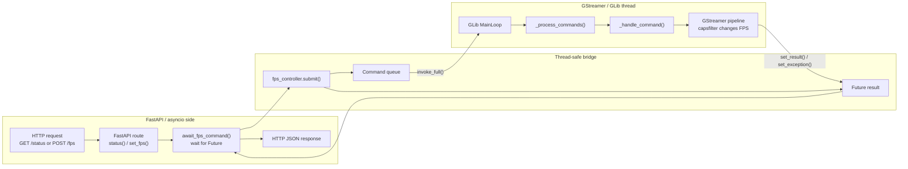

# FPS Control Async Flow

`videorate` is the GStreamer element used to normalize or change a stream's
frame rate. Place it before a capsfilter, then set the capsfilter to the target
rate, for example `video/x-raw,framerate=15/1`. `videorate` will drop frames
when lowering FPS and duplicate frames when raising FPS so the downstream
pipeline receives buffers at the requested cadence.

Simple pipeline that limits a test source to 10 FPS:

```bash
gst-launch-1.0 videotestsrc is-live=true ! \
  video/x-raw,framerate=30/1 ! \
  videorate ! \
  video/x-raw,framerate=10/1 ! \
  videoconvert ! \
  autovideosink
```

The main idea is that FastAPI and GStreamer run in different execution contexts.
The API side receives HTTP requests asynchronously. The GStreamer side owns the
pipeline and runs on its own GLib thread. They communicate with commands,
futures, and a thread-safe queue.



## What This Means

`fps_app.py` should stay responsive to HTTP requests. It does not touch the
GStreamer pipeline directly. When a request arrives, it creates a command and
waits asynchronously for the result.

`fps_control.py` owns the GStreamer objects. Its controller thread runs a GLib
main loop, receives queued commands, and applies changes to the pipeline from
that thread.

The queue and future are the bridge:

- `submit()` puts a command into the queue.
- `GLib.MainContext.invoke_full()` wakes the GStreamer thread.
- `_process_commands()` handles the command.
- The command result is written back to the `Future`.
- FastAPI awaits that future and returns JSON to the client.

For `POST /fps`, the command eventually calls `_set_fps()`, validates the FPS,
and updates the capsfilter caps to:

```text
video/x-raw,framerate=<fps>/1
```

For `GET /status`, the command returns the current controller state.

---

### Code

<details>
<summary>Pipeline</summary>
```python
self.pipeline = Gst.parse_launch(
        "v4l2src device=/dev/video0 "
        "! video/x-raw,format=YUY2,width=640,height=480,framerate=30/1 "
        "! videorate name=rate drop-only=true "
        "! capsfilter name=fps_caps "
        "! videoconvert "
        "! fpsdisplaysink sync=false "
    )
```
</details>

The pipeline creates a named capsfilter:

```python
"! videorate name=rate drop-only=true "
"! capsfilter name=fps_caps "
```

After `Gst.parse_launch()` builds the pipeline, the controller keeps a reference
to that element:

```python
self.capsfilter = self.pipeline.get_by_name("fps_caps")
```

When the API asks for a new FPS, `_set_fps()` first validates the requested
value, then calls `_apply_fps_caps()`:

```python
def _set_fps(self, fps: int):
    fps = self._validate_fps(fps)
    if self.capsfilter is None:
        raise RuntimeError("Pipeline is not running")

    self._apply_fps_caps(fps)
    self.fps = fps
    return {"ok": True, **self._status_fields()}
```

`_apply_fps_caps()` is the part that actually edits the caps. It creates a new
`Gst.Caps` object from the requested frame rate and writes it to the capsfilter's
`caps` property:

```python
def _apply_fps_caps(self, fps: int):
    caps = Gst.Caps.from_string(f"video/x-raw,framerate={fps}/1")
    self.capsfilter.set_property("caps", caps)
```

Because `videorate` is directly before the capsfilter, it adapts the incoming
stream to satisfy the new downstream caps. With `drop-only=true`, this example is
intended for reducing FPS by dropping frames rather than creating extra frames.

#### Demo files:

- `fps_control.py` contains the GStreamer controller. It creates the pipeline,
  owns the GLib main loop, validates FPS changes, and updates the capsfilter.
- `fps_app.py` contains the FastAPI application. It exposes the status and FPS
  endpoints, serves the HTML page, and forwards commands to the controller.
- `static/fps.html` contains the browser UI. It shows the current controller
  status and sends FPS update requests to the FastAPI server.

<details>
<summary>fps_control.py</summary>

```python
--8<-- "docs/Other/Gstreamer/demo_application/control_pipe_using_fastapi/code/fps_control.py"
```

</details>


<details>
<summary>fps_app.py</summary>

```python
--8<-- "docs/Other/Gstreamer/demo_application/control_pipe_using_fastapi/code/fps_app.py"
```

</details>

<details>
<summary>static/fps.html</summary>

```html
--8<-- "docs/Other/Gstreamer/demo_application/control_pipe_using_fastapi/code/static/fps.html"
```

</details>
