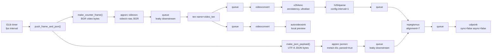
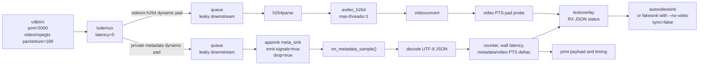

## MPEG-TS in brief

MPEG Transport Stream (MPEG-TS) is a container format designed for streaming
audio, video, and metadata over unreliable networks or broadcast links. The
stream is split into small fixed-size packets, usually 188 bytes, where each
packet carries a packet identifier (PID). A receiver uses these PIDs and the
program tables in the stream to find the elementary streams that belong to a
program, such as a video track, audio track, or metadata track.

MPEG-TS is commonly used for live video because it can be decoded progressively
and can recover from packet loss better than formats that depend on a complete
file structure.

## Simple video-only UDP pipeline

The following pipeline generates a test video pattern, encodes it as H.264,
muxes it into MPEG-TS, and streams it over UDP:

```bash
gst-launch-1.0 -e \
  videotestsrc is-live=true ! \
  video/x-raw,width=1280,height=720,framerate=30/1 ! \
  x264enc tune=zerolatency bitrate=2000 speed-preset=ultrafast key-int-max=30 bframes=0 ! \
  h264parse config-interval=-1 ! \
  mpegtsmux alignment=7 ! \
  udpsink host=127.0.0.1 port=5000 sync=false async=false
```

!!! info "mpegtsmux alignment=7"
    mpegtsmux alignment=7 tells GStreamer how many MPEG-TS packets to group into each output buffer.
    MPEG-TS packets are normally 188 bytes each.

    ```
    7 * 188 = 1316 bytes
    ```
    This is commonly used for UDP streaming because 1316 bytes fits well inside a typical Ethernet MTU of 1500 bytes after IP/UDP headers are added. It helps avoid IP fragmentation.

!!! info "h264parse config-interval=-1"
    tells h264parse to insert the H.264 configuration data into the stream with every IDR keyframe.
    For UDP/live streaming, -1 is useful because a receiver can join the stream later and still get the required decoder configuration at the next keyframe. Without SPS/PPS appearing in-band often enough, a late receiver may fail to decode until it somehow receives that config data.

    **IDR**: Instantaneous Decoder Refresh frame. A keyframe that can be decoded without needing earlier frames. After an IDR, the decoder can start fresh.

This sends an MPEG-TS stream with only one video elementary stream and no audio
or metadata channels.

Run this receiver pipeline in another terminal to receive the MPEG-TS stream,
extract the H.264 video, decode it, and display it:

```bash
gst-launch-1.0 \
  udpsrc port=5000 caps="video/mpegts, systemstream=(boolean)true, packetsize=(int)188" ! \
  queue max-size-buffers=0 max-size-bytes=0 max-size-time=100000000 leaky=downstream ! \
  tsdemux latency=0 ! \
  queue max-size-buffers=2 max-size-bytes=0 max-size-time=0 leaky=downstream ! \
  h264parse ! \
  avdec_h264 ! \
  videoconvert ! \
  queue max-size-buffers=2 max-size-bytes=0 max-size-time=0 leaky=downstream ! \
  autovideosink sync=false
```

This version is tuned for low latency. `tsdemux latency=0` removes the default
demux smoothing delay, leaky queues prevent old frames from building up, and
`autovideosink sync=false` displays frames as soon as they are decoded. If the
machine cannot decode fast enough, frames may be dropped instead of increasing
the visible delay.

- queue before tsdemux: absorb UDP jitter (absorb means “take in and smooth out.”)
- queue after tsdemux: separate demux from decode
- h264parse: clean/prepare H.264 for decoder
- queue before sink: prevent display slowness from causing latency buildup

---

## Metadata-only UDP pipeline

MPEG-TS can carry a metadata elementary stream without video or audio. In
GStreamer, `mpegtsmux` accepts this kind of metadata on a `meta/x-klv` sink pad.
For a real interoperable system, wrap the JSON in valid KLV. For a simple lab
pipeline, the JSON bytes can be sent on that private metadata channel.

Run this sender pipeline to stream only JSON metadata over UDP:

```bash
while true; do
  printf '{"timestamp":%s,"source":"demo","value":42}\n' "$(date +%s)"
  sleep 1
done | gst-launch-1.0 -e \
  fdsrc fd=0 do-timestamp=true ! \
  queue ! \
  meta/x-klv,parsed=true ! \
  mpegtsmux alignment=7 ! \
  udpsink host=127.0.0.1 port=5000 sync=false async=false
```

Run this receiver pipeline in another terminal to receive the MPEG-TS stream and
print the metadata channel to stdout:

```bash
gst-launch-1.0 \
  udpsrc port=5000 caps="video/mpegts, systemstream=(boolean)true, packetsize=(int)188" ! \
  queue max-size-buffers=0 max-size-bytes=0 max-size-time=100000000 leaky=downstream ! \
  tsdemux latency=0 ! \
  queue ! "meta/x-klv" ! identity silent=false dump=true ! fakesink sync=false
```

The final branch handles only the demuxed metadata stream:

- `queue` decouples `tsdemux` from the metadata consumer so parsing and printing
  metadata does not block demuxing.
- `"meta/x-klv"` filters the branch to KLV metadata buffers from the transport
  stream.
- `identity silent=false dump=true` logs each buffer and dumps its bytes, which
  makes the JSON payload visible in the terminal.
- `fakesink sync=false` discards the buffers after inspection and does not wait
  on the pipeline clock.


---

## Demo: 

### Sender

`json_sender.py` creates a live MPEG-TS sender with two synchronized inputs.
For every timer tick it generates one OpenCV video frame and one UTF-8 JSON
payload, gives both buffers the same PTS/DTS/duration, muxes them with
`mpegtsmux`, and sends the transport stream to `udp://HOST:PORT`.



<details>
<summary>Sender code</summary>
```python
--8<-- "docs/Other/Gstreamer/metadata/mpegts/code/json_sender.py"
```
</details>


### Receiver

`json_receiver.py` listens for an MPEG-TS stream on UDP port `5000` by default. `tsdemux`
creates dynamic pads for the incoming streams: the H.264 pad is linked to the video
decode/display branch, while the first non-video pad is treated as the private JSON
metadata stream and linked to an `appsink`.

For every metadata sample, the receiver decodes the bytes as UTF-8 JSON, prints the
payload with timing information, compares metadata PTS with the latest decoded video
PTS, and updates a `textoverlay` on the video output. Invalid JSON is logged as raw
bytes so transport or payload issues are still visible.



<details>
<summary>Receiver code</summary>
```python
--8<-- "docs/Other/Gstreamer/metadata/mpegts/code/json_receiver.py"
```
</details>
