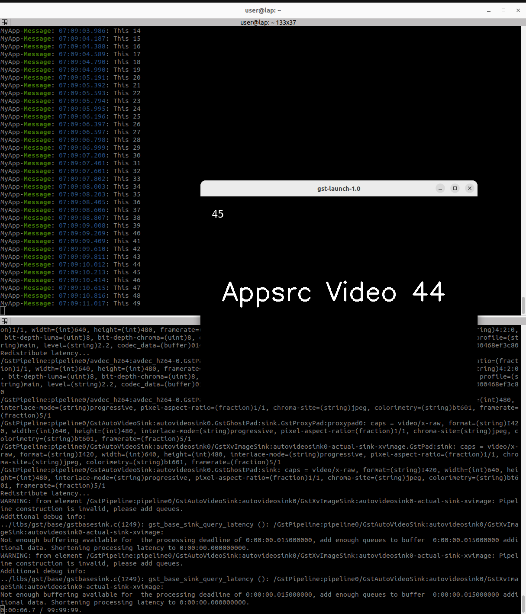

---
tags:
    - gstreamer
    - mpegts
---

# Gstreamer mpegts


<div class="grid-container">
    <div class="grid-item">
        <a href="klv">
        
        <p>klv</p>
        </a>
    </div>
    <div class="grid-item">
    <a href="">
        <p>TBD</p>
        </a>
    </div>
    <div class="grid-item">
        <a href="">
        <p>TBD</p>
        </a>
    </div>
    
</div>


## Demo 
Send video over udp using h264 encoder and mpegts as a transform (no RTP)

```bash title="sender"
gst-launch-1.0 -v videotestsrc is-live=true \
! x264enc tune=zerolatency bitrate=1000 speed-preset=superfast key-int-max=15 \
! video/x-h264,profile=main \
! mpegtsmux \
! udpsink host=127.0.0.1 port=5000

```
- **key-int-max=15**: Forces a keyframe every 15 frames (lower values reduce startup delay).
- **tune=zerolatency**: Removes internal buffering.

```bash title="receiver"
gst-launch-1.0 -v udpsrc port=5000 \
! tsdemux \
! h264parse \
! avdec_h264 \
! autovideosink
```

!!! tip Reduce startup delay
    **key-int-max**=15: Forces a keyframe every 15 frames (lower values reduce startup delay).
     

[tmuxp script to run the pipes](simple_mpeg_stream.yaml)


---

### More then one stream
- Using RTP

```bash title="sender"
gst-launch-1.0 -v mpegtsmux name=mux alignment=7 \
    ! rtpmp2tpay \
    ! udpsink host=127.0.0.1 port=5000 \
videotestsrc pattern=ball is-live=true ! videoconvert ! x264enc tune=zerolatency bitrate=1000 speed-preset=superfast key-int-max=15 ! h264parse ! queue ! mux. \
videotestsrc pattern=smpte is-live=true ! videoconvert ! x264enc tune=zerolatency bitrate=1000 speed-preset=superfast key-int-max=15  ! h264parse ! queue ! mux.
```


```bash title="receiver"
gst-launch-1.0 -v udpsrc port=5000 buffer-size=2000000 caps="application/x-rtp, media=video, encoding-name=MP2T, payload=33" \
! rtpmp2tdepay \
! tsdemux name=demux \
demux. ! queue ! h264parse ! avdec_h264 ! videoconvert ! autovideosink \
demux. ! queue ! h264parse ! avdec_h264 ! videoconvert ! autovideosink

```

!!! note queue multiqueue
    TODO: read more about the difference

!!! tip check if stream alive
    ```
    gst-launch-1.0 -v udpsrc port=5000 ! fakesink dump=true
    gst-launch-1.0 -v udpsrc port=5000 caps="video/mpegts, systemstream=true" ! tsdemux ! fakesink
    ```

    dump stream data to screen


---

## AppSrc Demo

Send generated image using opencv to `appsrc` element
  
<details><summary>Send image using appsrc example</summary>
```python title="" linenums="1" hl_lines="1"
--8<-- "docs/Other/Gstreamer/mpegts/gst_appsrc_mpeg_udp.py"
```
</details>

### usage

Run script and receiver pipe

```bash title="receiver"
gst-launch-1.0 -v udpsrc port=5000 \
! tsdemux \
! h264parse \
! avdec_h264 \
! autovideosink
```



### Add RTP
Sending MPEG video over RTP
- RTP includes sequence numbers in each packet, allowing the receiver to reorder packets if they arrive out of order. using jitter
- RTP packets contain timestamps to help the receiver synchronize playback.

- TODO: Add more why, check when direct UDP is batter

```python
# change pipe for rtp support
PIPELINE = f"""appsrc is-live=true name=source is-live=true format=time \
! video/x-raw,format=BGR,width={WIDTH},height={height},framerate={FRAMERATE}/1 \
! videoconvert \
! timeoverlay time-mode=buffer-count \
! x264enc tune=zerolatency bitrate=1000 speed-preset=superfast key-int-max=15 \
! video/x-h264,profile=main \
! mpegtsmux alignment=7 \
! rtpmp2tpay \
! udpsink host=127.0.0.1 port=5000"""
```

|   | description  |
|---|---|
| mpegtsmux alignment=7  | The alignment property in mpegtsmux determines how MPEG-TS packets are arranged inside the output transport stream. <br><br>  <p>**7**: Fully aligned – combines all alignments above for better RTP streaming.</p> |
| rtpmp2tpay | Encapsulates MPEG-TS (Transport Stream) data into RTP packets |


```bash title="receiver pipe"
gst-launch-1.0 -v udpsrc port=5000 buffer-size=2000000 caps="application/x-rtp, media=video, encoding-name=MP2T, payload=33" \
! rtpmp2tdepay \
! tsdemux name=demux \
! h264parse \
! avdec_h264 \
! autovideosink
```

---