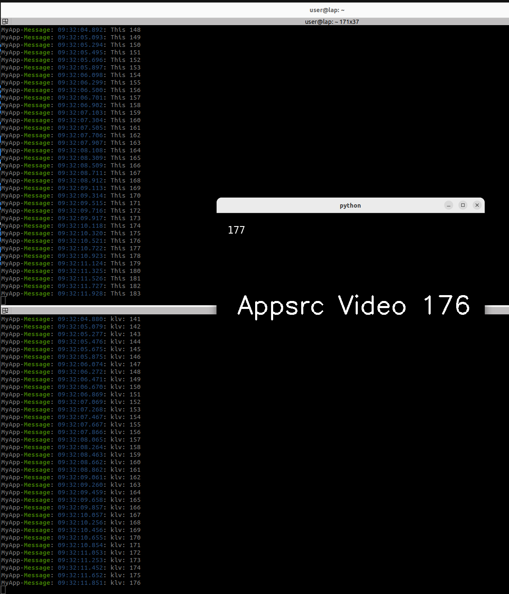

---
tags:
    - gstreamer
    - mpegts
    - klv
    - metadata
    - python
---

# MPEG with KLV

<details><summary>mpeg send image and kvl data</summary>
```python title="sender"
--8<-- "docs/Other/Gstreamer/mpegts/kvl/appsrc_mpeg_klv_udp.py"
```
</details>

<details><summary>mpeg receiver parse kvl data</summary>
```python title="receiver"
--8<-- "docs/Other/Gstreamer/mpegts/kvl/play_mpeg_video_parse_klv.py"
```
</details>





## Reference , To check and read
- [GStreamer KVL plugins](https://impleotv.com/content/gstreamer-klv-plugins/help/index.html)
- [klv_decoder](https://github.com/tayre/klv-decoder)