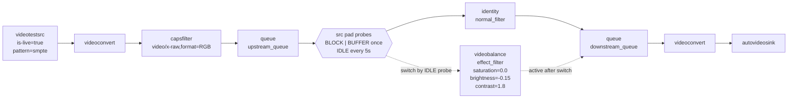

# GStreamer Pad Probe

A GStreamer pad probe is a callback attached to a pad. It lets your application
observe or control data as it passes through a pipeline.

Pads are the connection points between elements:

```text
source element src pad -> sink pad next element
```

When you add a probe to a pad, GStreamer calls your function when matching
events, buffers, queries, or blocking conditions pass through that pad.

## Common uses

Pad probes are useful when you need to:

- inspect buffers without changing the pipeline structure
- read metadata, timestamps, flags, or encoded bytes
- drop selected buffers
- modify buffers before they reach the next element
- debug caps, events, or pipeline flow
- block a pad briefly while relinking pipeline elements


## Simple Python Example

This example prints the PTS and size of every buffer passing through an
`identity` element:

```python
#!/usr/bin/env python3

import gi

gi.require_version("Gst", "1.0")

from gi.repository import GLib, Gst

Gst.init(None)


def buffer_probe(pad, info, user_data):
    buffer = info.get_buffer()
    if buffer is None:
        return Gst.PadProbeReturn.OK

    print(f"buffer pts={buffer.pts}, size={buffer.get_size()}")
    return Gst.PadProbeReturn.OK


pipeline = Gst.parse_launch(
    "videotestsrc is-live=true ! "
    "identity name=tap ! "
    "videoconvert ! "
    "autovideosink"
)

tap = pipeline.get_by_name("tap")
pad = tap.get_static_pad("sink")
pad.add_probe(Gst.PadProbeType.BUFFER, buffer_probe, None)

loop = GLib.MainLoop()
bus = pipeline.get_bus()
bus.add_signal_watch()


def on_message(bus, message, loop):
    if message.type == Gst.MessageType.ERROR:
        err, debug = message.parse_error()
        print("ERROR:", err)
        print("DEBUG:", debug)
        loop.quit()
    elif message.type == Gst.MessageType.EOS:
        loop.quit()


bus.connect("message", on_message, loop)
pipeline.set_state(Gst.State.PLAYING)

try:
    loop.run()
except KeyboardInterrupt:
    pass
finally:
    pipeline.set_state(Gst.State.NULL)
```

## Return Values

The probe callback return value controls what happens next:

- `Gst.PadProbeReturn.OK`: let the buffer/event continue
- `Gst.PadProbeReturn.DROP`: drop this buffer/event
- `Gst.PadProbeReturn.REMOVE`: remove this probe
- `Gst.PadProbeReturn.HANDLED`: mark the item as handled

Most inspection probes should return `OK`.

## Performance Notes

A pad probe runs on the streaming thread. Keep the callback short.

Avoid slow work inside the probe, such as disk I/O, network calls, heavy JSON
parsing, or long locks. If the probe takes too long, it can slow the whole
pipeline, increase latency, or cause dropped frames. For expensive processing,
copy the small data you need and send it to another thread or queue.

## Probe Types

`pad.add_probe()` receives a `Gst.PadProbeType` mask. Combine flags with `|`
when a callback should handle more than one kind of item.

- `Gst.PadProbeType.BUFFER`: called for each `Gst.Buffer`. Use this for frame
  or packet inspection, timestamps, metadata, encoded payload parsing, or
  selectively dropping buffers.
- `Gst.PadProbeType.BUFFER_LIST`: called for `Gst.BufferList` batches. Use this
  when an element pushes grouped buffers and you need to inspect or drop the
  whole batch.
- `Gst.PadProbeType.EVENT_DOWNSTREAM`: called for downstream events such as
  caps, segment, tag, EOS, or flush-stop. Use this to debug negotiation and
  stream-control events moving from source to sink.
- `Gst.PadProbeType.EVENT_UPSTREAM`: called for upstream events such as seek,
  latency, navigation, or QoS. Use this to observe control requests moving from
  sink to source.
- `Gst.PadProbeType.EVENT_BOTH`: shorthand for upstream and downstream events.
  Use this when the same callback should inspect all pad events.
- `Gst.PadProbeType.QUERY_DOWNSTREAM`: called for downstream queries. Use this
  to inspect queries sent toward sinks, such as allocation or scheduling.
- `Gst.PadProbeType.QUERY_UPSTREAM`: called for upstream queries. Use this to
  inspect queries sent toward sources, such as position, duration, latency, or
  caps queries.
- `Gst.PadProbeType.QUERY_BOTH`: shorthand for upstream and downstream queries.
  Use this when the same callback should inspect all pad queries.
- `Gst.PadProbeType.BLOCK`: blocks the pad before matching data continues. Use
  this for short, controlled pipeline changes such as relinking or replacing an
  element.
- `Gst.PadProbeType.IDLE`: called when the pad is idle and keeps it blocked
  until the probe is removed. Use this when you need a stable point for dynamic
  pipeline edits.

---

## Block and Idle



`prob_block_idle_switch.py` starts with the normal path linked as:

```text
upstream_queue -> normal_filter -> downstream_queue
```

The switch point is the `src` pad of `upstream_queue`. After two seconds the
example installs a `BLOCK | BUFFER` probe on that pad. It fires on the next
buffer, prints the buffer PTS, and returns `REMOVE`, so this first probe only
demonstrates where a buffer-blocking probe pauses data flow.

Every five seconds the example installs an `IDLE` probe on the same pad. An
idle probe runs when the pad has no data passing through it and keeps the pad
blocked while the callback runs, which gives the code a stable point to change
links. The callback chooses the current filter and the next filter from the
`using_effect` flag, unlinks the old path, sets the old filter to `NULL`, links
`upstream_queue` through the new filter to `downstream_queue`, syncs the new
filter state with the pipeline, flips `using_effect`, and returns `REMOVE` to
unblock the pad.

The result is a live pipeline that alternates between the identity path and the
`videobalance` grayscale effect without stopping the whole pipeline.


<details>
<summary>Demo</summary>
```python
--8<-- "docs/Other/Gstreamer/pad_prob/code/prob_block_idle_switch.py"
```
</details>