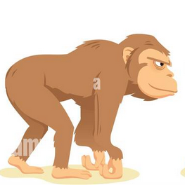
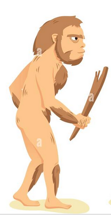
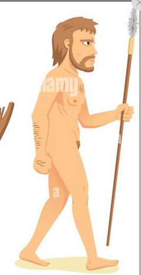
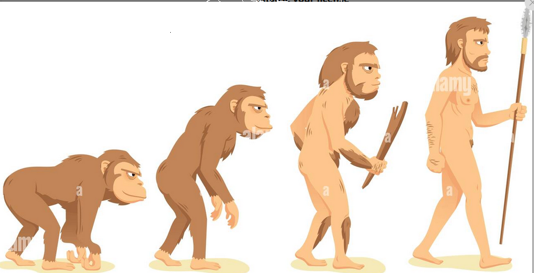

Robotics Software Development

---
# Skills

- Programming
- Robotics
- ROS
- DevOps
- Do not afraid to learn new things
  
---

# Prerequisites

- Linux
- Python

---

# Novice
- Git
- C++ for robotics (cmake)
- ROS2 basics
- Docker basics
- Robot simulation (basic)
- more linux
  - bash
  - OS

---

# Beginner
- ROS2 advanced
- Unit testing
- GStreamer
- Mavlink
- Ardupilot
- Networking

---

# More
- Robot Perception
- Math for robotics
- Deployment
- More programming skills
  - Adv python
  - Adv C++
  - UI

<!--  -->

---

<!-- style: h1 { position: absolute; top: 30px; left: 50%; transform: translateX(-50%); } -->

# Advanced

- Embedded
- AI
- Filters / Kalman filter
- SLAM
- Advanced perception

---

<!-- style: h1 { position: absolute; top: 30px; left: 20%; transform: translateX(-50%); } -->

# Done

