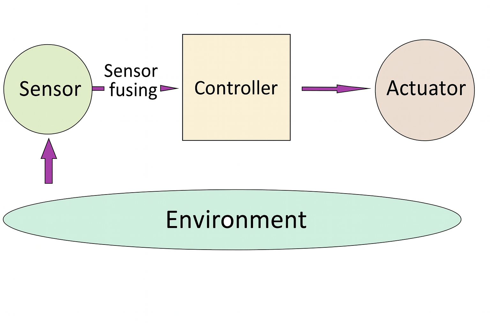

Robotics Engineering

---
# Math & Physics
- [Linear Algebra Essentials (9h)](https://www.udacity.com/course/linear-algebra-essentials--cd0667)
- [Calculus Essentials(3h)](https://www.udacity.com/course/calculus-essentials--cd0668)
- [Probability (13h)](https://www.udacity.com/course/probability--cd12639)
- [more Probability]()

---

# Programming

- [C++ (62h)](https://www.udacity.com/course/c-plus-plus-nanodegree--nd213)

---

# Control, Sensor fusing and other algorithms

---

# Sensor fusing
- [Sensor Fusion](https://www.udacity.com/course/sensor-fusion-engineer-nanodegree--nd313)

---

# Control

- [MPC]()
- 

---

#  robotics algorithm

- [SLAM](https://www.youtube.com/watch?v=wVsfCnyt5jA)
- [Particle filters ]()
- [Localization]()
- [Path planning]()
- [Master the Concepts of Reinforcement Learning. Implement a complete RL solution and understand how to apply AI tools to solve real-world problems.](https://www.coursera.org/specializations/reinforcement-learning?utm_medium=sem&utm_source=gg&utm_campaign=b2c_emea_x_multi_ftcof_career-academy_cx_dr_bau_gg_pmax_gc_s1_en_m_hyb_23-12_x&campaignid=20858198824&adgroupid=&device=c&keyword=&matchtype=&network=x&devicemodel=&creativeid=&assetgroupid=6490027433&targetid=&extensionid=&placement=&gad_source=1&gad_campaignid=20854471652&gclid=Cj0KCQjw4qHEBhCDARIsALYKFNPAzKB3E9KaylrWkeCy8nSFgs5d4y98a1fryBp_M9V-l2Pi32FVlC4aAk4wEALw_wcB)

---

# ROS 

- [ROS2 control]()
- [ROS2 NAvigation Stack]()

