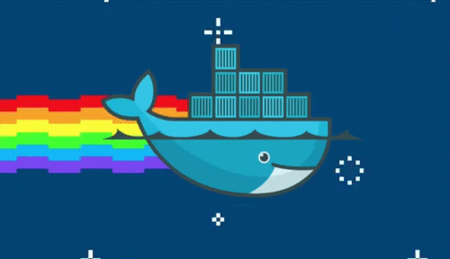
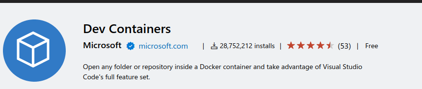
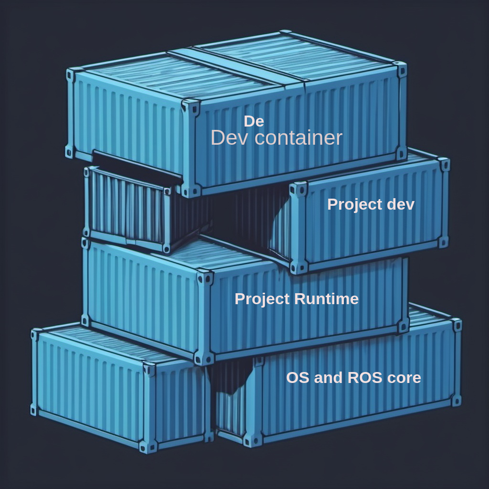
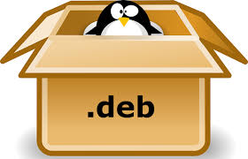

# ROS2 from dev to deploy
## on nvidia jetson 

---

# Agenda

- Dev
- Build and test
- Deploy
- Source control (??)
- Version control

---

# Today
- Dev on linux machine as python project (no ROS)
- Deploy: copy python files to remote system 
  - Deploy as ZIP
- Deploy: Burn pre cocked jetson image
  

---

# Docker as a way of life
- Dev: using vscode devcontainer
- Build: using docker to build for different architecture
- Test: using docker as test environment (allow clean system)
- Deploy: Deploy the application as cocked docker image

---

# Dev
- Using VSCode devcontainer
  - support remote development (run on jetson)
- Docker hierarchy
  - OS with Chosen ROS version + simulator + common dev tools
  - Project runtime dependencies (runtime/test)
  - Project dev dependencies (dev)
  - Project cycle (forget package and python pip)

---

# Build
- Cross Compiler
- Using docker as cross compiler environment
  - using **dev** docker that build for the jetson arm architecture

---

# Test
- Using docker as consistent and repetitive environment for testing
  - Use it to test package install tests

---

# Deploy - Find your way

- deb packages
- docker image
- jetson image

---

# Deploy - debian package
- Standard
- The linux/debian way 
- every package are installable has version and metadata
- easy to deploy from remote
  

---

# Deploy - jetson image
- pre install jetson image with all project dependencies and code
- Code install as debian package
- easy to copy
- 
---

# Deploy - with docker
- Build application docker with all dependencies
- Easy deploy

---

# Deploy - with docker - when
- legacy
- test's
- mixing system
- when is no other way

---

# Deploy - with docker - why not
- Hardware issue
- Hard to deploy from remote

---

# Version

- Every thing has a version
  - package
  - OS image
  - docker image
- Every project / application has version page

---

# Control after release
- Dev days: yes, we know ourself
- From release and on:
  - Source control
  - Ticket and issue
  - Code review and test
  

---

# All fit together 
- Build Debian packages
- Install Packages on the docker image
- Backup jetson image with docker include 
---

# Final thought
 Docker for dev using devcontainer
 Docker for build
 Docker for test
 Docker for production