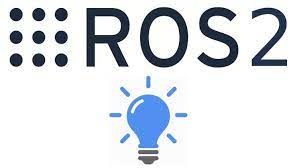
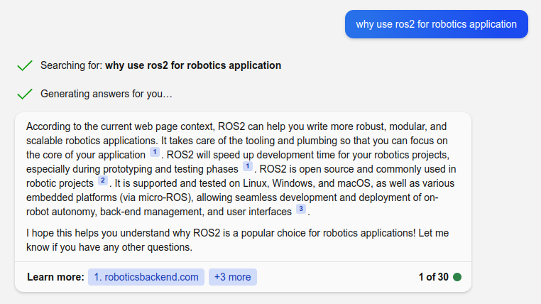
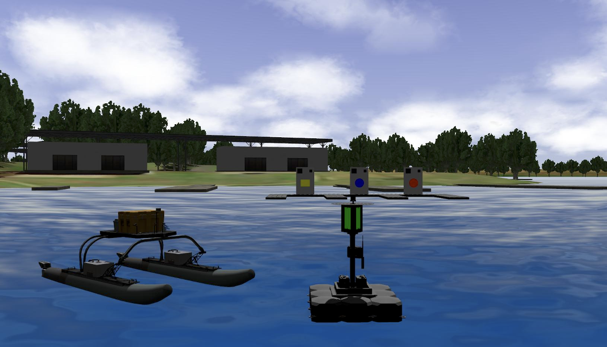
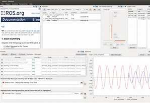
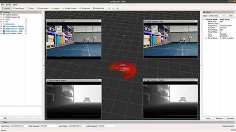
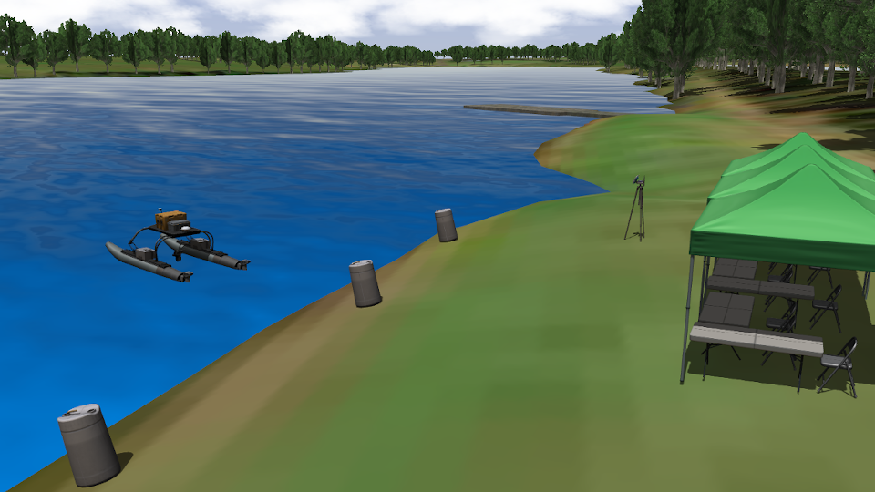
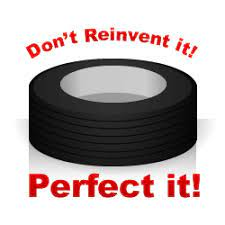

# ROS2 
What, Why and basic verbs and concept

---

# What
 - Open source software development kit for robotics applications.
 - Standard
 - From research and prototyping through to deployment and production

---

# Why

- For me it a STANDARD

---

# Verbs
- DDS
- Node
- Pub / Sub
- Service
- Parameters

---

# Tools
- Rqt
- Rviz
- Gazebo

---

# What to remember

- ROS2 is a standard
  - Don't invite the wheel (reuse other works)
- ROS2 is a way of thinking to solve robotics problems
- ROS2 is a SDK

---
# Learn from others

- [Autonomous, GPS-Denied Quadrotor Flight](https://youtu.be/6eeetSVHXPk)
  
---
# DARPA
](image.png)

[link](https://youtu.be/aTiBpWX5GV4)

---

# VRX

---
# Eye on the prize. glance to the future
- ROS Version
- Simulation
  - Gazebo version
- Flight controller
  - PX4 /ArduPilot

[2024 ROS Metrics Report](https://cdck-file-uploads-us1.s3.dualstack.us-west-2.amazonaws.com/flex022/uploads/ros/original/3X/3/7/37c752346eb33f4f5ebde0c513b949b15adae453.pdf)

---

# Node message and topic

Node: A node is an executable that uses ROS to communicate with other nodes.
Message: ROS data type
Topics: ROS2 topic is a way of communication between ROS2 nodes

---

# Pub / Sub

---

# Service

---

# Action

---

# Rqt
RQT is a Qt-based framework for GUI development for ROS

---

# Rviz
- Rviz is a 3D visualization tool for ROS
- It allows you to visualize sensor data and other information from your robot in real-time

---

# Gazebo

---

# Without words

[video link](https://user-images.githubusercontent.com/24916364/162032176-a2d503a0-4f75-4785-b2e2-f24ba90b1819.mov)

---

# Final

- ROS is a standard 
- Way of thinking
- SDK for develop robotics application

