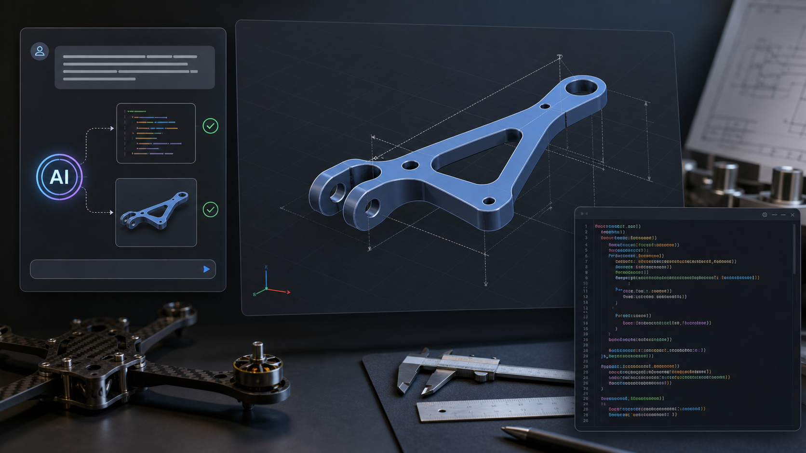

# CAD & AI with CadQuery and Codex



This page starts a workflow for using [CadQuery](https://cadquery.readthedocs.io/en/latest/) as code-first CAD and Codex as the assistant that helps write, review, and iterate the model code.

The goal is simple:

- describe the part in engineering language
- let Codex draft CadQuery Python code
- run the code locally
- inspect the shape in CQ-editor
- export STEP/STL when the model is good

Reference to watch later:

- [YouTube: CAD / AI video](https://youtu.be/wG4u7sOcfuo)

---

## Install with `uv`

CadQuery supports pip installation, and `uv` can manage the virtual environment and package installation. The official CadQuery docs still describe conda as the more mature route, but pip is supported on Linux, macOS, and Windows.

Use a stable Python version. Avoid the newest Python if CadQuery dependencies have not caught up yet.

```bash
mkdir cadquery_ai
cd cadquery_ai

uv init
uv python pin 3.11
uv add cadquery
```

Test the install:

```bash
uv run python -c "import cadquery as cq; print(cq.Workplane('XY').box(1, 2, 3).toSvg()[:80])"
```

If you see SVG text printed, CadQuery is working.

---

## Add CQ-editor

CQ-editor is a GUI editor/viewer for CadQuery. It lets you run scripts, inspect the model, and export CAD files.

Install it in the same `uv` project:

```bash
uv add "git+https://github.com/CadQuery/CQ-editor.git"
```

Run it:

```bash
uv run cq-editor
```

---

## Hello World CadQuery part

Create `code/bracket.py`:

```python title="docs/Other/cad/code/bracket.py"
--8<-- "docs/Other/cad/code/bracket.py"
```

Open CQ-editor:

```bash
uv run cq-editor code/bracket.py
```

If CQ-editor does not receive the file path on your platform, open CQ-editor first and then load `code/bracket.py` from the GUI.

---

## Run without CQ-editor

For command-line testing, `show_object` is only available inside CQ-editor. Use this version when running with Python:

```python title="docs/Other/cad/code/bracket_export.py"
--8<-- "docs/Other/cad/code/bracket_export.py"
```

Run it:

```bash
uv run python code/bracket_export.py
```

---

## Using Codex for CAD

CadQuery is a good fit for Codex because the CAD model is normal Python code. Instead of clicking features in a GUI, you can ask Codex to change dimensions, add holes, add fillets, or split the model into named parameters.

Good first prompt:

```text
Create a CadQuery model for a simple mounting bracket.
Use named parameters for length, width, thickness, hole diameter, and fillet radius.
Make the script work in CQ-editor with show_object(part).
Keep the model simple and explain each modeling step.
```

Then iterate:

```text
Modify this CadQuery part:
- add two counterbored holes on the top face
- keep all dimensions as named parameters
- export STEP and STL from a command-line version
- explain which dimensions control the hole spacing
```

Ask Codex to review the CAD code too:

```text
Review this CadQuery script for fragile selectors, hard-coded dimensions,
and places where changing one parameter will break the model.
Suggest a cleaner parametric structure.
```

---

## Practical workflow

1. Start with a rough part description.
2. Ask Codex for a CadQuery draft.
3. Run it in CQ-editor.
4. Fix one modeling issue at a time.
5. Move magic numbers into named parameters.
6. Export STEP for CAD/CAM and STL for printing.

Keep the first models small. A simple bracket with holes and fillets is a better
first test than a full assembly.

---

## Sources

- [CadQuery installation documentation](https://cadquery.readthedocs.io/en/latest/installation.html)
- [CQ-editor GitHub repository](https://github.com/CadQuery/CQ-editor)


---

## Demo: Create my sport gym storage

<details>
<summary>Plan</summary>
```
--8<-- "docs/Other/cad/code/storage-rack.md"
```
</details>