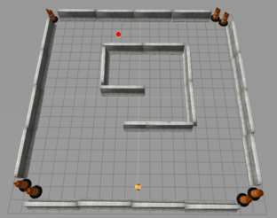
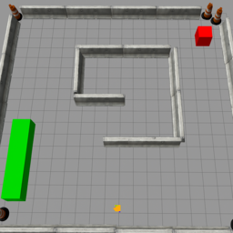

Robotics Software Development Interview

---
# Python

- Differentiate between list and tuple
- Explain immutable vs mutable
- Explain yield keyword 
- Explain python context manager and how to implement it.
- Explain thread safe object
  
---

# Python code I

what the output

```python
names = ["Alice", "Bob", "Charlie", "Dave"]
result = sorted([name.lower() for name in names if len(name) > 3], key=lambda x: x[-1])
print(result)
```

---

# Python code II

find my bug

```python
def remove_even(numbers):
    for num in numbers:
        if num % 2 == 0:
            numbers.remove(num)
    return numbers

print(remove_even([1, 2, 3, 4, 5, 6]))
```

---

# Python code III

What the output

```python
def log_message(*args, **kwargs):
    level = kwargs.get('level', 'INFO')
    prefix = kwargs.get('prefix', '')
    message = " ".join(str(arg) for arg in args)
    print(f"[{level}] {prefix}{message}")

log_message("System", "started")
log_message("Temperature:", 72, level="WARNING")
log_message("User", "login", prefix=">> ", level="DEBUG")
```

---

# Python code IV

What the bug and how fix it

```python
import threading

counter = 0

def increment():
    global counter
    for _ in range(100000):
        counter += 1

threads = [threading.Thread(target=increment) for _ in range(5)]

for t in threads: t.start()
for t in threads: t.join()

print("Counter:", counter)

```

---

# Python code V

What the result

```python
def mystery(n):
    if n == 0:
        return 0
    return n + mystery(n - 1)

print(mystery(4))
```

---

# Python code VI

What’s the difference between these two?

```python
def build_list(n):
    result = []
    for i in range(n):
        result.append(i * i)
    return result

def generate_values(n):
    for i in range(n):
        yield i * i

print("Using return:")
for x in build_list(5):
    print(x)

print("\nUsing yield:")
for x in generate_values(5):
    print(x)
```

---

# Control
- Explain filters and why i need them
- Explain PID system
- Give me example for system that i must add `I` control part to close my error

---

# filter I

```python
def ema_filter(current, previous, alpha=0.1):
    return alpha * current + (1 - alpha) * previous

data = [1,2,3,4,5,6]
p  = 0
for c in data:
    p= ema_filter(c, p)
```

- What is the functionality this filter implement
- What are the valid alpha that can be use for this functionally
    - Choice two alpha values and explain 


---

# Control I

I have a PID-controlled water heating system. 
The system has a large overshoot and takes a long time to stabilize. What tuning do you recommend?

---

# Control 

I design the system only with `PD` control what the pros and cons

---

# Robotics

I have a differential-drive robot that needs to reach a goal position marked by a red dot.
( the robot has no previous data about the obstacle in the room)



- The robot know it's position on map x,y
- The Robot know the target position x,y 
- The Robot algorithm need to find the shortest path to the target

---

- What sensor do I need to add to help the robot to reach the target ?
- Describe the algorithm to implement in pseudocode.
- Give me another set of sensors that can help solve the machine

---

# Robotics II

- What sensor do I need to add if the robot has no initialize position and no knowledge about the target location
- The robot needs to find the red box in the environment and stop near it?



- Describe the algorithm to implement in pseudocode
- What sensor to add if i want to control robot speed and yaw (no gps)

