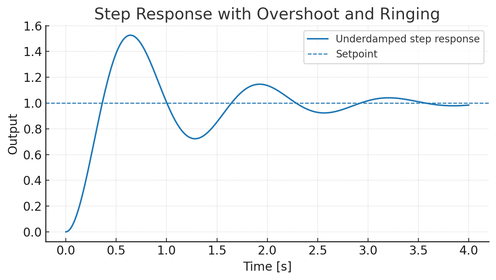
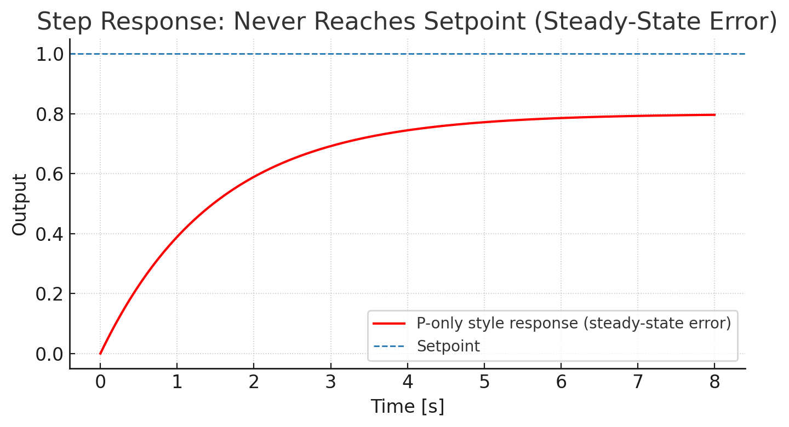

Robotics Software Development Interview II

---

# Control I
How to tune the PID 



---

# Control I

How to tune the PID 



---

# Control 

Explain and what are the usage
- anti-windup
- feed forward
- output rate limiting
- conditional integration

---

# ROS

- Explain ROS2 QoS
- Explain Intra-process communication in ROS 2, benefits and trade-offs?

---

# ROS
Your system runs multiple nodes that publish TF2 messages at a very high frequency.
Frequent calls to lookupTransform() are causing noticeable latency.
What techniques or optimizations in ROS 2 can help reduce this latency?

---

# ROS

You have two nodes — a Tracker and an ATR — that both consume significant system resources.
They do not need to run at the same time.
What ROS 2 features or mechanisms can you use to manage this situation effectively?

---

# Python

What is the output and way it work, suggest two or more way to achieve the same functionality / behavior

```
def func():
    func.c +=1

func.c = 0
func()
func()

print(func.c)
```

---

# Python

 Explain what Python’s asyncio library is and describe when it is appropriate to use it.

---

# Python

Explain the code

```python
class XXX:
    _instance = None
    def __new__(cls, *args, **kwargs):
        if cls._instance is None:
            cls._instance = super().__new__(cls)
        return cls._instance
```

---

# CPP

- Explain what std::move does.
- What is the difference between moving and copying an object?
- Give a case where moving is significantly more efficient.

---

# CPP

What’s the difference between 
- std::unique_ptr 
- std::shared_ptr
- std::weak_ptr

When would you use each?

---

# CPP

What the output?

```cpp
int x = 10;
auto f = [x]() mutable { return ++x; }; 
std::cout << f() << " " << f() << std::endl;
```

```cpp
int x = 10;
auto f = [](int x) { return ++x; }; // no mutable
std::cout << f(x) << " " << f(x) << std::endl;
```


