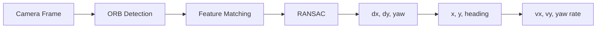

---
tags:
    - markdown
    - cheatsheet
    - vscode
---

## Robot visual odometry

```html title="control one mermaid canvas"
<div data-mermaid-height="180px"></div>
```

<div data-mermaid-height="180px"></div>



```html title="control one mermaid canvas"
<div data-mermaid-height="180px"></div>
```
<div data-mermaid-height="320px"></div>


# Markdown Cheatsheet and VSCode Extensions
[Github Docs - Basic writing and formatting syntax](https://docs.github.com/en/get-started/writing-on-github/getting-started-with-writing-and-formatting-on-github/basic-writing-and-formatting-syntax)

## Markdown

| Tag  | Markdown  |
|---|---|
| `**bold**`  | **bold**  |
| `*italic*`  | *italic*  |
| `~~strikethrough~~`  | ~~strikethrough~~  |
| `$\LaTeX$`  | $\LaTeX$  |
| `---`  | ---  |

---

## Links

|   |   |
|---|---|
| new tab  | `[link](https://uri){:target="_blank"}`  |


---

## images


|   |   |   |
|---|---|---|
| width control  | `{ width=10% }` | { width=10% } |
| width control  | `{ width=20% }` | { width=20% } |

---

### headings

# Heading 1
`# Heading 1`

## Heading 2
`## Heading 2`

### Heading 3
`### Heading 3`


---

### emoji
[Complete list](https://gist.github.com/rxaviers/7360908)

:sunglasses: `:sunglasses:`
:heart: `:heart:`
